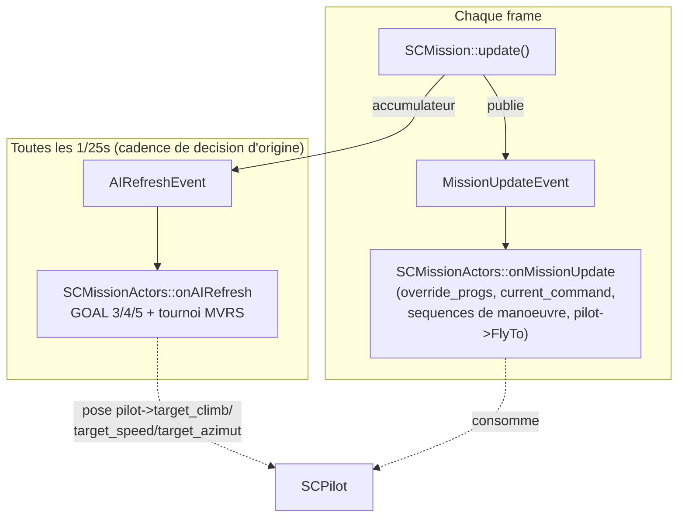

# Spécification d'implémentation — le moteur d'IA de Strike Commander
dans libRealSpace

*Chaque fonction ci-dessous est une méthode réelle de `SCMissionActors`,
`SCMission`, `SCPilot` ou `RSProf`. Les algorithmes proviennent de la
rétro-ingénierie du binaire d'origine (`AI_SYSTEM.md`, référencé pour
qui veut retracer une formule jusqu'à sa source) — cette spécification
ne documente que ce qu'il faut écrire, pas l'état antérieur du code.*

---

## 0. Architecture — deux événements, deux fréquences



`onMissionUpdate` reste la cascade de priorité pour `GOAL` sélecteur
`2` (exécution de mission). `onAIRefresh` s'ajoute pour les
sélecteurs `3`/`4`/`5`, à la cadence de décision d'origine (~25 Hz)
plutôt que sur le framerate réel du port — sans ce throttle, un port
tournant à un framerate supérieur à 25 fps ferait tourner le tournoi
`MVRS` plus souvent que dans le binaire d'origine, donc plus de
tirages aléatoires par seconde réelle et une IA statistiquement plus
forte/réactive qu'à l'origine (défaut relevé dans `AI_SYSTEM.md` §6).

---

## 1. Chargement des données — `RSProf`

### 1.1 Hiérarchie des chunks

```
FORM "PROF"
├── VERS                       → parsePROF_VERS
├── FORM "RADI"                → parsePROF_RADI
│   ├── INFO/SPCH/OPTS/MSGS
│   └── ASKS                   → profil JOUEUR uniquement
└── FORM "_AI_"                → parsePROF__AI_
    ├── "AI\0_" → isAI=true, MVRS, GOAL, ATRB
```

### 1.2 `parsePROF__AI_MVRS`

```cpp
struct AI_STATE {
    uint8_t node_id;
    int8_t  value;
};

void RSProf::parsePROF__AI_MVRS(uint8_t *data, size_t size) {
    ByteStream stream;
    if (data == nullptr) { return; }
    stream.Set(data, size);
    while (stream.GetPosition() < data + size) {
        uint8_t id = stream.ReadByte();
        int8_t  value = (int8_t) stream.ReadByte();
        this->ai.mvrs.push_back(AI_STATE{id, value});
    }
}
```

### 1.3 `parsePROF__AI_ATRB`

```cpp
void RSProf::parsePROF__AI_ATRB(uint8_t *data, size_t size) {
    ByteStream stream;
    if (data == nullptr) { return; }
    if (size == 1) {
        this->ai.atrb.TH = 8;  this->ai.atrb.CN = 8;  this->ai.atrb.VB = 8;
        this->ai.atrb.LY = 8;  this->ai.atrb.FL = 10; this->ai.atrb.AG = 10;
        this->ai.atrb.AA = 10; this->ai.atrb.SM = 8;  this->ai.atrb.AR = 8;
        return;
    }
    stream.Set(data, size);
    this->ai.atrb.TH = stream.ReadByte(); this->ai.atrb.CN = stream.ReadByte();
    this->ai.atrb.VB = stream.ReadByte(); this->ai.atrb.LY = stream.ReadByte();
    this->ai.atrb.FL = stream.ReadByte(); this->ai.atrb.AG = stream.ReadByte();
    this->ai.atrb.AA = stream.ReadByte(); this->ai.atrb.SM = stream.ReadByte();
    this->ai.atrb.AR = stream.ReadByte();
}
```

### 1.4 `NUMS` — fichier compagnon (`INTEL.IFF`), sur `SCMission`

```cpp
struct NUMSConstants {
    float unusedA, unusedB;
    Vec3 formationOffset;
    Vec3 secondaryOffset;
    float distanceThreshold1800;
    float distanceThreshold15_625;
    float distanceThreshold175;     // seuil de detection (§3.2)
    float distanceThreshold7;
    float distanceThreshold69;      // sequence Scissors/Rollaway (§4)
    float distanceThresholdPriority;
    float distanceThreshold97;      // sequence Immelmann/Split S (§4)
    float baseSpeedReference;
};
NUMSConstants nums;

void SCMission::loadNums(uint8_t *data, size_t size) {
    IFFSaxLexer lexer;
    std::unordered_map<std::string, std::function<void(uint8_t*, size_t)>> handlers;
    handlers["INTL"] = [this](uint8_t *d, size_t s) {
        ByteStream stream; stream.Set(d, s);
        auto readFixed = [&]() { return (int32_t)stream.ReadLong() / 256.0f; };
        this->nums.unusedA = readFixed();
        this->nums.unusedB = (float)(int16_t)stream.ReadShort() / 256.0f;
        stream.ReadShort();
        this->nums.formationOffset = { readFixed(), readFixed(), readFixed() };
        this->nums.secondaryOffset = { readFixed(), readFixed(), readFixed() };
        this->nums.distanceThreshold1800     = readFixed();
        this->nums.distanceThreshold15_625   = readFixed();
        this->nums.distanceThreshold175      = readFixed();
        this->nums.distanceThreshold7        = readFixed();
        this->nums.distanceThreshold69       = readFixed();
        this->nums.distanceThresholdPriority = readFixed();
        this->nums.distanceThreshold97       = readFixed();
        this->nums.baseSpeedReference        = readFixed();
    };
    lexer.InitFromRAM(data, size, handlers);
}
```

### 1.5 `ATRB` — deux copies distinctes sur l'entité, pas une

*Correction majeure suite à une session de vérification approfondie
(`AI_SYSTEM.md` §6ter).* Il existe **deux copies séparées** d'`ATRB`
sur l'entité IA :

1. **Copie de réglage/chargement** (`entité+0x96` à `+0x9E`) — le
   tampon direct issu du fichier.
2. **Copie de consommation directe** (`entité+0xB0` à `+0xB8`) —
   celle que la logique de décision lit réellement, via une famille
   de fonctions de jet de compétence (jet aléatoire 1-16 comparé à
   `stat + modificateur`) :

```cpp
bool SCMissionActors::skillCheck(uint8_t statValue, int modifier) {
    int roll = (std::rand() % 16) + 1;
    return roll <= (int)statValue + modifier;
}
```

| Offset | Trait `ATRB` | Confirmé par |
|---|---|---|
| `+0xB0` | `TH` | jet de compétence, consulté par le tournoi |
| `+0xB1` | `CN` | jet de compétence |
| `+0xB2` | `VB` | `canPlayRadioMessage` (§5.2) |
| `+0xB3` | `LY` | sélection de registre de message contextuel |
| `+0xB4` | `FL` | condition de branche (`> 14`) dans le dispatcheur de message |
| `+0xB5` | `AG` | jet de compétence |
| `+0xB6` | `AA` | comparaison par division, appelée depuis le tournoi lui-même |
| `+0xB7` | `SM` | jet de compétence |
| `+0xB8` | `AR` | jet de compétence |

### 1.6 Remise à l'échelle de `FL`/`AG`/`AA` par la difficulté

Concerne uniquement la copie de réglage, distincte de la copie de
consommation directe ci-dessus :

```cpp
int difficulty_level{0};

void RescaleSkillByDifficulty(RSProf &profile, int difficultyLevel) {
    profile.ai.atrb.FL = (uint8_t)(profile.ai.atrb.FL >> difficultyLevel);
    profile.ai.atrb.AG = (uint8_t)(profile.ai.atrb.AG >> difficultyLevel);
    profile.ai.atrb.AA = (uint8_t)(profile.ai.atrb.AA >> difficultyLevel);
}
```

---

## 2. L'événement `AIRefresh`

### 2.1 Événement

```cpp
class AIRefreshEvent : public EventMessage {
public:
    SCMission *mission{nullptr};
};
```

### 2.2 `SCMission` — accumulateur

```cpp
float ai_refresh_accumulator{0.0f};
// Le jeu d'origine tourne le tournoi MVRS sans aucun throttling (AI_SYSTEM.md
// §6) : le rythme de décision de l'IA scale directement avec le framerate,
// qui visait ~25 fps sur le binaire DOS d'origine (meme reference que la
// caméra, cf. CAMERA_SYSTEM.md/DATA_MODEL.md). Ce n'est PAS un choix de
// stabilite arbitraire pour le port : sur un port qui tourne a un framerate
// different (souvent bien superieur a 25), laisser le tournoi tourner a
// chaque frame rendrait l'IA statistiquement plus forte/plus reactive
// qu'a l'origine (plus de tirages aleatoires par seconde reelle). Ce
// throttle remet explicitement l'IA a la cadence de decision d'origine.
static constexpr float AI_REFRESH_INTERVAL = 1.0f / 25.0f;

float dt = this->tps > 0 ? 1.0f / (float)this->tps : 1.0f / 30.0f;
this->ai_refresh_accumulator += dt;
if (this->ai_refresh_accumulator >= AI_REFRESH_INTERVAL) {
    this->ai_refresh_accumulator -= AI_REFRESH_INTERVAL;
    AIRefreshEvent ai_refresh_event;
    ai_refresh_event.mission = this;
    this->messageBus.publish(std::make_unique<AIRefreshEvent>(ai_refresh_event));
}
```

### 2.3 `SCMissionActors` — déclarations

**L'`enum` des identifiants `MVRS` a été entièrement revérifié** —
une session précédente contenait un décalage systématique sur
presque toutes les valeurs. Chaque identifiant a été confirmé par
lecture complète de sa fonction de score :

```cpp
enum class GoalSelector : uint8_t {
    Empty                = 1,
    ExecuteAction        = 2,
    WanderRandom         = 3,
    BehaviorStateMachine = 4,
    ActiveWingman        = 5,
};

enum class MVRSInstinct : uint8_t {
    None                   = 0,
    PursuitBase            = 1,  // angulaire complet, gagnant applique aussi GeometricUtility
    PursuitAlwaysTen       = 2,  // score toujours 10, application = rupture directionnelle
    PursuitSimple          = 3,  // angulaire simplifie, ajustement TH
    PursuitExtended        = 4,  // angulaire etendu, application = solution d'interception
    PursuitImmelmannSplitS = 5,  // declenche la sequence acrobatique a 8 phases
    PursuitSensorGated     = 6,  // garde de portee, sous-mode et sequence propres
    PursuitSkillGatedTH    = 7,  // garde flags_75 bit6 / TH, ecrit position d'interception
    // 8,9,10,11,12 : score nul dans le seul chemin de code lu a ce jour.
    // NE PAS traiter comme des coquilles vides / non implementes : la
    // recherche de leur vrai consommateur est incomplete, pas fermee
    // (voir AI_SYSTEM.md §3.7/§3.8, correction explicite suite a
    // desaccord de Remi). ID=21 ci-dessous a le meme profil (score nul
    // en tournoi) et s'est revele avoir un role reel confirme hors
    // tournoi (§4bis) : 8-12 doivent etre implementes des que leur role
    // reel est retrouve, pas laisses de cote sur la base du score seul.
    Unresolved8            = 8,
    Unresolved9            = 9,
    Unresolved10           = 10,
    Unresolved11           = 11,
    Unresolved12           = 12,
    ScissorsRollaway       = 13, // declenche la sequence acrobatique a 5 phases
    Intercept              = 14, // calcul trigonometrique complet, binaire 0/10
    ThreatSensor           = 15, // binaire 0/10
    ThGateBinary           = 16, // CORRIGE : binaire 0/1 sur TH<12 uniquement
    WeaponReady            = 19,
    GeometricUtility       = 20, // score nul en tournoi ; outil geometrique reel hors-tournoi (§3.6)
    NavCommandCarrier      = 21, // score nul en tournoi ; porteur reel de commande de navigation
                                  // hors-tournoi, consomme par AI_NavSolutionToPoint (AI_SYSTEM.md §4bis)
                                  // — anciennement nomme "Trivial", correction suite a cette decouverte
};

virtual bool tryActiveWingman();
virtual bool tryWanderRandom();
virtual void runMVRSTournament();

void onAIRefresh(const AIRefreshEvent &event);
void executeFireControlSolution();
void armWeaponEngagement();
int  selectBestWeapon();
int  weaponEffectiveRange(int hpt_id);
bool targetDetectedBySensor();
bool interceptTrajectoryFeasible();
float computeSensorSecondaryAngle();
void applyBreakDirection();
void applyPursuitTracking();
void applyGeometricUtility();
int  weaponFiringConeAngle(int hpt_id);
void tickManeuverSequence(float dt);
int  computeMVRSScore(MVRSInstinct id);
int  scoreAngularFamily(MVRSInstinct id);
int  scoreWeaponReady();
bool skillCheck(uint8_t statValue, int modifier);
void applyMVRSInstinct(MVRSInstinct id);

MVRSInstinct mvrs_current_winner{MVRSInstinct::None};
float mvrs_maneuver_timer{0.0f};
int mvrs_maneuver_phase{0};
bool mvrs_break_right{false};
bool threat_modulator_active{false};
bool weapon_task_busy{false};
SCMissionActors *weapon_engagement_target{nullptr};
float weapon_engagement_timer{0.0f};
```

### 2.4 `SCMissionActors::onEvent`

```cpp
void SCMissionActors::onEvent(const EventMessage &event) {
    if (auto eventData = dynamic_cast<const MissionEventActorHit*>(&event)) {
        this->onGettingHit(*eventData);
        return;
    }
    if (auto eventData = dynamic_cast<const MissionUpdateEvent*>(&event)) {
        this->onMissionUpdate(*eventData);
        return;
    }
    if (auto eventData = dynamic_cast<const AIRefreshEvent*>(&event)) {
        this->onAIRefresh(*eventData);
        return;
    }
}
```

### 2.5 `SCMissionActors::onAIRefresh`

*Note (2026-09-19) : ce pseudocode ne reflète pas l'ordre réel d'`AI_TopLevelThink` (réactions prioritaires, objet en cours, contournement au sol) — voir §2.9 et `AI_SYSTEM.md` §4.2.*

```cpp
void SCMissionActors::onAIRefresh(const AIRefreshEvent &event) {
    if (!this->is_active || this->is_destroyed) return;
    if (this->profile == nullptr || !this->profile->ai.isAI) return;
    if (this->plane == nullptr || this->pilot == nullptr) return;

    for (uint8_t rawSel : this->profile->ai.goal) {
        GoalSelector sel = (GoalSelector)rawSel;
        switch (sel) {
            case GoalSelector::ActiveWingman:
                if (this->tryActiveWingman()) return;
                break;
            case GoalSelector::WanderRandom:
                if (this->override_progs.empty() && this->on_update.empty()) {
                    if (this->tryWanderRandom()) return;
                }
                break;
            case GoalSelector::BehaviorStateMachine:
                this->runMVRSTournament();
                return;
            default:
                break;
        }
    }
}
```

### 2.6 `SCMissionActors::tryActiveWingman`

```cpp
bool SCMissionActors::tryActiveWingman() {
    if (this->mission->player == nullptr) return false;
    bool escortingPlayer = (this->current_target != 0
                            && this->target == this->mission->player);
    if (escortingPlayer) {
        this->override_progs.clear();
        this->override_progs.push_back({prog_op::OP_SET_OBJ_FOLLOW_ALLY,
                                         this->mission->player->actor_id});
        return true;
    }
    return false;
}
```

### 2.7 `SCMissionActors::tryWanderRandom`

```cpp
bool SCMissionActors::tryWanderRandom() {
    if (this->current_target != 0) return false;
    Vector3D wander;
    wander.x = this->plane->x + (float)(std::rand() % 20000 - 10000);
    wander.y = this->plane->y;
    wander.z = this->plane->z + (float)(std::rand() % 20000 - 10000);
    this->pilot->SetTargetWaypoint(wander);
    this->pilot->target_speed = -10;
    return true;
}
```

*Note (implémentation réelle, libRealSpace, 2026-09-13) : la version
effectivement livrée tire un `SPOT` existant de la mission au hasard
(`std::rand() % spots.size()`) et le pose via le mécanisme
`current_command`/`flyToWaypoint` déjà existant, plutôt qu'un point 3D
calculé à la volée — voir §2.8 ci-dessous pour le contexte plus large sur
comment `current_command` s'articule avec la boucle `GOAL`.*

### 2.8 `SCMissionActors::executeGoalAction` (`GOAL_EXECUTE_ACTION`) —
navigation vs combat, un point encore ouvert

**Implémentation réelle, retenue après discussion avec Rémi (2026-09-13)** —
diffère de l'esprit du pseudo-code `onAIRefresh` ci-dessus (§2.5), qui
laissait `runMVRSTournament()` s'exécuter dès que le sélecteur `4` est
atteint. En pratique, `executeGoalAction()` (le sélecteur `2`,
`GOAL_EXECUTE_ACTION`) retraduit `current_command` en appel de méthode —
mais son retour n'est **pas** un simple `current_command != OP_NOOP` :

```cpp
bool SCMissionActors::executeGoalAction() {
    this->protectSelf();
    switch (this->current_command) {
        case OP_SET_WAIT_FOR_SECONDS:
        case OP_SET_OBJ_TAKE_OFF:
        case OP_SET_OBJ_LAND:
        case OP_SET_OBJ_FLY_TO_WP:
        case OP_SET_OBJ_FLY_TO_AREA:
        case OP_SET_OBJ_FOLLOW_ALLY:
            /* exécute la méthode correspondante, met à jour
               current_command_executed */
            return true;   // objectif de navigation pure : gagne le tick
        case OP_SET_OBJ_DESTROY_TARGET:
        case OP_SET_OBJ_DEFEND_TARGET:
        case OP_SET_OBJ_DEFEND_AREA:
            /* exécute quand même la méthode (l'avion continue de
               s'approcher/tirer sur la cible) */
            return false;  // objectif de combat : NE gagne PAS le tick
        default:
            return false;  // rien à faire
    }
}
```

**Pourquoi ce découpage** : `runGoalSelectors()` (§4bis de `AI_SYSTEM.md`
pour l'équivalent ASM, `AI_TopLevelThink`) s'arrête au premier sélecteur
qui « gagne » le tick. Dans **tous** les fichiers `PROF` échantillons
(Billy `[5,2,1,4,3]`, Hammer `[2,1,4,3]`, Gwen, cargo), le sélecteur `2`
précède toujours `4`. Si `2` gagnait le tick pour n'importe quel
`current_command` non vide (y compris `DESTROY_TARGET`, qui peut rester
actif très longtemps — tant que la cible n'est pas détruite), le tournoi
`MVRS` (sélecteur `4`) ne tournerait **jamais** en combat, exactement le
moment où il doit prendre la main pour la manœuvre tactique. En excluant
les trois objectifs de combat du « gain de tick » (tout en continuant à
les exécuter), `4` reste atteignable dans le même passage dès qu'il sera
câblé.

**Statut : hypothèse de travail, pas une certitude ASM.** `AI_SYSTEM.md`
§4.4 (`Goal_ActiveWingmanEngagement`, sélecteur `5`) montre qu'au moins un
sélecteur délègue lui-même à `AI_BehaviorStateMachine` en interne, en fin
de son propre traitement — ce qui suggère que l'articulation réelle entre
`Goal_ExecuteAction` et le tournoi `MVRS` n'est peut-être pas une simple
exclusion mutuelle au niveau de la boucle `GOAL`, mais une délégation
interne à certains native handlers. **À reconfirmer en ASM lors de la
session dédiée au tournoi `MVRS`** (§3 ci-dessous) avant de considérer ce
découpage comme définitif.

### 2.9 Ce que l'ASM fait autour de la boucle `GOAL` (non encore reproduit)

Source : `AI_SYSTEM.md` §4.2 corrigé, `AI_TICK_CALL_GRAPH.md` (citations). Ordre
réel de la décision IA, à chaque tick de l'entité :

1. **Réactions prioritaires** (menace, escorte, dégâts) : si l'une réagit, on
   s'arrête là — c'est le « protect self » qui passe avant « obey order ».
2. **Objet en cours** (`entité+0x0D`, nature inconnue) : s'il existe, il passe
   avant le tournoi et avant les objectifs.
3. **Avion au sol : `Goal_ExecuteAction` direct**, quel que soit le tableau
   `GOAL`. Avion en vol : parcours des emplacements du fichier.

Écarts actuels de libRealSpace par rapport à cet ordre :

| Règle ASM | État dans `runGoalSelectors()` |
|---|---|
| Au sol, `Goal_ExecuteAction` tourne sans consulter `GOAL` | **absent** : avec `GOAL=1` seul (tableau vide), un acteur ne décolle pas, alors qu'en jeu il décolle |
| La valeur `1` n'occupe aucun emplacement | traitée comme `GOAL_EMPTY` et ignorée à la lecture de la boucle : équivalent, mais l'acteur reste un acteur « à `GOAL` » |
| Réactions prioritaires avant les objectifs | **absent** ; `protectSelf()` est un palliatif appelé dans `executeGoalAction()`, donc lié au sélecteur `2` |
| Objet en cours (`entité+0x0D`) avant `GOAL` | **absent**, nature de l'objet non établie |
| Gestionnaires appelés avec `(entité, 0)` | sans objet ici |

Le contournement au sol est la règle prouvée la plus simple à reproduire :
si `plane->on_ground`, appeler `executeGoalAction()` avant de parcourir
`profile->ai.goal` (et ne pas exiger un tableau non vide dans `onAIRefresh`).

---

## 3. Le tournoi `MVRS`

### 3.1 `SCMissionActors::runMVRSTournament`

```cpp
void SCMissionActors::runMVRSTournament() {
    if (this->profile->ai.mvrs.empty()) return;

    int best = INT_MIN;
    MVRSInstinct winner{};
    bool hasWinner = false;
    for (auto &e : this->profile->ai.mvrs) {
        MVRSInstinct id = (MVRSInstinct)e.node_id;
        int score = this->computeMVRSScore(id);
        score += e.value;
        score += (std::rand() % 3) - 1;
        if (score > best) { best = score; winner = id; hasWinner = true; }
    }
    if (!hasWinner) return;
    this->mvrs_current_winner = winner;
    this->applyMVRSInstinct(winner);
}
```

### 3.2 `SCMissionActors::computeMVRSScore`

```cpp
int SCMissionActors::computeMVRSScore(MVRSInstinct id) {
    switch (id) {
        case MVRSInstinct::PursuitBase:
        case MVRSInstinct::PursuitAlwaysTen:
        case MVRSInstinct::PursuitSimple:
        case MVRSInstinct::PursuitExtended:
        case MVRSInstinct::PursuitImmelmannSplitS:
        case MVRSInstinct::PursuitSensorGated:
        case MVRSInstinct::PursuitSkillGatedTH:
        case MVRSInstinct::ScissorsRollaway:
            return this->scoreAngularFamily(id);
        case MVRSInstinct::Intercept:
            return this->interceptTrajectoryFeasible() ? 10 : 0;
        case MVRSInstinct::ThreatSensor:
            return this->targetDetectedBySensor() ? 10 : 0;
        case MVRSInstinct::ThGateBinary:
            // La fonction d'origine initialise sa variable de travail a
            // zero AVANT tout calcul, rendant tout plafonnement ulterieur
            // inatteignable. Le seul test qui compte est TH < 12 -> 0 ou 1.
            return (this->profile->ai.atrb.TH < 12) ? 1 : 0;
        case MVRSInstinct::WeaponReady:
            return this->scoreWeaponReady();
        case MVRSInstinct::Unresolved8:
        case MVRSInstinct::Unresolved9:
        case MVRSInstinct::Unresolved10:
        case MVRSInstinct::Unresolved11:
        case MVRSInstinct::Unresolved12:
            // TODO retrouver le vrai role avant implementation finale —
            // ne pas laisser a 0 par hypothese de "non implemente", voir
            // la note sur l'enum ci-dessus et AI_SYSTEM.md §3.7/§3.8.
            return 0;
        case MVRSInstinct::GeometricUtility:
        case MVRSInstinct::NavCommandCarrier:
            // Score nul dans le tournoi par conception confirmee (ce sont
            // des porteurs consommes directement hors tournoi, §3.6/§4bis) —
            // ce return 0 n'est pas une lacune, contrairement a 8-12 ci-dessus.
        default:
            return 0;
    }
}

int SCMissionActors::scoreAngularFamily(MVRSInstinct id) {
    if (this->target == nullptr || this->target->plane == nullptr) return 0;

    float pursuitAngle = this->computeSensorSecondaryAngle();

    int base = 5;
    if (id == MVRSInstinct::PursuitSensorGated) base = 3;
    if (id == MVRSInstinct::ScissorsRollaway || id == MVRSInstinct::PursuitSkillGatedTH) base = 1;

    int score = base;
    if (pursuitAngle < 90.0f) score -= 3;
    if (pursuitAngle < 45.0f) score -= 6;

    if (id == MVRSInstinct::PursuitSensorGated && !this->targetDetectedBySensor()) return 0;

    if (id == MVRSInstinct::PursuitSkillGatedTH
        && !this->skillCheck(this->profile->ai.atrb.TH, -7)) return 0;

    if (id == MVRSInstinct::ScissorsRollaway) {
        float fl = (float)this->profile->ai.atrb.FL;
        score += (int)((fl - 2) * (fl - 2) * 3.0f / 2.0f + 3.0f);
    }
    return std::max(0, std::min(9, score));
}

float SCMissionActors::computeSensorSecondaryAngle() {
    if (this->target == nullptr || this->target->plane == nullptr) return 180.0f;
    Vector3D toTarget = {this->target->plane->x - this->plane->x, 0.0f,
                          this->target->plane->z - this->plane->z};
    float bearingToTarget = atan2f(toTarget.z, toTarget.x) * 180.0f / (float)M_PI;
    float delta = bearingToTarget - this->plane->yaw / 10.0f;
    while (delta > 180.0f) delta -= 360.0f;
    while (delta < -180.0f) delta += 360.0f;
    return std::abs(delta);
}

bool SCMissionActors::targetDetectedBySensor() {
    if (this->threat_modulator_active) return true;
    if (this->target == nullptr) return false;
    float dist = (float)this->getDistanceToTarget(0);
    if (dist < this->mission->nums.distanceThreshold175) return true;
    return this->computeSensorSecondaryAngle() < 30.0f;
}

bool SCMissionActors::interceptTrajectoryFeasible() {
    if (this->target == nullptr || this->target->plane == nullptr) return false;
    if (!this->targetDetectedBySensor()) return false;

    Vector3D toTarget = {this->target->plane->x - this->plane->x, 0.0f,
                          this->target->plane->z - this->plane->z};
    Vector3D targetVel = {this->target->plane->speed_x, 0.0f, this->target->plane->speed_z};
    float targetSpeed = sqrtf(targetVel.x * targetVel.x + targetVel.z * targetVel.z);
    if (targetSpeed < 1.0f) return true;

    float mySpeed = (float)this->pilot->target_speed;
    if (mySpeed <= targetSpeed) return false;

    float distToTarget = sqrtf(toTarget.x * toTarget.x + toTarget.z * toTarget.z);
    if (distToTarget < 0.01f) return true;
    float cosAngle = (toTarget.x * targetVel.x + toTarget.z * targetVel.z)
                      / (distToTarget * targetSpeed);
    return cosAngle > -0.5f;
}

int SCMissionActors::scoreWeaponReady() {
    if (this->weapon_task_busy) return 0;
    if (this->current_target == 0 || this->target == nullptr) return 0;
    if (this->target->is_destroyed) return 0;
    if (this->target->plane->object_type != OBJECT_TYPE_AIRCRAFT) return 0;
    if (this->selectBestWeapon() < 0) return 0;
    return 5;
}

bool SCMissionActors::skillCheck(uint8_t statValue, int modifier) {
    int roll = (std::rand() % 16) + 1;
    return roll <= (int)statValue + modifier;
}
```

### 3.3 `SCMissionActors::applyMVRSInstinct`

```cpp
void SCMissionActors::applyMVRSInstinct(MVRSInstinct id) {
    switch (id) {
        case MVRSInstinct::PursuitBase:
            this->applyPursuitTracking();
            this->applyGeometricUtility();
            break;
        case MVRSInstinct::PursuitAlwaysTen:
            this->applyBreakDirection();
            break;
        case MVRSInstinct::PursuitSimple:
        case MVRSInstinct::PursuitExtended:
        case MVRSInstinct::PursuitSkillGatedTH:
            this->applyPursuitTracking();
            break;
        case MVRSInstinct::PursuitImmelmannSplitS:
            this->mvrs_maneuver_timer = 5.0f;
            this->mvrs_maneuver_phase = 1;
            break;
        case MVRSInstinct::PursuitSensorGated:
            this->mvrs_maneuver_timer = 6.0f;
            this->mvrs_maneuver_phase = 1;
            break;
        case MVRSInstinct::ScissorsRollaway:
            this->mvrs_maneuver_timer = 4.0f;
            this->mvrs_maneuver_phase = 1;
            break;
        case MVRSInstinct::WeaponReady:
            this->armWeaponEngagement();
            break;
        case MVRSInstinct::GeometricUtility:
            this->applyGeometricUtility();
            break;
        default:
            break;
    }
}

void SCMissionActors::applyPursuitTracking() {
    if (this->target == nullptr || this->target->plane == nullptr) return;
    Vector3D toTarget = {this->target->plane->x - this->plane->x,
                          this->target->plane->y - this->plane->y,
                          this->target->plane->z - this->plane->z};
    this->pilot->target_azimut = atan2f(toTarget.z, toTarget.x) * 180.0f / (float)M_PI;
    this->pilot->target_climb = (int)this->target->plane->y;
}

void SCMissionActors::applyGeometricUtility() {
    if (this->target == nullptr || this->target->plane == nullptr) return;
    float angle = this->computeSensorSecondaryAngle();
    if (angle >= 45.0f) {
        float dist = (float)this->getDistanceToTarget(0);
        if (dist < 256.0f) {
            // avertissement de proximite/collision — brancher sur §5
        }
    }
}

void SCMissionActors::armWeaponEngagement() {
    this->weapon_engagement_target = this->target;
    this->weapon_engagement_timer = 390.0f;
    this->executeFireControlSolution();
}

void SCMissionActors::applyBreakDirection() {
    float lateral = this->attack_pos_offset.x;
    if (lateral > 3.0f) this->mvrs_break_right = true;
    else if (lateral < -3.0f) this->mvrs_break_right = false;
    else this->mvrs_break_right = (std::rand() % 2) == 0;

    float breakAzimuth = this->plane->yaw / 10.0f + (this->mvrs_break_right ? 60.0f : -60.0f);
    this->pilot->target_azimut = breakAzimuth;
}
```

### 3.4 Ordre vs exécution — `destroyTarget` et la solution de tir

```cpp
bool SCMissionActors::destroyTarget(uint8_t arg) {
    SCMissionActors *newTarget = this->mission->getActorById(arg);
    if (newTarget == nullptr) return false;
    this->target = newTarget;
    this->current_target = arg;
    this->current_objective = prog_op::OP_SET_OBJ_DESTROY_TARGET;
    this->pilot->SetTargetWaypoint({this->target->plane->x,
                                     this->target->plane->y,
                                     this->target->plane->z});
    return false;
}

void SCMissionActors::executeFireControlSolution() {
    if (this->target == nullptr || this->target->plane == nullptr) return;

    int hpt_id = this->selectBestWeapon();
    if (hpt_id < 0) return;

    float dist = (float)this->getDistanceToTarget(0);
    if (dist > (float)this->weaponEffectiveRange(hpt_id)) return;

    if (this->computeSensorSecondaryAngle() > this->weaponFiringConeAngle(hpt_id)) return;

    if (this->skillCheck(this->profile->ai.atrb.TH, 0)) {
        this->plane->Shoot(hpt_id, this->target, this->mission);
    }
}

int SCMissionActors::weaponFiringConeAngle(int hpt_id) {
    auto &station = this->plane->weapon_stations[hpt_id];
    return station.is_gun ? 5 : 20;
}

int SCMissionActors::selectBestWeapon() {
    bool targetIsGround = (this->target->plane->object_type == OBJECT_TYPE_GROUND);
    int bestStation = -1;
    int bestAmmo = -1;
    for (int i = 0; i < this->plane->weapon_station_count; i++) {
        auto &station = this->plane->weapon_stations[i];
        if (station.ammo_remaining <= 0) continue;
        bool matches = targetIsGround ? station.is_air_to_ground : station.is_air_to_air;
        if (!matches) continue;
        if (station.ammo_remaining > bestAmmo) { bestAmmo = station.ammo_remaining; bestStation = i; }
    }
    return bestStation;
}

int SCMissionActors::weaponEffectiveRange(int hpt_id) {
    auto &station = this->plane->weapon_stations[hpt_id];
    bool targetIsGround = (this->target->plane->object_type == OBJECT_TYPE_GROUND);
    float skill = targetIsGround ? (float)this->profile->ai.atrb.AG : (float)this->profile->ai.atrb.AA;
    return station.base_effective_range + (int)(500.0f * skill / 16.0f);
}
```

---

## 4. Séquences de manœuvre acrobatique

Trois déclencheurs distincts, chacun avec son propre minuteur :
`PursuitImmelmannSplitS` (ID=5, 5.0s, 8 phases), `ScissorsRollaway`
(ID=13, 4.0s, 5 phases), `PursuitSensorGated` (ID=6, 6.0s, séquence
propre non détaillée phase par phase).

### 4.1 Appel depuis `onMissionUpdate`

```cpp
if (this->mvrs_maneuver_phase > 0) {
    float dt = this->mission->tps > 0 ? 1.0f / this->mission->tps : 1.0f / 30.0f;
    this->tickManeuverSequence(dt);
}
```

### 4.2 `SCMissionActors::tickManeuverSequence`

```cpp
void SCMissionActors::tickManeuverSequence(float dt) {
    this->mvrs_maneuver_timer -= dt;

    if (this->mvrs_current_winner == MVRSInstinct::PursuitImmelmannSplitS) {
        switch (this->mvrs_maneuver_phase) {
            case 1:
                this->pilot->target_climb = (int)(this->plane->y + 2000.0f);
                this->mvrs_maneuver_phase = 2;
                break;
            case 2:
                this->pilot->targetRoll = -30.0f;
                this->mvrs_maneuver_phase = 3;
                break;
            case 3:
                this->pilot->targetRoll = 0.0f;
                this->mvrs_maneuver_phase = 4;
                break;
            case 4:
                this->pilot->targetRoll = 90.0f;
                this->mvrs_maneuver_phase = 0;
                break;
        }
    } else if (this->mvrs_current_winner == MVRSInstinct::ScissorsRollaway) {
        switch (this->mvrs_maneuver_phase) {
            case 1:
                this->pilot->targetRoll = 45.0f;
                this->mvrs_maneuver_phase = 2;
                break;
            case 2:
                this->pilot->targetRoll = 0.0f;
                this->mvrs_maneuver_phase = 0;
                break;
        }
    }
    if (this->mvrs_maneuver_timer <= 0.0f) {
        this->mvrs_maneuver_phase = 0;
    }
}
```

---

## 5. Radio — limiteur de fréquence et alerte de menace

### 5.1 Déclarations

```cpp
struct ThreatRecord {
    SCMissionActors *source{nullptr};
    bool locked{false};
    bool isMissile{false};
};
std::vector<ThreatRecord> tracked_threats;

int last_message_code{-1};
float last_message_timestamp{0.0f};
int follow_mode{0};

virtual bool canPlayRadioMessage(int category, int messageCode);
virtual void checkMissileThreatWarning();
```

### 5.2 `SCMissionActors::canPlayRadioMessage`

`entité+0xB2` est maintenant confirmé être `ATRB.VB` directement
(§1.5), plus une hypothèse thématique :

```cpp
bool SCMissionActors::canPlayRadioMessage(int category, int messageCode) {
    float elapsed = this->mission->elapsedTime - this->last_message_timestamp;
    int effective = (int)this->profile->ai.atrb.VB;
    if (category < 0 || category >= 6) effective = 16;

    if (messageCode == this->last_message_code && messageCode != -1 && effective > 3) {
        effective -= 3;
    }

    if (effective <= 0) return true;
    if (this->follow_mode == 2) return true;

    float threshold;
    if (effective >= 12)      threshold = 20.0f;
    else if (effective >= 8)  threshold = 40.0f;
    else if (effective >= 4)  threshold = 60.0f;
    else                      threshold = 80.0f;

    return elapsed > threshold;
}
```

### 5.3 `SCMissionActors::checkMissileThreatWarning`

```cpp
void SCMissionActors::checkMissileThreatWarning() {
    if (this->tracked_threats.empty()) return;

    int lockedCount = 0;
    for (auto &t : this->tracked_threats) if (t.locked) lockedCount++;
    int ratio = (lockedCount * 100) / (int)this->tracked_threats.size();
    if (ratio <= 80) return;

    bool threatensPlayer = false;
    bool isMissileType = false;
    for (auto &t : this->tracked_threats) {
        if (t.locked && t.source != nullptr && t.source == this->mission->player) {
            threatensPlayer = true;
            isMissileType = t.isMissile;
            break;
        }
    }
    if (!threatensPlayer) return;

    int code = isMissileType ? 9 : 10;
    if (this->canPlayRadioMessage(1, code)) {
        this->setMessage((uint8_t)code);
        this->last_message_code = code;
        this->last_message_timestamp = this->mission->elapsedTime;
    }
}
```

### 5.4 Appel depuis `onMissionUpdate`

```cpp
if (ai_actor->profile != nullptr && ai_actor->profile->ai.isAI) {
    ai_actor->checkMissileThreatWarning();
}
```

---

## 6. Ordre de construction suggéré

1. **Chargement** (§1) — valider avec les échantillons disponibles.
2. **`AIRefreshEvent`** (§2.1-2.4) sans logique de décision.
3. **`runMVRSTournament` limité à `WeaponReady`** (§3.1-3.2, §3.4).
4. **Reste du tournoi** (§3.2-3.3). `20` et `21` ont un score nul en
   tournoi par conception confirmée mais un rôle réel hors tournoi
   (outil géométrique / porteur de commande de navigation) — les
   implémenter à leur place réelle, pas dans le tournoi. **`8`-`12`
   restent à implémenter dès que leur rôle réel est retrouvé dans
   l'assembleur** (voir `AI_SYSTEM.md` §3.7/§3.8) — ne pas les laisser
   de côté sur la seule base d'un score nul observé dans le chemin lu
   à ce jour, cette lecture est incomplète.
5. **`tryActiveWingman`/`tryWanderRandom`** (§2.6-2.7).
6. **Séquences de manœuvre** (§4), `PursuitSensorGated` en dernier.
7. **`canPlayRadioMessage`/`checkMissileThreatWarning`** (§5).
8. **Vérifier `AI_REFRESH_INTERVAL` en jeu** (§2.2, `1/25s`) — c'est une
   remise à l'échelle sur la cadence de décision d'origine, pas une
   valeur à ajuster pour le confort ; ne pas l'augmenter/diminuer sans
   nouvelle donnée sur le framerate cible du binaire DOS.
