# Strike Commander — Système de décision IA et format PROF

Document de référence autonome, consolidant l'ensemble des découvertes sur
le système de décision de l'intelligence artificielle et le format de
fichier `PROF` (profil pilote). Rédigé à partir de l'analyse du
désassemblage de `STRIKE.EXE` et validé empiriquement sur 8 fichiers
`.IFF` réels du jeu (7 profils `PROF` + 1 fichier de constantes `NUMS`).

**Statut des affirmations** : chaque section précise le niveau de
confiance — *confirmé* (lu ligne à ligne et/ou validé empiriquement),
*fortement déduit* (motif cohérent, non lu exhaustivement), ou *hypothèse
ouverte* (piste plausible, non vérifiée).

---

## 1. Vue d'ensemble

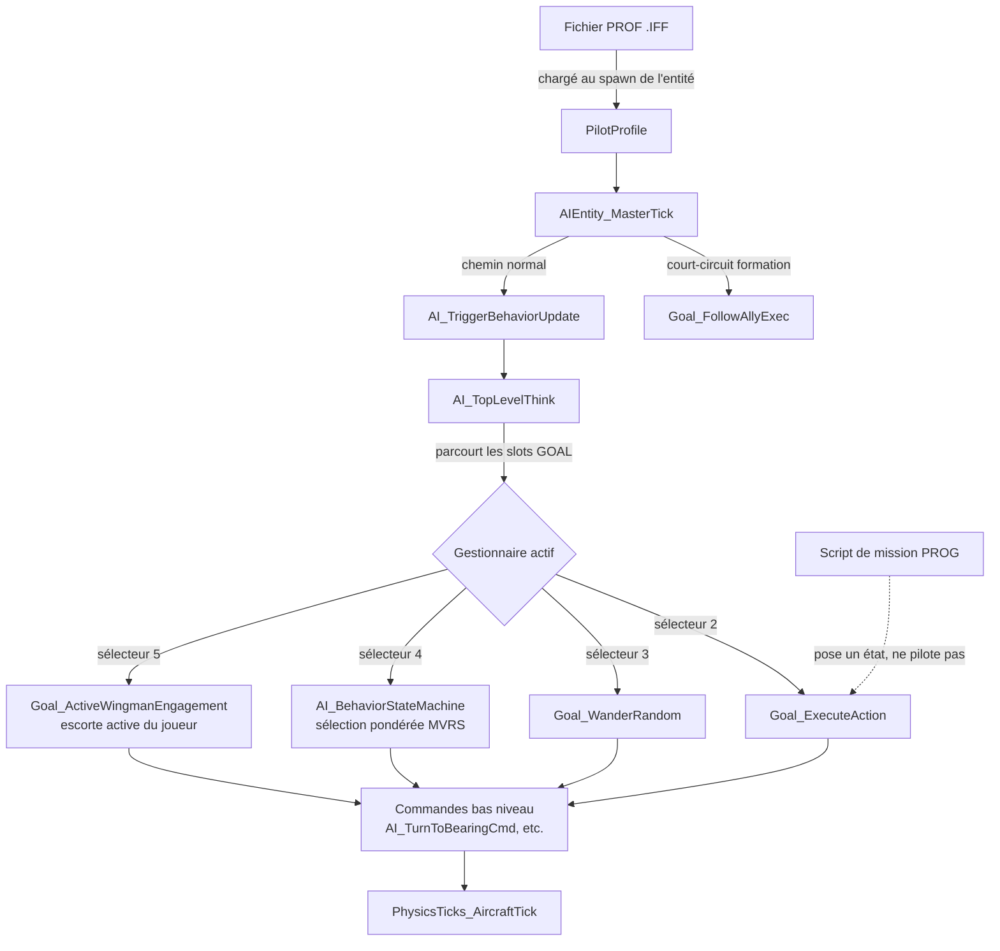

Le script de mission ne pilote jamais l'IA directement : il **pose un
état persistant** sur l'entité, que la boucle de tick vient consulter et
honorer à son propre rythme. C'est un découplage propre entre script et
exécution.

---

## 2. Format du fichier `PROF`

### 2.1 Format conteneur (IFF)

Standard IFF : chaque chunk = tag ASCII 4 octets + longueur 4 octets
**big-endian** + données (paddées à une longueur paire si besoin). `FORM`
est un chunk conteneur dont les 4 premiers octets de données sont un
type, suivi de sous-chunks.

### 2.2 Structure complète, confirmée par lecture du chargeur et
validation sur 7 fichiers PROF réels

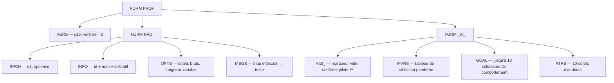

| Chunk | Contenu | Statut |
|---|---|---|
| `VERS` | `u16` big-endian, toujours `2` dans les 7 échantillons PROF | confirmé |
| `SPCH` | `u8` unique. **Optionnel** — absent dans certains fichiers (ex. un des deux fichiers cargo). Si présent et qu'une condition mémoire globale est remplie, déclenche le chargement d'un fichier `INTEL\SPEECH\*.PAK` | confirmé (lecture), hypothèse ouverte (rôle exact de la valeur) |
| `INFO` | `u16` id + chaîne C (nom) + chaîne C (indicatif) | confirmé |
| `OPTS` | Séquence de lettres minuscules ASCII, longueur 0 à 8+ selon fichier — **liste des questions/ordres qu'on peut poser à ce personnage par radio** (une lettre par option disponible) | confirmé (information de Rémi + consommateur tracé, voir §2.4) |
| `MSGS` | Suite de `(u8 index, chaîne C)` — répliques radio. Les index forment un **vocabulaire fixe partagé** dans tout le jeu (ex. l'index `0x11` correspond toujours à « missile entrant ! ») ; chaque fichier ne fournit que les répliques pertinentes pour ce personnage | confirmé |
| `AI\0_` | Chunk vide (longueur 0), marqueur de présence uniquement | confirmé |
| `MVRS` | Voir §3 | confirmé (structure et consommateur) |
| `GOAL` | Voir §4 | confirmé |
| `ATRB` | 10 octets **lus séquentiellement** dans le fichier — 9 correspondent à des statistiques nommées et documentées dans le manuel officiel du jeu (confirmé par Rémi), échelle 0-16 pour chacune. Le 10ᵉ octet reste sans nom connu (voir §2.3). Absent ou de mauvaise taille → défauts non-nuls appliqués par le moteur | confirmé, noms validés par le manuel |

### 2.3 Détail `ATRB` — statistiques nommées et ordre de lecture

**Confirmé par le manuel officiel du jeu** (fourni par Rémi) : les 9
premiers octets du chunk correspondent à des statistiques de
personnalité/compétence nommées, chacune sur une échelle de 0 à 16 :

| # | Code | Nom | Signification (0 → 16) |
|---|---|---|---|
| 0 | `TH` | Trigger Happy | prudent → dépensier (tire facilement) |
| 1 | `CN` | Confidence | s'effraie facilement → très difficile à effrayer |
| 2 | `VB` | Verbosity | ne parle jamais → parle beaucoup (radio) |
| 3 | `LY` | Loyalty | ne suit jamais les ordres → suit toujours les ordres |
| 4 | `FL` | Flying | aucune compétence → meilleure compétence |
| 5 | `AG` | Air-to-Ground | aucune compétence → meilleure compétence |
| 6 | `AA` | Air-to-Air | aucune compétence → meilleure compétence |
| 7 | `SM` | Showmanship | ne fait pas de démonstration → très démonstratif |
| 8 | `AR` | Aggressiveness | prudent → agressif |

**Validation empirique exacte** : les 9 valeurs décodées pour Billy
(`10,14,12,13,15,9,15,16,15`) correspondent **position par position,
sans exception**, à celles publiées dans le manuel du jeu pour
« Billy "Primetime" Parker ». Confirme que le chunk `ATRB` est lu dans
cet ordre exact, sans réarrangement, ce qui correspond à la lecture
directe confirmée dans `libRealSpace` (`ReadByte()` × 9, dans cet
ordre précis).

**Le 10ᵉ octet** (valeur `1` chez Billy) **n'a pas de nom dans cet
extrait du manuel** — soit une statistique non documentée dans la
page fournie, soit un octet réservé/de remplissage. Reste ouvert.

Le chargeur interne du jeu (`PilotProfile_LoadATRB_12E47`, seg010,
méthode de vtable) recopie ensuite ces 10 octets vers des offsets
**non séquentiels** dans la structure `PilotProfile` — un détail
d'implémentation interne à `STRIKE.EXE`, sans incidence sur la
compréhension du **format de fichier** lui-même :

| Octet fichier | Stat | Offset mémoire interne | Défaut si absent |
|---|---|---|---|
| 0 | `TH` | `+0x97` | 8 |
| 1 | `CN` | `+0x99` | 8 |
| 2 | `VB` | `+0x98` | 8 |
| 3 | `LY` | `+0x9A` | 8 |
| 4 | `FL` | `+0x96` | 10 |
| 5 | `AG` | `+0x9B` | 10 |
| 6 | `AA` | `+0x9C` | 10 |
| 7 | `SM` | `+0x9D` | 8 |
| 8 | `AR` | `+0x9E` | 8 |
| 9 | (sans nom) | `+0x9F` (**écrêté à un maximum de 3**) | 0 |

Les octets 4, 5, 6 (`FL`/`AG`/`AA`) sont dupliqués à `+0xA0`, `+0xA1`,
`+0xA2` (stockage miroir, motif identique au système « valeur
courante + valeur par défaut » qu'on retrouve ailleurs).

**Pour un port** : lire 10 octets séquentiels dans un tableau est
suffisant si l'ordre mémoire interne du jeu original n'a pas besoin
d'être reproduit à l'identique.

### 2.4 Détail `OPTS` — menu radio du personnage

Confirmé par information externe de Rémi puis vérifié en traçant le
consommateur dans le désassemblage : chaque lettre minuscule de `OPTS`
représente une **question ou un ordre** qu'on peut poser à ce personnage
par radio.

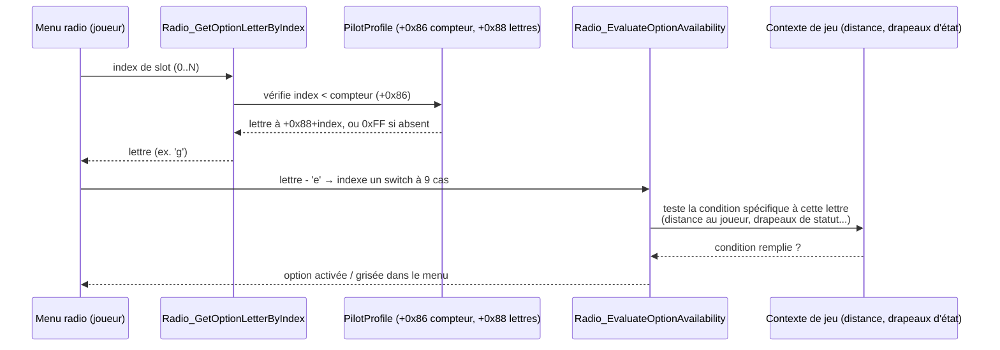

**Deux niveaux distincts** :

1. **Statique** (chargé depuis `PROF`) : `OPTS` liste les options que ce
   personnage *supporte en principe* — `Radio_GetOptionLetterByIndex_1F200`
   retourne la lettre à un index donné (ou `0xFF` si l'index dépasse le
   nombre d'options du personnage).
2. **Dynamique** (calculé à chaque interrogation) :
   `Radio_EvaluateOptionAvailability_1642C` prend cette lettre, calcule
   `lettre - 'e'` pour indexer un switch à 9 cas (lettres `e` à `m`), et
   détermine si cette option précise est **actuellement** posable —
   par exemple la lettre `f` (cas 1) calcule la distance 3D entre le
   joueur et l'entité et la compare à un seuil (`0x1388` = 5000, probable
   portée radio/visuelle) ; les lettres `g`/`h`/`k` vérifient des
   drapeaux d'état globaux (probable mode combat/verrouillage).

**Cohérence avec les fichiers réels** : Billy et Gwen (coéquipiers
actifs, §8) ont chacun 8 lettres (`dihgjklm`) — un menu radio riche.
Hammer (PNJ non-interactif) a un `OPTS` **vide** — aucune question
disponible, cohérent avec son statut non-interactif. Les pilotes de
cargo n'en ont qu'une poignée. Point non résolu : la lettre `d`,
présente chez Billy/Gwen, tombe **hors** de la plage gérée par ce switch
(`e`-`m`) — probablement traitée par un mécanisme séparé (option
« toujours disponible », par exemple un accusé de réception/salutation).

---

## 3. `MVRS` — système de sélection pondérée aléatoire

### 3.1 Structure mémoire réelle

**Correction importante** : contrairement à une première documentation,
il n'existe **pas** deux mécanismes séparés (« 8 champs fixes » +
« liste extensible »). C'est **un seul tableau contigu**, à pas de 5
octets, commençant à `PilotProfile+0x202` :

```
struct MvrsEntry {
    far_ptr  node;        // 4 octets — pointeur vers un OBJET (donnée), pas une
                           // fonction. Cet objet contient à son offset 0 une
                           // valeur qui sert ensuite à retrouver une table de
                           // fonctions (mécanisme non entièrement élucidé,
                           // voir §3.7) ; c'est SEULEMENT au moment de l'appel
                           // [vtable+4]/[vtable+8] qu'un vrai pointeur de
                           // fonction est atteint et invoqué.
    int8_t   raw_value;   // 1 octet  — valeur signée du fichier PROF
};                          // 5 octets par entrée

MvrsEntry table[N];  // N = entier stocké à PilotProfile+0x200
```

Les 8 premiers emplacements du tableau correspondent aux identifiants
que le moteur reconnaît nativement (voir §3.2) et sont **toujours**
construits par le chargeur, que le fichier les fournisse ou non. Tout
identifiant supplémentaire présent dans le fichier est ajouté à la suite
du même tableau (`PilotProfile+0x22A` et au-delà), et le compteur
`+0x200` (initialisé à 8) est incrémenté à chaque ajout.

### 3.2 Les 8 identifiants toujours construits, et leur champ de biais

Chaque identifiant, lors de la construction du nœud par défaut
(`PilotProfile_ResolveNamedPropertyNode_742FC`, switch à 21 cas
confirmé — une seule occurrence de ce switch dans tout le binaire,
recherche exhaustive effectuée), reçoit une valeur de « tag »
(`node[0]`) qui sert ensuite d'offset direct pour résoudre les
méthodes virtuelles de ce nœud, dans une table de descripteurs à
seg339 (19 emplacements valides sur 21 possibles, `ID=17`/`18`
pointant tous deux vers le cas par défaut — invalides).

**Mécanisme confirmé par lecture exhaustive de `PilotProfile_LoadFromPROF_73B4F`** :
ces 8 identifiants sont construits **une fois, de façon permanente et
inconditionnelle**, tôt dans le chargement — indépendamment du
contenu du tableau `MVRS` du fichier. Si le fichier liste **aussi**
l'un de ces 8 identifiants, sa valeur **ne crée pas** une nouvelle
entrée de tournoi — elle est interceptée par une chaîne de cas
spéciaux et stockée comme **biais de configuration** dans un champ
dédié sur le nœud déjà construit :

| ID (déc) | Tag du nœud | Champ de biais (si présent dans le fichier) |
|---|---|---|
| 4 | `0x264` | `+0x229` |
| 7 | `0x228` | `+0x21F` |
| 14 | `0x19C` | `+0x20B` |
| 15 | `0x188` | `+0x210` |
| 16 | `0x174` | `+0x215` |
| 19 | `0x160` | `+0x224` |
| 20 | `0x14C` | `+0x206` |
| 21 | `0x138` | `+0x21A` |

**Seuls les 13 identifiants restants** (`1,2,3,5,6,8,9,10,11,12,13`,
plus les 2 invalides `17`/`18` sans effet) passent par le **9ème et
dernier site d'appel** du constructeur — celui, dynamique, de la
boucle de lecture du tableau `MVRS` du fichier — pour créer de
véritables nouvelles entrées de tournoi. C'est pourquoi les fichiers
d'exemple (Billy, Stern, Hammer : jusqu'à 13 entrées ; Gwen : 10 ;
le cargo C-130 : seulement 3) ne listent jamais les 8 identifiants
fixes — ils n'ont pas besoin de l'être pour exister.

### 3.3 Pseudo-code complet du chargement — construction des nœuds et
lecture du fichier

Reconstitué à partir d'une lecture ligne à ligne de
`PilotProfile_LoadFromPROF_73B4F` (les adresses `+0x202` etc. sont
celles de la table unifiée du §3.1).

```c
void LoadMVRS(PilotProfile* p, FileReader* file) {

    // ── PHASE 1 : construction des 8 nœuds par défaut ──────────────────
    // Inconditionnelle — s'exécute que le fichier contienne MVRS ou non.
    // Les 8 identifiants sont des CONSTANTES CODÉES EN DUR dans le
    // programme, jamais lues depuis le fichier à ce stade. Le code est
    // entièrement déroulé (8 blocs identiques répétés), pas une boucle.

    static const uint8_t KNOWN_IDS[8] = {0x14, 0xE, 0xF, 0x10, 0x15, 0x7, 0x13, 0x4};
    static const int PRIMARY_OFFSET[8]   = {0x202, 0x207, 0x20C, 0x211, 0x216, 0x21B, 0x220, 0x225};
    static const int SECONDARY_OFFSET[8] = {0xC1,  0xC5,  0xC9,  0xCD,  0xD1,  0xD5,  0xD9,  0xBD};

    for (int i = 0; i < 8; i++) {
        FarPtr node = PilotProfile_ResolveNamedPropertyNode(p, KNOWN_IDS[i]);
        *(FarPtr*)(p + PRIMARY_OFFSET[i])   = node;   // pointeur, emplacement primaire
        *(FarPtr*)(p + SECONDARY_OFFSET[i]) = node;   // même pointeur, dupliqué
    }

    // ── PHASE 2 : remise à zéro des 8 valeurs brutes ────────────────────
    for (int i = 0; i < 8; i++) {
        *(uint8_t*)(p + RAW_VALUE_OFFSET[i]) = 0;   // +0x206, +0x20B, +0x210...
    }

    // ── PHASE 3 : validation de présence du chunk (non bloquante) ───────
    bool found = ResourceRecord_SeekAndRead(file, "MVRS", &chunk_buffer);
    if (!found) {
        ReportDiagnostic(0x8001);   // avertissement journalisé, PAS un abandon
    }
    // la suite s'exécute TOUJOURS, que le chunk ait été trouvé ou non
    // (si absent, chunk_length vaut 0 et la boucle ci-dessous ne fait rien)

    int entry_count = chunk_length / 2;    // nombre de paires (id, valeur) dans le fichier
    FarPtr write_cursor = p + 0x22A;        // curseur pour la liste extensible
    p->mvrs_total_count = 8;                 // compteur, démarre à 8 (les fixes)

    // ── PHASE 4 : lecture séquentielle des paires depuis LE FICHIER ─────
    for (int i = 0; i < entry_count; i++) {
        uint8_t id = ReadByte(file);          // lecture réelle depuis le fichier

        // comparaison SÉQUENTIELLE contre les 8 identifiants connus
        // (8 cmp/jnz en chaîne dans le désassemblage, pas une recherche
        // dans un tableau)
        int match = -1;
        for (int k = 0; k < 8; k++) {
            if (id == KNOWN_IDS[k]) { match = k; break; }
        }

        if (match >= 0) {
            // ID CONNU : écrase juste la valeur brute du nœud déjà construit
            uint8_t value = ReadByte(file);   // 2e lecture réelle depuis le fichier
            *(uint8_t*)(p + RAW_VALUE_OFFSET[match]) = value;
        } else {
            // ID INCONNU : construit un NOUVEAU nœud à la volée et
            // l'ajoute à la fin de la liste extensible
            FarPtr node = PilotProfile_ResolveNamedPropertyNode(p, id);
            *(FarPtr*)write_cursor = node;               // pointeur (4 octets)
            uint8_t value = ReadByte(file);               // 2e lecture réelle
            *(uint8_t*)(write_cursor + 4) = value;         // valeur (1 octet)

            write_cursor += 5;              // taille d'une entrée
            p->mvrs_total_count++;           // incrémente le compteur global
        }
    }
}
```

**Points clés** :

- Les 8 nœuds « natifs » existent **toujours**, avec des pointeurs
  valides, même si le fichier ne mentionne aucun `MVRS` — seule leur
  valeur brute reste à `0` (défaut) si le fichier ne les écrase pas.
- Le fichier n'est **lu réellement** qu'à partir de la phase 4 — tout ce
  qui précède (phases 1-2) n'utilise que des constantes du programme.
- Un identifiant du fichier qui correspond à l'un des 8 connus **ne
  construit pas de nouveau nœud** — il écrase seulement la valeur brute
  d'un nœud déjà existant. Un identifiant inconnu construit un nœud
  **complet** (pointeur + valeur) et l'ajoute à la fin de la liste.
- Une fois en mémoire, la distinction disparaît : `AI_BehaviorStateMachine`
  (§3.5) parcourt un seul tableau contigu, sans savoir quelles entrées
  étaient « fixes » et lesquelles ont été ajoutées dynamiquement.

### 3.4 Le nœud de propriété — ce qui est écrit, ce qui est lu

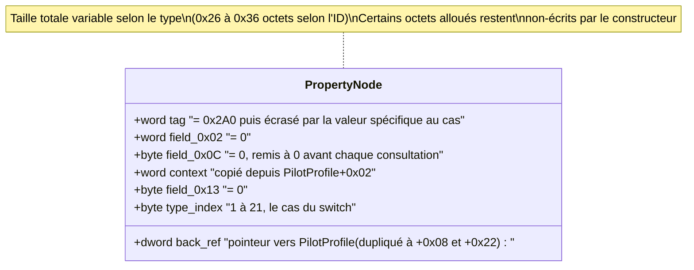

### 3.5 Le consommateur — `AI_BehaviorStateMachine` (gestionnaire `GOAL`
sélecteur 4)

**C'est la découverte centrale de cette investigation** : la fonction
`AI_BehaviorStateMachine_WeightedOptionSelector_9D05` (l'un des 4
gestionnaires sélectionnables par `GOAL`) parcourt l'**intégralité** du
tableau `MVRS` et réalise une sélection pondérée aléatoire.

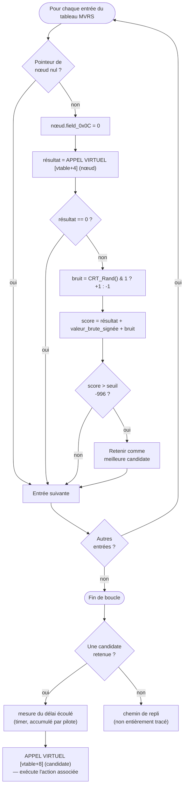

**Pseudo-code complet reconstitué :**

```c
// AI_BehaviorStateMachine_WeightedOptionSelector (gestionnaire GOAL, sélecteur 4)
// Mécanisme de TOURNOI confirmé precisement (vraie recherche du meilleur score) :
int AI_BehaviorStateMachine(Entity* entity) {
    PropertyNode* best = NULL;
    int best_score = -996;   // plancher de depart (0xFC18 signe) — tres bas,
                              // accepte quasiment n'importe quel candidat valide

    MvrsEntry* table = &entity->mvrs_table;  // base = PilotProfile+0x202
    int count = entity->mvrs_count;           // PilotProfile+0x200

    for (int i = 0; i < count; i++) {
        MvrsEntry* entry = &table[i];
        if (entry->node == NULL) continue;

        entry->node->field_0x0C = 0;
        int weight = call_virtual(entry->node, /*slot*/ 4);   // [vtable+4]
        if (weight == 0) continue;

        int noise = (rand() & 1) ? +1 : -1;
        int score = weight + entry->raw_value /* signé */ + noise;

        if (score > best_score) {           // le champion precedent perd son
            if (best != NULL) {              // drapeau "choisi" (field+2 = 0)
                best->field_0x02 = 0;
            }
            best_score = score;              // le seuil DEVIENT le nouveau
            best = entry->node;              // meilleur score : vrai argmax,
        }                                     // pas un seuil fixe
    }

    if (best != NULL) {
        int now = read_timer();                          // sub_27144
        int elapsed = now - last_sample_time;
        per_pilot_accumulator_table[pilot_id] += elapsed;  // word_704E6+0x5B56/+0x5B60

        call_virtual(best, /*slot*/ 8);   // [vtable+8] — applique/exécute l'option
        return 1;  // "j'ai agi ce tick"
    }

    // chemin de repli — non entièrement trace
    return fallback_behavior(entity);
}
```

**Interprétation** : chaque entrée `MVRS` représente une **option de
comportement/manœuvre candidate**. Son score de sélection combine :

1. un **poids de base calculé dynamiquement**, dépendant du type de
   l'option (méthode virtuelle `[vtable+4]` du nœud — **la même méthode**
   que celle consultée par `Entity_ProximityTest_ThreatGate` dans un
   contexte de balayage de cible, confirmant que `[vtable+4]` est un
   idiome générique de « score/poids » réutilisé à travers le moteur) ;
2. un **modificateur propre au pilote** — la valeur signée du fichier
   `PROF` ;
3. du **bruit aléatoire** (±1).

### 3.6 Autre consommateur confirmé : la boucle de balayage de cible

Indépendamment du mécanisme de sélection ci-dessus, le nœud de la
propriété `ID=20` (tag `0x14C`) spécifiquement est **aussi** consulté
pendant le balayage de nouvelle cible :

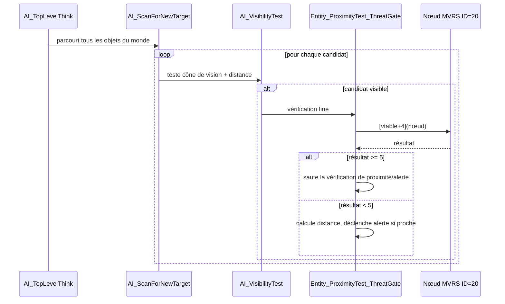

Cette même infrastructure (`AI_VisibilityTest`) est également invoquée
depuis du code d'évaluation de menace dans `seg008`, suggérant qu'elle
est **partagée** entre le balayage de cible de l'IA et la réaction aux
menaces entrantes (missiles).

**Point de méthode important** : pour un pilote donné, seuls les
identifiants **réellement présents dans son fichier `.IFF`** sont
pertinents pour le tableau `MVRS` dynamique — mais `ID=20` fait partie
des **8 identifiants toujours construits par défaut** (§3.2), donc ce
mécanisme s'applique à tous les pilotes IA indépendamment du contenu
de leur fichier.

**Point de méthode important (2)** : le mécanisme de sélection pondérée
du §3.5 ne se déclenche **pas à chaque tick inconditionnellement** —
uniquement lorsque la boucle `GOAL` (§4.2) atteint un emplacement
configuré avec le sélecteur `4`. Si le pilote n'a pas de `4` dans sa
liste `GOAL`, ou si un emplacement de priorité supérieure a déjà agi ce
tick, `MVRS` n'est jamais consulté. `GOAL` reste donc la structure de
contrôle de plus haut niveau ; `MVRS` n'est qu'un des 4 comportements
qu'un de ses emplacements peut déclencher.

### 3.6bis La classe complète du nœud enfin localisée — `ovr229`

**Découverte majeure** : en partant du constructeur générique
(`PilotProfile_NamedPropertyNode_Construct_755A0`) et en examinant tout
ce qui l'entoure dans son overlay, la **classe complète** a été
retrouvée. `ovr229` ne contient que **5 fonctions, 161 lignes au
total** — confirmant qu'un overlay VROOMM correspond ici précisément à
**un seul fichier source / une seule classe C++** :

| Fonction | Rôle |
|---|---|
| `PilotProfile_NamedPropertyNode_Construct_755A0` | Constructeur (déjà documenté, §3.3) |
| `NotifiableRef_AttachTarget_75612` | Copie des champs, appelle `[vtable+0x1C]` de la cible **si une condition est vraie** (argument `1`) |
| `NotifiableRef_DetachTarget_75661` | Variante inconditionnelle de la précédente (argument `0`), remet les champs à zéro |
| `NotifiableRef_SwapTarget_756A4` | Opération d'échange (lit puis écrit un champ de la cible) |
| `NotifiableRef_Destructor_756D5` | Vrai destructeur (convention Borland *ScalarDeletingDtor*) |

**Le vrai destructeur révèle le cycle de vie complet** : pose
`node[0]=0x2F8` (même tag temporaire que le constructeur), appelle
`WeakRef_InvalidateFar_3A432` (le pendant « libérer » de `SetReference`,
déjà documenté dans le registre de références faibles, `seg081`) pour
invalider la référence établie à la construction, puis — conditionnellement
— appelle `Memory_TypedFree_5C7B6` (tag `0x5C44`) pour libérer réellement
la mémoire. Cycle de vie C++ classique et complet.

**Connexion majeure, inattendue** : `NotifiableRef_DetachTarget_75661`
est appelée via `VROOMM_StubThunk_6AB54` — **le même thunk** qu'on avait
vu invoqué à plusieurs reprises dans `AIEntity_MasterTick_5ACC` et
`Entity_ProximityTest_ThreatGate_315B` pour « notifier la cible »,
**sans jamais avoir fait le lien avec la classe des nœuds `MVRS`**.
Ceci révèle que cette classe n'est **pas réservée aux nœuds de
propriété `MVRS`** — c'est une classe générique de **référence
notifiable**, réutilisée dans tout le système de suivi de cible de
l'IA.

**Un nouveau slot de vtable découvert** : `[vtable+0x1C]`, en plus des
`[vtable+4]`/`[vtable+8]` déjà identifiés (§3.4/§3.5) — confirme que la
classe a au moins ces trois méthodes virtuelles distinctes, sans
compter le destructeur.

**Méthode qui a permis cette découverte** (à retenir pour la suite) :
partir d'un point d'ancrage certain (ici, le constructeur) et lire
**tout l'overlay qui le contient**, plutôt que de chercher par nom de
fonction — les 4 fonctions sœurs portaient encore l'ancien nom erroné
`TargetTrackObject_*` d'un balayage rapide initial, jamais revérifiées
depuis la correction du constructeur lui-même.

### 3.6ter Le vrai constructeur/destructeur de l'entité IA trouvé —
un 4ᵉ slot de vtable, et la preuve que `MVRS` est vraiment possédé

En poursuivant la même méthode dans `ovr228` (l'overlay du
sélecteur d'identifiant `sub_742FC`), une zone de 30 fonctions
massivement mal nommée par le balayage rapide (« AircraftDamageModel »,
« AircraftDamageComponent[Family] ») s'est révélée être tout autre
chose : **le constructeur et le destructeur réels de l'entité IA
elle-même** — celle qui porte `goal_state` (`+0x11D`), le tableau
`GOAL` (`+0x1B0`) et le tableau `MVRS` (`+0x200`/`+0x202`), et dont la
vtable de classe contient `AIEntity_MasterTick_5ACC` en `+0xC`
(confirmé : la donnée `unk_6D1B8` utilisée par le constructeur — 8
octets à zéro — est physiquement suivie, en mémoire, par cette même
vtable de classe).

**`AIEntity_Construct_74B43`** (196 lignes) — hérite d'une classe de
base `WorldObjectA` (confirmé : premier appel à
`WorldObjectA_Method_ClearField2_738DA`), puis initialise notamment :

- `goal_state` (`+0x11D`) = **`0xFFFF`** — la valeur sentinelle
  « aucun objectif actif » d'une entité fraîchement construite, avant
  tout chargement `PROF`.
- Position par défaut (`+0x111/+0x115/+0x119`) = **(0, 0, 0x3E800)** —
  le même décalage d'altitude (1000 en virgule fixe 24.8) que celui
  trouvé dans `Goal_ActiveWingmanEngagement_878F` pour le
  positionnement de formation.
- `+0x200` (compteur `MVRS`) = 0, `+0x202` (premier pointeur `MVRS`) =
  0 — confirme que la table `MVRS` démarre **strictement vide**, avant
  que `PilotProfile_LoadFromPROF_73B4F` ne la peuple.
- Références faibles établies sur `+0x10F/+0x137/+0x145/+0x147` — les
  mêmes champs cible déjà rencontrés dans `Goal_IsComplete` et
  `Goal_ActiveWingmanEngagement_878F`.
- Trois nouvelles constantes non décodées : `+0x139=30000`,
  `+0x13D=512000`, `+0x141=64000`.
- Efface le premier emplacement `GOAL` (`+0x1B0`, 8 octets), et
  déballe/remballe des bits de statut sur `+0x28B/+0x28C` — exactement
  le même motif observé au tout début d'`AIEntity_MasterTick_5ACC`.

**`AIEntity_Destruct_74E1C`** (142 lignes) — la découverte la plus
importante de cette section :

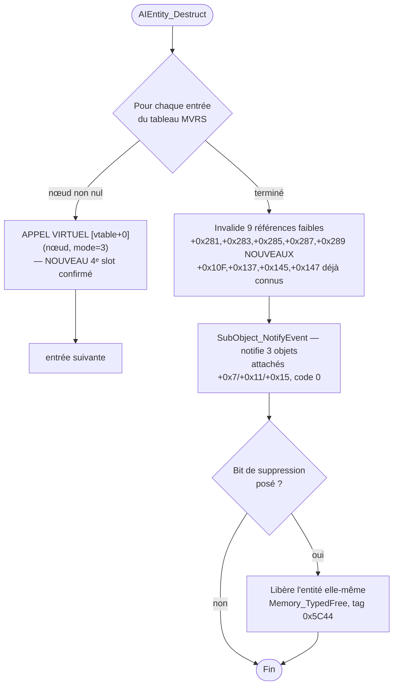

**Ce que ça prouve définitivement** : l'entité IA **possède** réellement
ses nœuds `MVRS` (pas de simples références partagées) — elle les
détruit un par un, en appelant sur chacun sa propre méthode virtuelle
`[vtable+0]` avec un argument `3` (mode de suppression). C'est le
**quatrième slot de vtable confirmé** sur cette classe de nœud, en plus
de `+4` (score, §3.5), `+8` (application, §3.5) et `+0x1C` (attacher/
détacher, §3.6bis) :

| Slot vtable | Rôle confirmé |
|---|---|
| `+0x00` | Destructeur par type (appelé en boucle par `AIEntity_Destruct_74E1C`) |
| `+0x04` | Calcul du score/poids (§3.5, `AI_BehaviorStateMachine`) |
| `+0x08` | Application/exécution de l'option choisie (§3.5) |
| `+0x1C` | Attacher/détacher (notification, §3.6bis) |

**Mise à jour** : ce mur a depuis été franchi (§3.7) — le corps de ces
méthodes n'est pas dans un pool dynamique introuvable, mais dans une
**table statique de vtables directement dans `seg339`**, une par type,
adressable dès que le tag est connu. Les 8 fonctions de score et le
destructeur générique ont été lues intégralement ; voir §3.7 pour le
détail complet et le tableau des 8 types.

### 3.6quater Troisième consommateur confirmé : la succession de leader
d'escadrille

`Escort_LeaderSuccession_C17A` (découvert en relisant intégralement
`seg006`) touche le nœud `MVRS` de deux façons distinctes dans son
propre switch interne :

- **Cas « leader mort/hors-jeu »** : calcule la distance à la cible
  d'escorte (via `[vtable+0x3C]` sur celle-ci, comme dans
  `MissionInit_LoadEntitiesAndPlayIntroCamera_7B035`), compare contre
  un seuil, puis appelle **`[vtable+8]` directement sur le nœud
  `ID=20`** (`+0xC1`) — même idiome de finalisation que
  `Entity_ProximityTest_ThreatGate` et `AI_BehaviorStateMachine`, dans
  un troisième contexte sans rapport direct avec les deux premiers.
- **Cas « re-vérification périodique »** : vérifie qu'un délai minimal
  s'est écoulé (60 unités, mêmes champs de temps que
  `AIEntity_MasterTick`) **avant** d'appeler
  `AI_BehaviorStateMachine_WeightedOptionSelector` — confirme un
  rate-limiting explicite de la sollicitation `MVRS` depuis ce point
  d'entrée spécifique.

**Bilan des consommateurs confirmés à ce jour** : `AI_BehaviorStateMachine`
(§3.5, via `GOAL` sélecteur 4), `Entity_ProximityTest_ThreatGate` (§3.6,
balayage de cible), et `Escort_LeaderSuccession` (ci-dessus, succession
de leader) — trois points d'entrée indépendants, tous consultant `[vtable+4]`
et/ou `[vtable+8]` sur les mêmes nœuds, confirmant que ce mécanisme est
un véritable **service partagé** dans le moteur, pas une fonctionnalité
isolée à un seul sous-système.

### 3.7 ⭐⭐⭐⭐⭐⭐⭐⭐⭐⭐ LE MUR FRANCHI — les fonctions de score et
d'application enfin localisées

Après plusieurs jours de recherche infructueuse (pool d'allocation
dynamique introuvable, overlays voisins écartés un par un), la clé
s'est révélée être une **erreur d'interprétation d'une instruction
assembleur** : l'appel `call dword ptr [bx+4]` (sans préfixe de
segment explicite) avait été supposé opérer dans le segment du nœud
lui-même — alors qu'en l'absence de préfixe, x86 utilise **`DS` par
défaut**, et `assume ds:seg339` s'applique dans tous les segments
concernés. **`node[0]` n'est donc pas un décalage dans un tas
dynamique : c'est un décalage statique direct dans `seg339`**, le
même segment de données global que celui contenant les vtables de
classe déjà croisées.

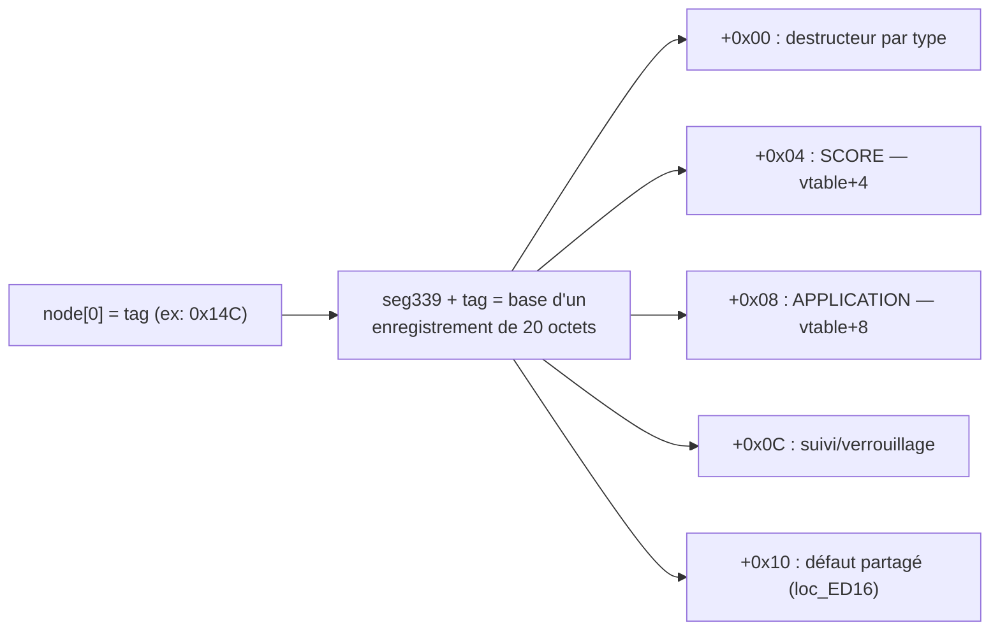

**Chaque type de propriété a son propre enregistrement de 20 octets
dans `seg339`, à l'offset exact indiqué par son tag.** Pas de pool
dynamique, pas de construction à la volée pour cette partie — une
vraie table statique de vtables miniatures, une par type, directement
adressable une fois le tag connu.

#### `ID=19` entièrement décodé — `MVRS_ID19_ScoreWeaponReadiness_77000` / `MVRS_ID19_ApplyWeaponTracking_7709A`

*(Tag `0x160`, distinct du nœud `ID=20`/tag `0x14C` discuté au §3.6 —
les deux avaient été mélangés sous une même étiquette hexadécimale
ambiguë dans une version antérieure de cette section, corrigé ici.)*

```c
// [vtable+4] — score
int Score(Node* node) {
    Entity* entity = node->back_ref;               // node+0x22
    Target* target = entity->field_283 ?: entity->field_137;
    Result* r = target ? target->vtable[0]() : NULL;

    if (entity->field_13 == 0 && r && r->field_11 == 2) {
        if (WeaponStationCheck(entity->field_104, 0xFC))
            return 5;
    }
    return 0;   // exclu du tournoi si 0
}

// [vtable+8] — application
void Apply(Node* node, arg) {
    if (node->field_C == 0) Score(node);            // réévalue si besoin
    GenericHelper(node, arg);
    node->field_26 = 0;
    node->field_D = 0x200;                            // mode "arme sélectionnée"

    Target* target = entity->field_283 ?: entity->field_137;
    SetReference(&node->field_27, target);             // cache la cible sur le nœud

    if (!target) {
        NotifiableRef_AttachTarget(node, arg);          // motif générique (ovr229)
    } else {
        SetReference(&node->field_29, NULL);
        node->field_34 = 0;
        node->field_30 = 100000;                        // minuteur de verrouillage
        node->vtable[0xC](arg);                          // démarre le suivi
    }
}
```

**Interprétation** : ce type de propriété représente « préparer/
sélectionner une arme contre la cible courante ». Score binaire (`0`
ou `5`) selon qu'un poste d'arme compatible est libre et qu'aucune
autre tâche n'occupe l'entité. Quand sélectionné, il met en cache la
cible sur le nœud et démarre un minuteur de verrouillage de 100 000
unités.

**Un cinquième slot de vtable confirmé** : `+0xC`, retrouvé
indépendamment dans `Escort_LeaderSuccession_C17A` — méthode
« démarrer le suivi/verrouillage », appelée uniquement quand une
cible est effectivement acquise.

#### Récapitulatif complet et corrigé des 19 identifiants `MVRS` valides

*Cette table remplace une version antérieure qui contenait un
décalage systématique d'attribution (chaque fonction lue avait été
associée au mauvais identifiant numérique). Chaque ligne ci-dessous a
été revérifiée par ancrage direct sur les étiquettes absolues de la
table `seg339` (méthode : les labels `off_6DXXX` d'IDA donnent
l'adresse absolue réelle de chaque emplacement, permettant de
recalculer précisément quel identifiant correspond à quelle fonction
— pas une déduction par proximité ou par ordre de lecture), puis
chaque fonction de score **et** d'application a été lue intégralement.*

| ID | Tag | Score — contenu réel | Application — contenu réel |
|---|---|---|---|
| 1 | `0x2B4` | Angulaire, base 5, gardes `byte_720C3`/`word_72093`, `sub_564A`/`sub_56E5` | Calcul géométrique complet (delta de position 3D via `[vtable+0x3C]`/`[vtable+0x4C]`, longueur via `sub_5828E`), pose `node+0x26=0/1`, **appelle directement l'application d'`ID=20`** (`entité+0x22→+0xC1→vtable+8`) (`loc_EEA0`) |
| 2 | `0x28C` | **Toujours 10** (`sub_EC22`, sert aussi de synchronisation de contexte partagée par tous les scores) | Rupture gauche/droite, pile ou face si ambigu (`loc_F2C8`) |
| 3 | `0x278` | Angulaire simple (pas de `sub_564A`/`sub_56E5`), ajustement `TH` `/4` | Minuteur générique `0x400` (`loc_F6C2`) |
| 4 | `0x264` | Angulaire étendu, double seuil de menace (`dword_720CD` vs deux seuils) | **Solution d'interception complète** : `Angle_DeltaNormalized_A`, pose bit0/1 de `entité+0x32`, écrit position anticipée dans `node+0x26/2A/2E` (`loc_FCE1`) |
| 5 | `0x250` | Sous-mode riche, fenêtre temporelle `dword_720D9`, lit `avion+0x8B` — **déclenche la séquence Immelmann/Split S à 8 phases** (`node+0x26=1` si `dword_72034` dépassé) | Minuteur `0x400`, amorce phase 1 (`loc_100B6`) |
| 6 | `0x23C` | Garde de portée capteur (`dword_7203D+0xFA000`), sous-mode différent (`node+0x26=2`) | Minuteur `0x500` seul — les phases vivent dans le suivi `loc_10673` |
| 7 | `0x228` | Base 1 (plancher), garde `flags_75` bit6/`TH`, pose bits `entité+0x32`, écrit position d'interception | Lit ces mêmes bits pour choisir le minuteur (`0x100`/`0x200`/`0x400` selon capteur) (`loc_10AF2`) |
| 8 | `0x214` | Renvoie 0 dans le chemin de score lu — **investigation incomplète, voir note ci-dessous** | Délégation triviale, aucun minuteur (`loc_1115D`) |
| 9 | `0x200` | Renvoie 0 dans le chemin de score lu — **investigation incomplète, voir note ci-dessous** | Délégation triviale pure (`loc_112F7`) |
| 10 | `0x1EC` | Renvoie 0 dans le chemin de score lu — **investigation incomplète, voir note ci-dessous** | Délégation triviale pure (`loc_1131D`) |
| 11 | `0x1D8` | Renvoie 0 dans le chemin de score lu — **investigation incomplète, voir note ci-dessous** | Délégation triviale pure (`loc_11343`) |
| 12 | `0x1C4` | Renvoie 0 dans le chemin de score lu — **investigation incomplète, voir note ci-dessous** | Délégation triviale pure (`loc_11369`) |
| 13 | `0x1B0` | Base 1, formule riche, utilise `dword_72039` ET `dword_7202C` — **déclenche la séquence Scissors/Rollaway à 5 phases** | Minuteur `0x400`, amorce phase 1 (`loc_1138F`) |
| 14 | `0x19C` | **Interception** — calcul trigonométrique complet (angle/distance, `imul`/`shrd`), pas juste binaire dans le principe mais le résultat final reste `0` ou `10` | `loc_11763` |
| 15 | `0x188` | **Détection de menace** — binaire, 0 ou 10 | — |
| 16 | `0x174` | **CORRIGÉ, lu intégralement** : `var_4` est initialisé à `0` en dur, rendant la branche de plafonnement `0x900` inatteignable — le résultat final ne dépend que d'un seul test (`TH < 12`) et la valeur retournée est en réalité **`0` ou `1`** (lecture d'un octet décalé, `[bp-3]`, pas `[bp-4]`) — **pas l'échelle continue `0x100`-`0x900` documentée précédemment** | Retour à la base (`loc_118C3`) |
| 19 | `0x160` | **Prêt à tirer** — lu intégralement : résout une cible via `entité+0x283` (référence prioritaire) sinon `entité+0x137` (cible de mission), vérifie son type (`==2`) via `[cible→vtable+0]`, **garde affinée : `node+0x13` doit être VIDE** (pas déjà de cible verrouillée sur ce nœud), puis contrôle le poste d'arme (`sub_40F92`, code `0xFC`) — retourne `0` ou `5` | Verrouillage/suivi de cible, minuteur ~390s (`sub_7709A`) |
| 20 | `0x14C` | **Toujours 0** — mais utilisé comme **outil géométrique partagé hors tournoi**, référencé en dur via `entité+0xC1`, consommé par `AI_ProximityGeometricWarning_315B` pour une alerte de proximité/collision, **et directement par l'application d'`ID=1`** | `loc_1195A` |
| 21 | `0x138` | Renvoie 0 dans le chemin de score lu (juste `sub_EC22` puis retour direct) — **investigation incomplète, voir note ci-dessous ; ce nœud a par ailleurs un rôle réel et confirmé hors tournoi, voir §4bis** | `loc_11AC4` (non détaillée cette session) |

`ID=17`/`18` : invalides, la table de saut du constructeur pointe les
deux vers le cas par défaut (aucun nœud construit).

**Sur les identifiants `8,9,10,11,12` (correction — voir note
méthodologique ci-dessous)** : dans le seul chemin lu jusqu'ici, chacun
appelle `sub_EC22` (donc écrit une copie de position dans
`node+0x15/0x19/0x1D`) puis renvoie 0 sans calcul supplémentaire ; la
boucle du tournoi (`AI_BehaviorStateMachine_WeightedOptionSelector_9D05`)
exclut structurellement toute entrée au score exactement nul avant même
le tirage aléatoire — **mais cette lecture est incomplète, pas une
conclusion définitive.** Une recherche de lecteur de l'écriture
`node+0x15/0x19/0x1D` n'a rien donné, ce qui — conformément à la règle
de méthode de ce projet (« si tu ne trouves pas le mécanisme, c'est que
tu cherches mal, pas qu'il n'existe pas ») — signale une recherche à
reprendre plutôt qu'une preuve d'absence. Rémi conteste explicitement la
conclusion « coquille vide / jamais implémenté » précédemment tirée
ici : ces identifiants restent à retracer avant toute affirmation sur
leur rôle réel (ou son absence). Vérifié sur les 4 fichiers d'échantillon
(fait, pas une interprétation) : Billy/Stern/Hammer listent les 13
entrées `1`-`13` (dont `8`-`12` à valeur `0` dans le fichier) ; Gwen
référence `1`-`7` puis `11,12,13` (sans `8,9,10`) ; le cargo C-130 n'a
que `3,4,13`.

### 3.8 Au-delà des 8 fixes — les identifiants « extensibles » décodés
sur un cas réel (Billy)

Les 8 types du §3.7 sont ceux **toujours construits par défaut**, mais
`sub_742FC` gère en réalité un switch à **21 cas** — un par identifiant
possible (1 à 21, moins 2 emplacements invalides à 17/18), vérifié par
recherche exhaustive (une seule occurrence de ce switch dans tout le
binaire). Le fichier de Billy utilise les identifiants `1` à `13` —
voir la table complète et corrigée au §3.7bis pour le détail de
chacun. Sur ces 13, **7 ont une vraie logique de score graduée**
(`1,2,3,4,5,6,7`), `13` a une formule riche et distincte (déclencheur
de la séquence Scissors/Rollaway), et les **5 suivants (`8` à `12`)
renvoient 0 dans le seul chemin de code lu jusqu'ici** — voir la note
de correction ci-dessous, ce dernier point n'est pas une conclusion
acquise.

**Note de correction (session ultérieure, sur désaccord explicite de
Rémi)** : une version antérieure de cette section concluait ici que
ces 5 identifiants (et `21`, voir §3.7) « n'ont jamais été réellement
implémentés », les qualifiant de coquilles vides structurellement
exclues du tournoi. **Cette conclusion est retirée.** Elle violait la
règle de méthode de ce projet (ne jamais conclure « pas implémenté »
sur la base d'une branche qui ne donne rien) et se trouve d'ailleurs
contredite ailleurs dans ce même document : le §4bis établit que le
nœud `ID=21` — pourtant classé ici « coquille vide » — a un rôle réel
et confirmé comme porteur générique de commande de navigation,
consommé directement par `AI_NavSolutionToPoint` en dehors du
mécanisme de tournoi. Rien ne garantit que `8`-`12` n'ont pas un usage
comparable, non trouvé faute d'avoir cherché au bon endroit. Vérifié
sur les 4 fichiers d'échantillon disponibles (fait, pas une
interprétation) : Billy/Stern/Hammer listent les 13 entrées
séquentiellement ; Gwen référence `1`-`7` puis `11,12,13` (sans
`8,9,10`) ; le cargo C-130 n'a que `3,4,13`. Cette observation élimine
l'hypothèse d'un gabarit d'outil généré aveuglément (qui produirait
les mêmes entrées pour tous) — la sélection semble délibérée, et sa
logique exacte (pourquoi Gwen garde `11`/`12` tout en abandonnant
`8,9,10`) reste à expliquer, probablement en retrouvant leur vrai
consommateur plutôt qu'en les supposant sans effet.

**Découverte complémentaire, valable pour TOUS les types** :
`sub_EC22` (appelée en première ligne par absolument toutes les
fonctions de score, et étant elle-même le score dédié d'`ID=2`)
copie une position de référence dans `node+0x15/0x19/0x1D` à chaque
appel — y compris pour les identifiants `8`-`12`. Le lecteur de cette
copie n'a pas encore été retrouvé — piste à reprendre, pas un point
fermé. La boucle du tournoi
(`AI_BehaviorStateMachine_WeightedOptionSelector_9D05`) exclut par
ailleurs explicitement toute entrée au score exactement nul avant le
tirage aléatoire et la comparaison avec le meilleur score courant.

**Trois précisions méthodologiques importantes** (retour d'expérience
Rémi, à conserver) :

1. **Un score à 0 ne veut pas dire « ce type ne fait rien »** — un
   score nul dans le mécanisme de *tournoi* signifie seulement que ce
   type ne peut pas gagner *ce* tournoi précis ; ça ne prouve rien sur
   une éventuelle consommation directe du nœud ailleurs dans le moteur
   (cf. `ID=20` et `ID=21`, tous deux à score nul mais avec un rôle
   réel confirmé hors tournoi, §3.6 et §4bis). Pour `8`-`12`, l'absence
   de lecteur trouvé pour leur écriture (`sub_EC22`) est à ce stade une
   recherche incomplète, pas une preuve d'inutilité — voir §3.8.
2. **L'angle de poursuite est un vrai calcul géométrique**, pas une
   notion abstraite — confirmé via `Targeting_ComputeBearingElevation_55B1A`
   (position propre vs position de la cible).
3. **Toute attribution ID↔fonction doit être vérifiée par ancrage sur
   les étiquettes absolues de la table `seg339`** (les labels
   `off_6DXXX` d'IDA donnent l'adresse réelle), jamais par proximité
   physique dans le fichier ni par une heuristique de corrélation
   indirecte — une vérification initiale par cette dernière méthode
   s'est révélée insuffisante et a nécessité une reprise complète.

### 3.9 Les fonctions d'APPLICATION — ce qui se passe quand un type
gagne le tournoi

Toutes les fonctions de score **et** d'application des identifiants
`1` à `13` ont été lues intégralement (voir §3.7bis pour la table
complète). Elles révèlent une **architecture à trois temps** :

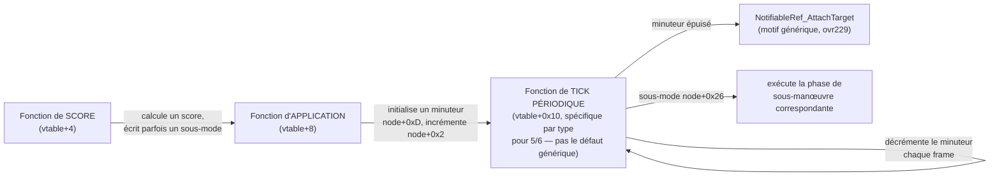

**Un vrai champ d'état partagé entre types différents** :
`entité+0x32` est un bitfield lu et écrit par plusieurs types `MVRS`
distincts, créant une chaîne de dépendance :

- `ID=4` (application, `loc_FCE1`) calcule un delta géométrique
  (`Angle_DeltaNormalized_A_4F95`) et **pose le bit 0** si le résultat
  est positif, écrit aussi une position anticipée dans `node+0x26/2A/2E`.
- `ID=7` (application, `loc_10AF2`) **lit ce même bit 0** pour choisir
  la durée de son propre minuteur (`0x100` si posé, `0x200` sinon), et
  teste aussi les bits 1 et 3 du même champ (posés par le score d'`ID=7`
  lui-même) pour décider d'appeler `sub_56E5` (capteur mis en cache).
- `ID=2` (application, `loc_F2C8`) calcule une **vraie décision de
  virage** (gauche/droite selon un offset latéral, avec un **pile ou
  face** — `CRT_Rand_70D` — comme départage si ambigu) et l'écrit
  dans `node+0x2E`.

**Séquence Immelmann/Split S à 8 phases — appartient à `ID=5`** (et
non `ID=6` comme documenté dans une version antérieure). Le score
d'`ID=5` (`loc_434E`) pose `node+0x26=1` quand `dword_72034`
(constante `NUMS`) est dépassé ; son application (`loc_100B6`) initie
un minuteur `0x400` et la phase 1 ; le tick périodique
(`loc_1011F`, lu intégralement) exécute les 8 phases — chaque phase
(`node+0x26`, 1 à 8) commande une attitude précise (tangage,
inclinaison, cap) via les mêmes contrôleurs bas niveau que la
navigation normale (`AI_TurnToBearingCmd`, `AI_TurnToHeadingCmd`,
`AI_PitchRollController_Heading`). Motifs reconnaissables : phases 0-2
correspondent à un Immelmann (tirer à cabrer, ajuster l'inclinaison,
rouler à plat puis ajuster le cap) ; phase 3 (inclinaison à 90°) est
cohérente avec le début d'un Split S. La phase 5 écrit directement
dans `entité+7+0x1F` — le même champ consommé aux côtés de l'entrée
souris du joueur dans `Player_MainUpdate` (§4bis).

**Séquence Scissors/Rollaway à 5 phases — appartient à `ID=13`** (et
non `ID=0xE` comme documenté précédemment). Le score d'`ID=13`
(`loc_4A99`) utilise à la fois `dword_72039` ET `dword_7202C` (les
deux constantes `NUMS` déjà associées à cette séquence) ; son
application (`loc_1138F`) initie un minuteur `0x400` et la phase 1.

**`ID=6` a sa propre séquence, distincte de celle d'`ID=5`** : son
score (`loc_45BE`) pose `node+0x26=2` (pas 1), son application
(`loc_1060A`, `loc_10673`) initie un minuteur `0x500` (pas `0x400`) —
les phases vivent entièrement dans la fonction de tick, pas encore
détaillées phase par phase.

**Ce qui reste ouvert** : le détail phase par phase du tick d'`ID=6`
(`loc_10673`), et la signification précise de `sub_4F95` au-delà de
son rôle de calcul d'angle déjà confirmé.

---

## 4. `GOAL` — sélection de comportement de haut niveau

### 4.1 Mécanisme de chargement

Chaque octet du chunk fichier (valeurs `2` à `5`, ou `1` pour un
emplacement vide) sélectionne un **pointeur de fonction** parmi 4,
depuis une table fixe du moteur :

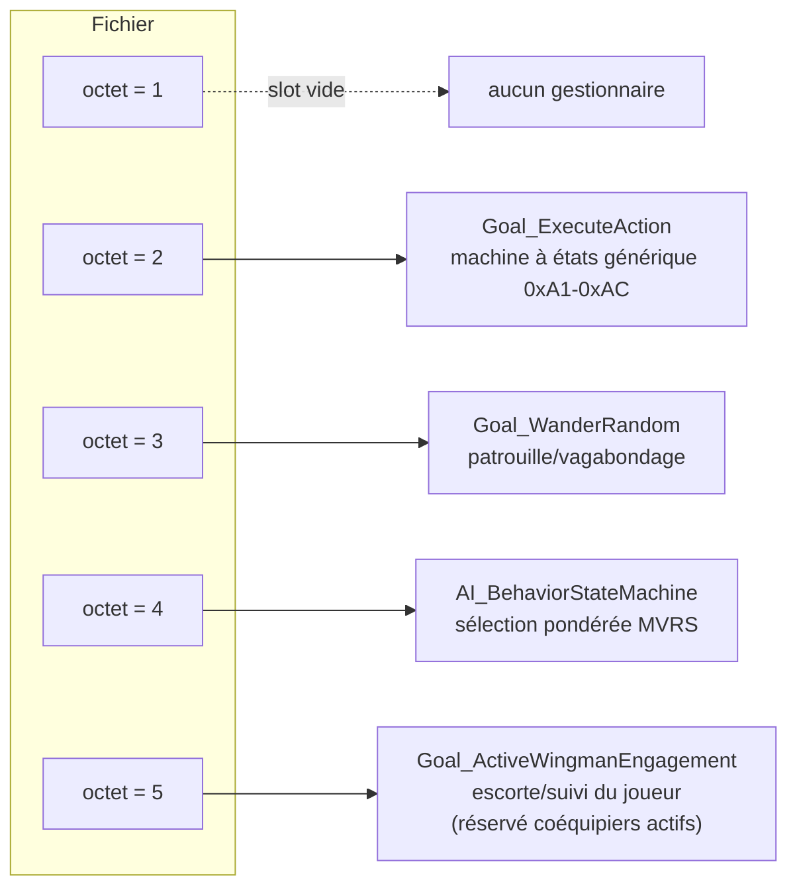

### 4.2 `AI_TopLevelThink` — réactions, objet en cours, puis objectifs

**CORRIGÉ (2026-09-19)** : la version précédente de cette section décrivait
`AI_TopLevelThink` comme une simple boucle sur les emplacements `GOAL`. La
lecture de la fonction (`seg004`, voir `AI_TICK_CALL_GRAPH.md` pour les
citations) montre que les objectifs viennent **en dernier**, après des
réactions prioritaires et un test d'objet en cours. Le cas spécial du
« drapeau générique sur l'aéronef lié » de l'ancienne version est en fait le
drapeau **« au sol »** (octet `+0x20` du sous-objet de l'avion, posé par
`PhysicsTicks`). Le milieu de la fonction (traitement des menaces, chaîne de
cibles `+0x287` / `+0x289`) n'est pas lu en détail.

```c
// pseudocode de la structure lue (ordre réel)
int AI_TopLevelThink(Entity* entity) {
    // 1. début
    if (byte_6E4D7 && entity->b0 >= 0xC) Targeting_AcquireBestThreat(entity, 0);
    AI_MessageDispatcher(entity);
    Radio_CombatChatterDispatch(entity);

    // 2. traitement des menaces, SAUTÉ si décollage/atterrissage (+0x11D = 0xA1/0xA2),
    //    avion au sol, ou word_70466 <= 3  (partie non lue en détail)

    // 3. réactions prioritaires, avant tout objectif
    int reacted = 0;
    if (entity->f281) {
        if (entity->obj0D == NULL && entity->f27F == 2)
            reacted = AI_EscortPriorityReactionHandler(entity);
        else
            AI_QueryTargetField4B(entity);
    }
    if (!reacted && entity->f27F <= 1)
        reacted = Formation_DamageReactionHandler(entity);
    if (reacted) return;                      // "protect self" passe avant "obey order"

    // 4. objet en cours : passe avant GOAL et tournoi (nature de l'objet non établie)
    if (entity->obj0D != NULL && entity->f27F != 0) {
        entity->obj0D->vtable[0xC](entity->obj0D);   // temps cumulé dans word_704E6+0x5B56
        return;
    }

    // 5. objectifs
    if (aircraft_on_ground(entity)) {         // [[[entité+0xB]]+0x20] != 0
        Goal_ExecuteAction(entity, 0);        // direct, tableau GOAL ignoré
    } else {
        for (int i = 0; entity->goal_slots[i].handler != NULL; i++) {   // entité+0x1B0, 8 octets
            if (entity->goal_slots[i].handler(entity, 0))               // premier qui répond non nul
                break;
        }
    }
    // 6. épilogue (+0x280, +0x10D, +0x28B bit2) : non interprété
}
```

Points établis :
- **Les gestionnaires sont alternatifs**, choisis par l'octet du fichier
  (2 `Goal_ExecuteAction`, 3 `Goal_WanderRandom`, 4 tournoi, 5
  `Goal_ActiveWingmanEngagement`) : ils ne s'enchaînent pas.
- **La valeur `1` du fichier n'occupe aucun emplacement** (abandonnée dans
  `PilotProfile_LoadFromPROF`) ; `GOAL=1` seul donne un tableau vide.
- **Au sol, `Goal_ExecuteAction` tourne quel que soit le tableau `GOAL`**,
  ce qui explique qu'un personnage avec `GOAL=1` seul décolle mais, une fois
  en vol, n'exécute plus rien.
- **Le gestionnaire est appelé avec `(entité, 0)`**, pas avec l'index de
  l'emplacement.

### 4.3 `Goal_ExecuteAction` — la machine à états générique (sélecteur 2)

Gère 11 codes d'état persistants (`0xA1` à `0xAC`, stockés à l'offset
`+0x11D` de l'entité), **confirmés identiques aux opcodes du langage de
script de mission** (voir §5) :

| Code | Signification (confirmée par la table d'opcodes externe) | Condition de complétion |
|---|---|---|
| `0xA1` | Décoller | Cible valide de type `0x11` présente |
| `0xA2` | Atterrir | Cible `+0x19 == 0x12` |
| `0xA4` | (voler vers point/zone) | Distance ≤ 128000 |
| `0xA7` | Détruire la cible | `target+0x137` devient non-nul |
| `0xA8` | Défendre la cible | Même test que `0xA7` |
| `0xA9` | Défendre une zone | Distance parcourue (delta de compteurs globaux) |
| `0xAA` | Suivre un allié | `target+0x145 == 0` (référence perdue) |
| `0xAC` | (immédiat) | Toujours complet |
| autre | — | Drapeau générique sur la cible référencée |

```c
int Goal_ExecuteAction(Entity* entity, int slot) {
    int state = entity->goal_state;  // +0x11D

    if (!Goal_IsComplete(entity, state)) {
        // execute l'action native associee a cet opcode
        MissionScript_CallNativeHandler(entity, state, /* operandes */);
        return 1;
    } else {
        // objectif atteint : avancer/effacer selon contexte
        return 0;
    }
}
```

### 4.4 `Goal_ActiveWingmanEngagement` — le gestionnaire du sélecteur `5`
(escorte active du joueur)

Entièrement tracé (393 lignes). Confirme précisément l'hypothèse
pressentie dès les premières corrélations empiriques sur les fichiers
`PROF` (§8) : ce gestionnaire est spécifiquement le comportement
« devenir/rester coéquipier actif du joueur ».

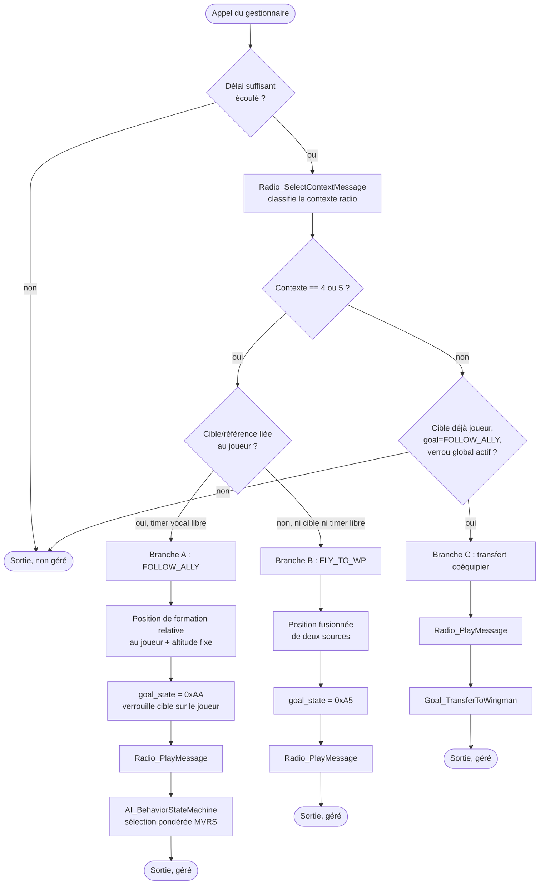

**Trois branches de comportement** :

- **(A) Escorte/suivi du joueur** — si le contexte radio est `4`/`5`,
  que la cible ou référence de l'entité pointe vers le joueur
  (`word_722E6`), et que le timer d'expression vocale n'est pas occupé :
  calcule une position de formation relative au joueur
  (`AI_ResolveNodePosition_54274`, décalage d'altitude fixe et décalage
  latéral), fixe `goal_state = 0xAA` (`OP_SET_OBJ_FOLLOW_ALLY`),
  **verrouille la référence cible directement sur le joueur**,
  déclenche un message radio, puis **délègue la décision finale à
  `AI_BehaviorStateMachine`** — confirme que le mécanisme de sélection
  pondérée `MVRS` (§3.5) intervient aussi dans le comportement
  d'escorte active, pas uniquement via le sélecteur `GOAL` `4`
  isolément.
- **(B) Repli vers un point de navigation** — si le contexte `4`/`5` est
  présent mais la condition de cible joueur n'est pas remplie : calcule
  une position différente (fusion de deux sources — probable
  interception/rendez-vous), fixe `goal_state = 0xA5`
  (`OP_SET_OBJ_FLY_TO_WP`), message radio.
- **(C) Transfert de coéquipier** — si le contexte radio n'est *pas*
  `4`/`5`, mais que la cible est déjà le joueur, l'état est déjà
  `FOLLOW_ALLY`, et qu'un verrou global (`byte_6E4CD`) est actif :
  déclenche un message radio distinct puis appelle
  **`Goal_TransferToWingman_C4FD`** (transmet l'état `GOAL`/cible/point
  de navigation vers une autre entité — passation d'escorte, par
  exemple si le coéquipier courant doit être remplacé).

**Ce que ça confirme architecturalement** : ce gestionnaire relie
ensemble le système radio contextuel, le verrouillage de cible sur le
joueur, la machine à états `GOAL`, et le mécanisme de sélection pondérée
`MVRS` en aval — c'est le point de jonction entre « qui peut être
coéquipier » (déterminé au chargement du fichier `PROF`, §8) et
« comment ce coéquipier se comporte concrètement » (délégué à
`AI_BehaviorStateMachine`).

---

## 4bis. Comment une décision se traduit en mouvement réel — chaîne
complète vérifiée

**Question posée et résolue dans cette session** : une fois que
`GOAL`/`MVRS` décident *quoi* faire (« aller à ce point de
navigation »...), comment ça se traduit en déplacement effectif de
l'avion ? Une première hypothèse (VM de script `COMP` partagée avec
la caméra) a été vérifiée puis **écartée** — la balise `COMP` n'existe
que dans le chargeur de caméra (`Cinematic_LoadCameraDef_23E7D`,
`seg041`), aucune trace côté `PROF`/avion. La bonne piste s'est
révélée être une **chaîne de guidage géométrique classique**,
entièrement tracée et vérifiée fonction par fonction :

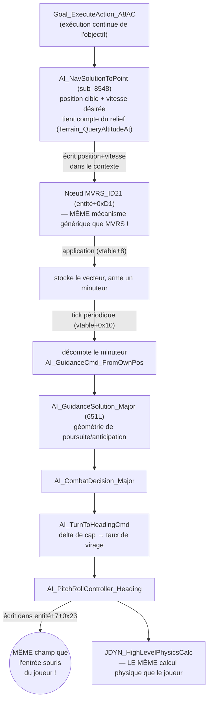

**Le point décisif** : `AI_PitchRollController_Heading` écrit son
résultat dans `entité+7+0x23` — **exactement le champ que
`Player_MainUpdate_13100` lit aux côtés de la valeur dérivée de la
souris du joueur**, dans la même comparaison. Ce n'est pas une
coïncidence d'offset : l'IA et le joueur alimentent le **même point
d'entrée**, avec des valeurs interchangeables, avant que le résultat
ne soit consommé par `JDYN_HighLevelPhysicsCalc` (`sub_4B09D`) — la
fonction de calcul physique de haut niveau du modèle de vol `JDYN`,
**partagée sans distinction entre avions pilotés par le joueur et par
l'IA**.

**Ce que ça confirme et infirme** :
- **Infirme** : pas de VM de mouvement séparée façon caméra scriptée,
  pas de téléportation qui contournerait la physique.
- **Confirme** : l'IA calcule un vrai **taux de virage** via une
  géométrie de poursuite complète (angle vers la cible, anticipation,
  normalisation d'angle ±180°), puis injecte ce résultat dans le
  **même pipeline physique aérodynamique** que les commandes du
  joueur — une architecture « pilote virtuel qui pousse le manche »,
  pas un raccourci.
- **Rôle du nœud `MVRS_ID21`** : le type qu'on avait classé
  « placeholder désactivé » (score toujours 0, jamais retenu par le
  tournoi) sert en réalité de **porteur générique de commande de
  navigation**, construit une fois par `PilotProfile_LoadFromPROF`
  (`push 15h` → `sub_742FC`, le même constructeur que tous les nœuds
  `MVRS`) et utilisé DIRECTEMENT (hors tournoi) par
  `AI_NavSolutionToPoint`. Confirme que le mécanisme générique de
  nœud (tag `0x5C44`) sert à la fois au scoring `MVRS` et au portage
  de commandes de navigation calculées à la volée.
- **`entité+0x139`** (rayon d'arrivée) et **`entité+0x141`** (vitesse
  de croisière), les deux dernières constantes du constructeur
  d'entité restées floues, sont maintenant pleinement expliquées :
  paramètres de navigation par entité, consommés directement par
  `AI_NavSolutionToPoint`.

**`AI_GuidanceSolution_Major` (651 lignes) lue intégralement** — le
maillon géométrique central de la chaîne, une vraie loi de guidage de
poursuite avec anticipation (proportional navigation/lead pursuit) :

- Calcule le delta d'angle entre deux vecteurs d'approche, avec
  gestion complète du wraparound ±180°.
- **Cas particulier angle divergent (>90°)** : bascule sur un calcul
  simplifié plutôt qu'un angle-entre-vecteurs direct, pour éviter les
  artefacts numériques sur des vecteurs presque opposés.
- **Garde de portée capteur** : si la cible est hors de portée de
  détection réelle (comparaison à `dword_7203D`), saute directement à
  un angle de correction maximal fixe (±166°) plutôt qu'un calcul fin.
- **Estimation du temps de virage basée sur la capacité de manœuvre
  propre de l'avion** (`[avion+0x67]`, le même champ que les
  séquences `MVRS_ID14b`) — un avion plus manœuvrant obtient une
  correction plus agressive.
- **Réoriente son propre vecteur d'entrée** en fonction de la
  distance à la cible (facteur cosinus × distance) avant de calculer
  le delta final.
- **Ne décide pas elle-même** : délègue en queue d'appel à
  `AI_CombatDecision_Major`, en lui passant le cap final calculé plus
  deux deltas intermédiaires — confirmant le triptyque complet
  géométrie → décision → exécution.

**Pour une réimplémentation fidèle** : plutôt que des points de
consigne (`target_climb`/`target_speed`) consommés par une physique
simplifiée pour les appareils IA, le jeu original calcule un delta de
cap via une vraie géométrie de guidage puis l'injecte dans le modèle
de vol complet, au même titre qu'une entrée manette. Le bit `flags_75`
bit 4 (`Aero_ComputeControlFlags75Bit5B`) reste un mécanisme réel mais
séparé — probablement un ajustement aérodynamique fin, pas le
mécanisme de navigation lui-même.


---

## 5. Lien avec le langage de script de mission

### 5.1 Vue d'ensemble de l'interpréteur

`MissionScript_ExecutePROG_51106` dispatche sur **209 valeurs d'opcode**
via une table de sauts indexée directement par la valeur brute de
l'octet d'opcode (pas de décalage). **119 des 209 valeurs (57 %)**
pointent vers le même gestionnaire par défaut (`loc_51C94` — avance à
l'opcode suivant ou termine le script) : il ne reste donc que **80
cibles réellement distinctes** à comprendre. Elles ont toutes été
décodées ligne par ligne.

Chaque instruction opère sur un « token » de 5 champs situé à `[di]`
(`di+6`, `di+8`, `di+0xA`, `di+0xC`, `di+0xE`, `di+0x12`...), avec un
« registre de travail » à `[di+0xC]`, un registre de résultat de
comparaison bit à bit à `[di+0x16]`, et un contexte de script partagé
(`[bp+var_2]`) donnant accès à deux tableaux bornés : un tableau de
« variables générales » (`[bx+0x48]`=taille, `[bx+0x4A]`=base) et un
banc fixe de 8 « registres gameflow » (`[bx+0xA1]`).

### 5.2 Table complète des 80 opcodes décodés — noms validés par
implémentation externe (`libRealSpace`)

Rémi a fourni la table d'opcodes qu'il utilise aujourd'hui dans son
port, validée par le jeu réel (à l'exception du cas `208`). Elle a
permis de **corriger plusieurs interprétations trop génériques** issues
de la seule lecture du désassemblage — notamment : ce que j'appelais
« tableau de variables générales » est en réalité un **tableau de
drapeaux (flags)**, et ce que j'appelais « registre accumulateur »
est le **registre de travail (work register)**.

| Opcode | Nom (validé `libRealSpace`, sauf mention contraire) | Rôle confirmé par le désassemblage |
|---|---|---|
| `0` | `OP_NOOP` | Aucune exécution — confirmé (tombe dans le gestionnaire par défaut) |
| `1` | `OP_EXIT_PROG` | Termine le script — *voir note ci-dessous : partage le même code que `0`* |
| `2` | `OP_EXEC_SUB_PROG` | **Vrai mécanisme d'appel de sous-programme** : vérifie une profondeur de pile d'exécution (max 16 niveaux), résout un sous-programme nommé (`Expr_LookupNamedValue_51E4A`), empile le contexte courant puis saute au début du sous-programme (`MissionScript_ExecSubProgram_51033`) |
| *(3)* | *(variante d'adressage de `OP_EXEC_SUB_PROG`)* | Même chemin de code que `2`, mais lit `[di+0xC]` — absent de la table `libRealSpace`, probablement un mode d'adressage alternatif du même opcode conceptuel |
| `8` | `OP_SET_LABEL` | Aucune exécution — confirmé (marqueur de saut, tombe dans le défaut) |
| `9` | `OP_SPOT_DATA` | Aucune exécution — confirmé (déclaration de donnée inline, tombe dans le défaut) |
| **`16`** | **`OP_MOVE_VALUE_TO_WORK_REGISTER`** | Charge une valeur immédiate dans `[di+0xC]` — *confirmé* |
| `17` | `OP_MOVE_FLAG_TO_WORK_REGISTER` | Lit `drapeau[idx]` (bornes vérifiées) → registre de travail |
| *(18)* | *(lecture+écriture de drapeau)* | Motif lecture-puis-écriture conditionnelle — pas d'entrée dédiée côté `libRealSpace` |
| *(19)* | *(variante de `16`)* | Lit `[di+0xE]` au lieu de `[di+8]` |
| **`20`** | **`OP_SAVE_VALUE_TO_GAMFLOW_REGISTER`** | Écrit dans l'un des 8 registres gameflow — *confirmé* |
| *(21)* | *(`OP_RANDOM`)* | `(rand() × valeur) / 0x8000` — pas d'entrée dédiée côté `libRealSpace` |
| *(32-45, sauf 35)* | *(famille ALU complète)* | ADD/SUB/OR/AND/XOR/MUL/DIV, variantes immédiat et drapeau — seule `35` est nommée côté `libRealSpace` |
| `35` | `OP_ADD_WORK_REGISTER_TO_FLAG` | `drapeau[idx] += registre_de_travail` — **corrige ma lecture initiale** (j'avais lu « `variable[idx] += idx` », l'opérande source est en réalité le registre de travail, pas l'index lui-même) |
| `46` | `OP_MUL_VALUE_WITH_WORK` | Registre de travail ×= immédiat |
| `64` | `OP_CMP_WORK_WITH_VALUE` | Compare(registre de travail, immédiat) |
| `65` | `OP_CMP_VALUE_WITH_WORK` | Compare(immédiat, registre de travail) — ordre inversé |
| *(66-68)* | *(variantes de comparaison drapeau/registre)* | Pas d'entrées dédiées côté `libRealSpace` |
| `69` | `OP_TEST_FLAG` | Compare `drapeau[idx]` à `1` — **corrige ma lecture** (« compare variable à la constante 1 » généralisait ce qui est en fait un test booléen dédié) |
| `70` | `OP_GOTO_IF_CURRENT_COMMAND_IN_PROGRESS` | Saut conditionnel sur `[di+0xE]` — **corrige ma lecture** : ce n'est pas un test de champ générique, c'est directement lié à l'état de complétion de l'objectif courant (`Goal_IsComplete`, §4.3) |
| *(71)* | *(saut si commande terminée)* | Symétrique de `70` |
| `72`/`73` | `OP_BRANCH_IF_EQUAL`/`_NOT_EQUAL` | Sauts sur le bit « égal » — confirmé |
| `74`/`75` | `OP_BRANCH_IF_LESS`/`_GREATER` | Sauts sur bit « inférieur »/« supérieur » — confirmé |
| *(76-78)* | *(sauts combinés ≤/≥, saut inconditionnel)* | Pas d'entrées dédiées côté `libRealSpace` |
| `79` | `OP_EXECUTE_CALL` | Appel natif (`sub_50FDB`) — confirmé |
| `80` | `OP_MOVE_WORK_REGISTER_TO_FLAG` | Écrit le registre de travail dans `drapeau[idx]` — confirmé |
| *(81)* | *(variante d'écriture drapeau)* | Pas d'entrée dédiée côté `libRealSpace` |
| `82`/`83` | `OP_SET_FLAG_TO_TRUE`/`_FALSE` | `drapeau[idx] = 1` / `= 0` — confirmé |
| *(84)* | *(bascule de drapeau, `^= 1`)* | Pas d'entrée dédiée côté `libRealSpace` |
| `85`/`86` | `OP_ADD_1_TO_FLAG`/`OP_REMOVE_1_TO_FLAG` | Incrémente/décrémente `drapeau[idx]` en place — confirmé |
| **`128`/`129`** | **`OP_ACTIVATE_SCENE`/`OP_DEACTIVATE_SCENE`** | Résout un nœud nommé et pose/efface son drapeau — **corrige ma lecture générique** (« set/clear drapeau de nœud ») : c'est spécifiquement l'activation/désactivation d'une **scène** (chunk `SCNE`, cf. `DATA_MODEL.md`) |
| *(130)* | *(test de scène active)* | Pas d'entrée dédiée côté `libRealSpace` |
| **`144`** | **`OP_ACTIVATE_OBJ`** | Résout un nœud puis appelle `GeomNode_BuildOrRefreshCluster_51EDC` — **confirme et précise** la découverte du spawn de formation : c'est l'activation d'un objet/formation, pas un « spawn cluster » générique |
| *(145)* | *(`Expr_Node_ClearDirtyAndNotify`)* | Pas d'entrée dédiée côté `libRealSpace` |
| **`146`** | **`OP_IF_TARGET_IN_AREA`** | Teste le bit 0 du champ `+0x39` d'un nœud résolu — **résout le sens exact** de ce bit de drapeau |
| **`147`** | **`OP_IS_TARGET_ALIVE`** | Teste le bit 1 du même champ `+0x39` — **résout le sens exact** de ce second bit |
| **`148`** | **`OP_INSTANT_DESTROY_TARGET`** | Appelle `Expr_Node_DetachChildAndRecompute_524EB` — **précise** que « détacher un nœud du graphe » est le mécanisme de destruction instantanée d'une cible |
| **`149`** | **`OP_DIST_TO_TARGET`** | Distance 3D vers la cible, /1000 — confirmé |
| *(150)* | *(calcul temporel, constante `0x8CA00`)* | Pas d'entrée dédiée côté `libRealSpace` |
| **`151`** | **`OP_DIST_TO_SPOT`** | Distance 3D vers un point nommé (« spot »), /1000 — confirmé, précise la cible du calcul (un `spot`, cf. `OP_SPOT_DATA` opcode `9`) |
| **`152`** | **`OP_IS_TARGET_ACTIVE`** | Teste le champ `+0x52` d'un nœud résolu — **résout le sens exact** de ce test |
| **`160`** | **`OP_SET_WAIT_FOR_SECONDS`** | Temporisation basée sur horloge globale (`dword_70458`) — confirmé, précise l'unité (secondes) |
| **`161`-`171`** | **`OP_SET_OBJ_TAKE_OFF`/`LAND`/`FLY_TO_WP`(165)/`FLY_TO_AREA`(166)/`DESTROY_TARGET`/`DEFEND_TARGET`/`DEFEND_AREA`/`FOLLOW_ALLY`/`SET_MESSAGE`(171)** | Toute la famille délègue à `MissionScript_CallNativeHandler_52513` — confirmé pour l'ensemble |
| *(178, 180, 177...)* | *(variantes `OP_SET_OBJ_*` supplémentaires)* | Suivent la même structure de code ; pas toutes nommées côté `libRealSpace` |
| **`190`** | **`OP_DEACTIVATE_OBJ`** | Appel natif conditionné à un bit de drapeau du nœud résolu — **précise** que c'est le symétrique de `OP_ACTIVATE_OBJ` (144) |
| *(192)* | *(`Expr_VM_OpcodeHelperA_53504`)* | Pas d'entrée dédiée côté `libRealSpace` |
| **`208`** | **`OP_SELECT_FLAG_208`** — comportement non identifié côté `libRealSpace` | **Résolu par cette analyse** : écrit `[di+8]` (un octet) dans la variable globale `byte_6D559` — un simple « écrire un octet dans un registre/drapeau global sélectionné », distinct du registre gameflow de l'opcode `20`. Reste à déterminer le rôle exact de `byte_6D559` en jeu, mais le **mécanisme** est maintenant connu avec certitude. |

**Note sur les opcodes `0`/`1`** : le désassemblage montre que `0` et `1`
empruntent exactement le **même chemin de code** (`loc_51143` : dépile
une valeur via `Expr_VM_PopValue_51096`, puis tombe dans le gestionnaire
par défaut). Si `libRealSpace` les distingue fonctionnellement
(`NOOP` vs `EXIT_PROG`), soit la distinction se fait **en dehors** de
cette fonction (dans le code appelant, sur la valeur de retour), soit
il existe une nuance non capturée par cette lecture — point à
vérifier si la distinction s'avère importante en pratique.

**Bilan du croisement** : sur les entrées de la table `libRealSpace`
correspondant à une cible réellement distincte dans le désassemblage
(hors `3`, `18`, `19`, `21`, etc. qui semblent être des variantes
d'adressage non nommées séparément), **toutes les correspondances
concordent** avec le comportement observé dans le code — aucune
contradiction trouvée, seulement des précisions bienvenues sur des
noms que j'avais dû garder génériques faute de contexte externe.

### 5.3 Correspondance confirmée avec les codes d'état `GOAL`

Les 11 codes d'état gérés par `Goal_ExecuteAction` (`0xA1`-`0xAC`) sont
**les mêmes valeurs numériques** que les opcodes ci-dessus. Tous
convergent vers un point commun (`loc_51C09`) qui empile opcode +
opérandes + cible et appelle `MissionScript_CallNativeHandler_52513`.

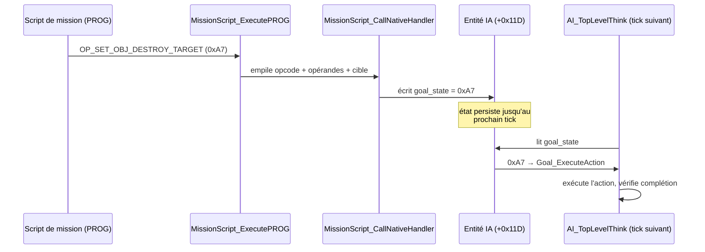

Le §5.2 ci-dessus est désormais **entièrement mis à jour avec la table
de référence `libRealSpace`** de Rémi (validée par le jeu réel, à
l'exception du cas `208` résolu par cette analyse). Les entrées entre
parenthèses sont des opcodes déduits du seul désassemblage, sans nom
officiel côté `libRealSpace`.

**Le script de mission ne pilote jamais l'IA en synchrone** — il pose un
état, la boucle de tick le consulte et l'honore à son propre rythme.

---

## 6. Le tick maître par entité — `AIEntity_MasterTick`

Point d'entrée racine, appelé une fois par entité par frame (méthode de
vtable `+0xC` de la classe avion/pilote — jamais documentée avant cette
investigation, malgré une couverture « 100 % » du fichier qui ne
couvrait en réalité que les blocs `proc` explicites).

**Conséquence importante, vérifiée directement dans le code (question
de Rémi)** : le tournoi `MVRS` (§3.5) remet le score de chaque entrée
à zéro et le recalcule **sans aucune condition temporelle** à chaque
appel (`mov byte ptr es:[bx+0Ch], 0` puis `call [vtable+4]`, dans la
boucle principale de `AI_BehaviorStateMachine`) — aucun accumulateur
de `dt`, aucun cooldown. Comme le tick est cadencé sur le framerate,
**la fréquence de décision de l'IA (et donc le nombre de jets
aléatoires par seconde réelle — bruit du tournoi via `CRT_Rand`, test
de compétence « 3d6 » dans `AI_ManeuverSolution_Major_6977`) scale
directement avec le framerate**, contrairement à la physique qui est
correctement synchronisée sur le temps réel. Un pilote de faible
compétence sur une machine rapide obtiendrait statistiquement plus de
tentatives par seconde qu'un pilote expert sur une machine lente — un
couplage logique/affichage non protégé, plausible pour un moteur de
1993.

```c
void AIEntity_MasterTick(Entity* entity) {
    unpack_status_flags(entity);  // +0x28C / +0x28D

    // seuils globaux de menace/proximite, partages avec d'autres
    // fonctions de decision (ex. AI_EvadeOrPursueSelector)
    dword_7203D = RangeTest(entity) + SecondaryAngleSensor(entity);
    dword_72039 = weighted_cosine(entity);

    update_heading_tracking(entity);
    entity->hud_airbrake_flag = entity->aircraft->flags_75.bit0;

    int threat_score = compute_threat_score(entity);
    if (entity->aircraft->flags_75.bit6) {
        threat_score = adjust(threat_score);  // division ou doublement selon contexte
    }
    threat_score *= 2;
    word_6D3BC = threat_score;

    if (entity->aircraft->flags_75.bit5 && entity->status.bit3) {
        Goal_FollowAllyExec(entity);   // court-circuit : mode formation
    } else {
        AI_TriggerBehaviorUpdate(entity);  // chemin normal
    }
}
```

---

## 6ter. `ATRB` retrouvé — la vraie copie vit à `entité+0xB0`, pas
`entité+0x96`

*Correction majeure suite à une session de travail avec Rémi. La
recherche précédente (ci-dessous conservée pour mémoire) cherchait
exclusivement autour d'`entité+0x96`-`+0x9E` — la zone où `ATRB` est
**chargé depuis le fichier**. Mais cette zone n'est qu'un tampon de
chargement : la copie réellement **consommée par la logique de
décision** vit ailleurs, à `entité+0xB0`.*

**Le fil qui a mené à la découverte** : en lisant `MVRS_ID7` en
détail avec Rémi, une fonction voisine hors-tournoi (`loc_3FCB`)
appelait une fonction utilitaire différente de celle utilisée par
`ID=7`. Les deux fonctions se sont révélées être une **famille de
jets de compétence** :

```asm
; motif commun, ex. sub_8C1E (entite+0xB0) :
mov al, es:[bx+0B0h]      ; lit un octet a un offset fixe sur l'entite
cbw
add ax, [bp+arg_4]         ; + un modificateur passe en parametre
call sub_70D                ; CRT_Rand
and ax, 0Fh
inc ax                       ; jet aleatoire 1-16
cmp ax, [resultat precedent]
jg ...                        ; si jet > (stat + modificateur) : echec
mov ax, 1                     ; sinon : reussite
```

**L'échelle du jet (1-16) correspond exactement à l'échelle
documentée d'`ATRB` (0-16)** — et il n'existe nulle part ailleurs
dans le binaire une autre valeur suivant cette échelle précise.
Recherche exhaustive de cette famille de fonctions (même motif,
offset variable) :

| Offset | Trait `ATRB` (ordre du fichier) | Confirmé par |
|---|---|---|
| `entité+0xB0` | `TH` (Trigger Happy) | `sub_8C1E`, jet de compétence appelé par `MVRS_ID7` (modificateur `-7`) |
| `entité+0xB1` | `CN` (Confidence) | `sub_8CA2`, jet de compétence, appelée depuis `sub_9027` |
| `entité+0xB2` | `VB` (Verbosity) | **`Radio_CanPlayMessage_CC7A`** — lue intégralement plus tôt dans cette session, le lien avec `ATRB` était resté non démontré à l'époque ; confirmé maintenant |
| `entité+0xB3` | `LY` (Loyalty) | `Radio_SelectContextMessage_CD4A` — compare `LY` à des paliers (`3`, `6`, `0xC`...) pour choisir un registre de message contextuel |
| `entité+0xB4` | `FL` (Flying) | `AI_MessageDispatcher_C5CD` — compare `FL > 14` comme condition de branche |
| `entité+0xB5` | `AG` (Air-to-Ground) | jet de compétence (motif identique, `sub_776FB`, voisine de la zone `MVRS_ID19`) |
| `entité+0xB6` | `AA` (Air-to-Air) | `sub_8CCE`, **appelée depuis `AI_BehaviorStateMachine_WeightedOptionSelector_9D05` elle-même** (le tournoi) — comparaison par division, pas un simple jet |
| `entité+0xB7` | `SM` (Showmanship) | `sub_8C4A`, jet de compétence, appelée par `loc_3FCB` (la fonction jumelle hors-tournoi qui a lancé cette investigation) |
| `entité+0xB8` | `AR` (Aggressiveness) | jet de compétence (motif identique, appelée depuis `seg004`) |

**Les 9 offsets existent sans trou**, de `+0xB0` à `+0xB8`, chacun
avec au moins un site de consommation réel confirmé — certains par un
simple jet de compétence (comparaison à un jet aléatoire 1-16), un
par comparaison directe à un seuil, un par division. Deux points
notables :

1. **Le mécanisme de remise à l'échelle par difficulté** (`FL`/`AG`/`AA`
   via `+0xA0`-`+0xA2`, documenté ci-dessous) copie depuis le tampon
   de chargement (`+0x96`-`+0x9E`) — reste valide et distinct de cette
   nouvelle copie à `+0xB0`. Il existe donc **deux copies** d'`ATRB`
   sur l'entité : une de chargement/réglage (`+0x96`), une de
   consommation directe par la logique de décision (`+0xB0`) — leur
   lien exact (laquelle alimente laquelle, à quel moment) n'a pas
   encore été tracé.
2. **Correction à propager** : plusieurs fonctions de score `MVRS`
   documentées dans cette session (`ID=3`, `6`, `7`, `13`, `16`) lisent
   `avion+0xB0` et ont été qualifiées de « garde carburant/ressource »
   — cette lecture est probablement **fausse**. `avion+0xB0` est très
   vraisemblablement `TH` (Trigger Happy), pas du carburant. Les
   sections concernées de ce document n'ont pas encore été corrigées
   en conséquence — à faire dans une passe dédiée.

---

### Ancienne recherche (conservée pour mémoire — cherchait au mauvais
endroit)

*Question de Rémi : quels traits `ATRB` sont réellement consommés par
une fonction de décision, au-delà de leur simple présence dans le
format de fichier ?*

**Deux faiblesses méthodologiques identifiées et corrigées en cours
de route** (relevées par Rémi) :
1. Une première passe lisait seulement une fenêtre de 10-40 lignes
   autour du point trouvé — insuffisant si la valeur n'est réellement
   utilisée que plus loin dans une fonction longue (`sub_1450B`, 195
   lignes ; `sub_76325`/`sub_80971`/`sub_8285A`, 190-219 lignes
   chacune) : la lecture a été refaite en couvrant l'intégralité de
   chaque fonction candidate, pas une fenêtre.
2. S'appuyer sur le nom déjà présent dans `function_index.json` comme
   signal de corroboration est circulaire — ces noms viennent souvent
   d'un balayage rapide, jamais vérifié en profondeur.

**Résultat de cette ancienne recherche (autour d'`entité+0x96`-`0x9E`
uniquement) : aucun usage trouvé pour `TH`, `CN`, `VB`, `LY`, `SM`,
`AR`.** Ce résultat n'est pas faux en soi — il est simplement **hors
sujet** : ces six traits sont bien consommés, mais à un autre offset
(`+0xB0`-`+0xB8`, voir ci-dessus) que celui cherché à l'époque. La
leçon méthodologique reste valable : une recherche rigoureuse qui ne
trouve rien doit faire douter de l'endroit cherché, pas conclure à
l'absence d'usage — exactement ce que Rémi a rappelé au moment de
relancer cette investigation.

**Usage réel confirmé — `FL`/`AG`/`AA`, remise à l'échelle par
difficulté (reste valide, distinct de la copie `+0xB0`) :**

`PilotProfile_RescaleSkillByDifficulty_12FC9` (25 lignes, lue
intégralement) relit le cache dupliqué de `FL`/`AG`/`AA`
(`+0xA0`/`+0xA1`/`+0xA2`, posé par `PilotProfile_LoadATRB_12E47`),
applique un décalage à droite par `word_7235F` — comparé à `1` et `2`
ailleurs dans le code, vraisemblablement un **niveau de difficulté**
— et réécrit le résultat dans les champs originaux. Appelée depuis
`Cockpit_ReadControlsFrame_8F720`.

---

## 6bis. Le système RWR — avertir en cas de danger, et le limiteur de
fréquence radio générique

*Section ajoutée en réponse à une question de Rémi : « comment l'IA
répond-elle à un message radio, se vante d'un exploit, avertit en cas
de danger ? » Les deux fonctions suivantes ont été lues intégralement
pour y répondre avec certitude plutôt que par extrapolation.*

**`AI_MissileThreatTrigger_A` (`sub_50FF`, 169 lignes) — le vrai
mécanisme d'alerte de danger, entièrement décodé :**

- Calcule un **ratio de menace** via deux sommes sur une liste
  d'enregistrements (`Roster_SumAttributeB × 100 / Roster_SumAttributeA`)
  — vraisemblablement un pourcentage de verrouillage/poursuite actif.
  Si > 80%, ou si la cible entre dans la portée du seuil capteur
  (`dword_7203D`), l'alerte se déclenche.
- **Point capital** : l'alerte radio ne se déclenche **que si la
  menace correspond spécifiquement au joueur** (comparaison directe
  d'un champ identifiant contre `word_722E6`, la référence globale du
  joueur) — ce n'est pas un avertissement générique pour n'importe
  quelle IA sous la menace.
- **Deux sous-types d'alerte** selon un champ de l'objet menaçant
  résolu : missile en approche (met à jour un indicateur visuel HUD
  en plus de l'alerte sonore, code `9`) vs verrouillage radar simple
  (alerte sonore seule, code `0xA`) — le classique RWR à deux
  niveaux.
- Pose systématiquement `flags_75` bit5 sur l'avion lié en cas
  d'alerte de type missile — le même bit documenté ailleurs comme lié
  à la formation (§7). Réutilisation multi-contexte probable, ou lien
  réel (rompre la formation en réaction à une menace serait
  cohérent) — non tranché avec certitude.

**`Radio_CanPlayMessage` (`sub_CC7A`, 104 lignes) — le limiteur de
fréquence générique, confirmé et précisé :**

- Calcule le temps écoulé depuis le dernier message, module le seuil
  d'attente par le trait de bavardage (`ATRB.VB`, offset `+0xB2`) —
  plus bavard, seuil plus bas, peut reparler plus vite.
- Table de 6 catégories de message avec seuil par défaut (16) si la
  catégorie n'est pas reconnue.
- **Répéter le même code de message qu'au dernier appel REND la
  répétition plus difficile** (réduit la valeur effective de 3), pas
  plus facile — évite qu'une IA martèle le même message en boucle.
- Sorties immédiates (toujours autorisé) si la valeur effective tombe
  à 0, ou dans un état spécifique (`entité+0x149==2`).

**Ce que ça répond à la question d'origine :**
1. *Avertir en cas de danger* — oui, un vrai mécanisme existe
   (`AI_MissileThreatTrigger_A`), mais spécifiquement pour des
   menaces missile/radar verrouillées sur le joueur, passant par
   `Radio_CanPlayMessage` comme limiteur de fréquence commun à tout
   le système radio.
2. *Répondre à un message radio* — couvert par `AI_MessageDispatcher`
   et `Radio_EvaluateOptionAvailability` (§2.4), déjà documentés.
3. *Se vanter d'un exploit* — **aucune fonction trouvée dans le
   binaire ne relie une destruction de cible à un déclenchement
   radio de vantardise.** Recherche explicite effectuée (mots-clés
   kill/victoire/abattu/exploit) sans résultat — ce comportement n'a
   pas été localisé dans le désassemblage à ce jour, à ne pas
   implémenter sans nouvelle piste concrète.

---

## 7. `flags_75` — récapitulatif des bits confirmés

Offset `+0x75` de l'objet **avion** (distinct de l'objet pilote/IA,
référencé depuis celui-ci via `+0xB`) :

| Bit | Rôle |
|---|---|
| 0 | Aérofrein déployé |
| 1 | Volets déployés |
| 2 | Train d'atterrissage sorti |
| 5 | Sous contrôle formation/escorte — gate le court-circuit du tick maître et la disponibilité de la réflexion IA |
| 6 | Modulateur du score de menace (`word_6D3BC`) dans le tick maître |

---

## 8. Validation empirique — 7 fichiers réels comparés

| | Billy | Hammer | Gwen | Gwen-en-cargo | Cargo A | Cargo B | **Stern** |
|---|---|---|---|---|---|---|---|
| Rôle | Coéquipier actif | PNJ non-interactif | Coéquipière active | (voir note) | Transport | Transport | **Commandant d'escadrille** |
| Indicatif | Primetime | Orca | Phoenix | Phoenix | Cargo | Whale | **Hawk** |
| `GOAL` | `[5,2,1,4,3]` | `[2,1,4,3]` | `[5,2,1,4,3]` | `[2]` | `[2,1,4,3]` | `[2,1,4,3]` | **`[5,2,1,4,3]`** |
| Sélecteur `5` présent | oui | non | oui | non | non | non | **oui** |
| `MVRS` (entrées) | 13 (ID 1-13, tout à 0) | 13 (ID 1-13, tout à 0) | 10 (ID 1-7,B,C,D) | 3 (ID 3,4,D) | 3 (ID 3,4,D) | 3 (ID 3,4,D) | **13 (ID 1-13, tout à 0)** |
| `MVRS` valeur remarquable | — | — | — | `ID=3 → -2` | `ID=3 → -2` | `ID=3 → -2` | **—** |
| `ATRB` | `[10,14,12,13,15,9,15,16,15,1]` | `[10,16,16,10,15,12,15,8,16,0]` | `[8,14,14,12,10,14,12,9,12,1]` | `[0,5,10,10,0,0,0,0,0,0]` | `[0,5,10,10,0,0,0,0,0,0]` | `[0,5,10,10,0,0,0,0,0,0]` | **`[2,16,6,16,15,15,15,6,13,1]`** |
| `ATRB` zéros | 0/10 | 1/10 | 0/10 | 7/10 | 7/10 | 7/10 | **0/10** |
| `OPTS` | `dihgjklm` (8) | (vide) | `dihgjklm` (8) | `d` (1) | `d` (1) | (vide) | **`d` (1 seule lettre)** |

**Rappel des noms** (§2.3, confirmés par le manuel officiel) : les 9
premières valeurs de `ATRB` sont dans l'ordre `TH, CN, VB, LY, FL, AG,
AA, SM, AR` (Trigger Happy, Confidence, Verbosity, Loyalty, Flying,
Air-to-Ground, Air-to-Air, Showmanship, Aggressiveness) — la 10ᵉ reste
sans nom connu.

**Stern (« Hawk »), commandant d'escadrille** : `GOAL` et `MVRS`
suivent exactement le même gabarit « pilote actif standard » que Billy
— rien de spécifique au statut de commandant dans ces deux chunks.
`ATRB`, en revanche, est nettement plus **irrégulier** (alterne fort et
faible : `2, 16, 6, 16, 15, 15, 15, 6, 13, 1`) plutôt que uniformément
élevé comme Billy/Gwen — cohérent avec un personnage caractérisé
individuellement plutôt qu'un gabarit générique. Fait notable : `OPTS`
ne contient **qu'une seule lettre** (`d`), la même qui apparaît chez
Billy et Gwen mais qui tombe **hors** de la plage `'e'`-`'m'` gérée par
le switch `Radio_EvaluateOptionAvailability_1642C` (§2.4) — sa
présence constante mais isolée chez un personnage qui n'a autrement
aucune autre option renforce l'hypothèse d'une option « toujours
disponible » (accusé de réception/salutation), distincte du mécanisme
contextuel des 9 autres lettres.

**Note « Gwen-en-cargo »** : un fichier nommé `C130.IFF` contient le
personnage **« Gwen Forester »** (identique à `GWEN.IFF`) mais avec un
bloc `_AI_` **identique bit à bit** au gabarit cargo. Ceci démontre que
`RADI` (personnalité, radio) et `_AI_` (comportement, capacités) sont
**deux dimensions indépendantes**, assemblées selon quel appareil le
personnage pilote dans une mission donnée plutôt que figées par
personnage.

**Deux fichiers cargo indépendants** (« Cargo A », indicatif « Cargo »,
et « Cargo B », indicatif « Whale ») partagent un bloc `_AI_`
**identique bit à bit**, confirmant que ce gabarit est catégoriel
(propre au type d'appareil), pas individuel.

### Test empirique complémentaire (suppression totale de `MVRS`)

En vidant entièrement la table `MVRS` d'un pilote via l'éditeur
graphique, un comportement en jeu **plus décisif et agressif** que la
normale a été observé (engagement systématique, tir des deux missiles
puis canon, sans hésitation apparente). Interprétation cohérente avec le
mécanisme du §3.5 : sans candidate dans la table de sélection pondérée,
la boucle ne trouve rien à choisir et bascule probablement vers un
chemin de repli plus direct — **pas un « frein levé »**, mais une
sélection parmi plusieurs options qui devient inutile.

---

## 9. Outils associés (dans cette archive)

- `tools/decode_prof.py` — décodeur en lecture seule d'un fichier `PROF`
- `tools/prof_editor.py` — éditeur graphique complet (lecture/écriture,
  fidélité byte-exacte vérifiée par aller-retour sur les 7 fichiers PROF)
- `analysis/sample_prof_files/` — les 6 fichiers réels utilisés pour la
  validation empirique de ce document

## 10. Carte de structure de l'objet Acteur — état actuel et méthode
pour la suite

Cette section consolide ce qu'on sait des références portées par
l'entité avion/pilote (« Acteur »), et documente explicitement la
méthode à privilégier pour continuer : **plutôt que de chercher par nom
de fonction (peu fiable — hérité d'un balayage rapide initial), partir
d'un point d'ancrage structurel connu avec certitude (un constructeur,
un offset, une référence) et lire l'assembleur directement autour de ce
point** — les fonctions apparentées vivent souvent dans le même segment
VROOMM, donc chaque nouvelle référence localisée augmente les chances de
tomber sur du code encore non documenté et directement pertinent.

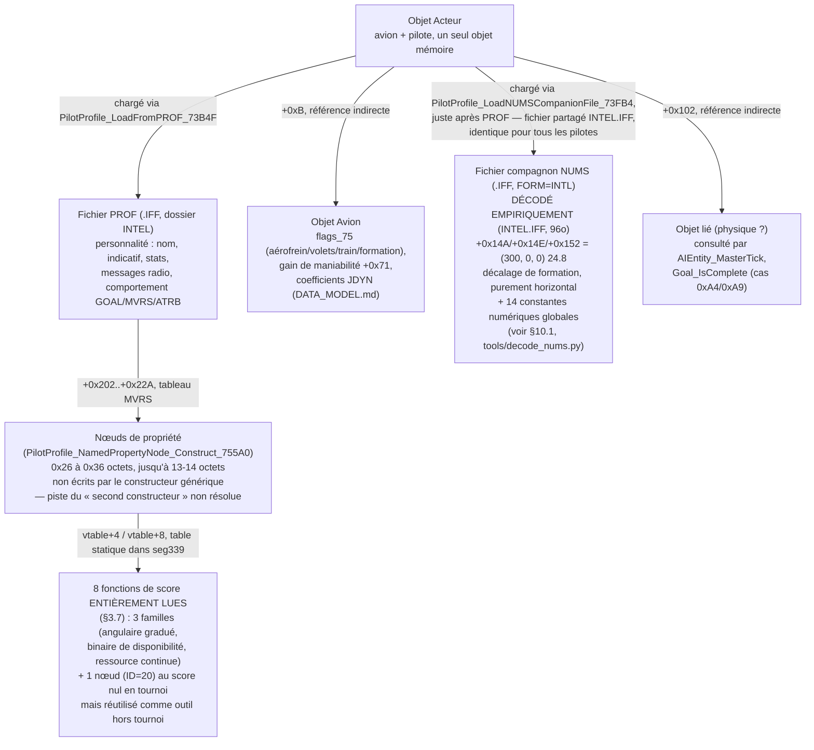

**Ce qui est solide** :
- L'objet Acteur EST directement `PilotProfile` — pas de sous-structure
  séparée, confirmé par `AIAircraft_LoadProfileGuarded_73940` qui écrit
  les champs `PROF` directement sur `this`.
- Trois chargements de fichiers distincts confirmés sur le même objet,
  tous dans `INTEL`, tous `.IFF`, mais de **formats internes différents**
  (`PROF`=`VERS`/`RADI`/`_AI_`, compagnon=`VERS`/`NUMS`) — ne pas assumer
  qu'un nom de dossier/extension partagé implique un format partagé.
- Deux références indirectes vers d'autres objets (`+0xB` = avion,
  `+0x102` = objet lié non identifié avec certitude) — piste à
  approfondir : qu'est-ce qui distingue précisément ces deux références,
  sont-elles parfois le même objet ?

### 10.1 `NUMS` décodé empiriquement — `INTEL.IFF`, fichier de
constantes partagées

Contrairement à `PROF` (une donnée par personnage), `INTEL.IFF` est **le
seul et unique fichier du jeu contenant un chunk `NUMS`** (fait confirmé
par Rémi, pas une simple observation limitée à cet échantillon) — son nom
générique (pas un nom de personnage) et son unicité confirment qu'il
s'agit d'un **fichier de constantes partagées, chargé identiquement par
tous les pilotes IA**, pas une personnalisation par pilote.

Séquence exacte des 18 champs confirmée (voir `tools/decode_nums.py`,
correspond exactement aux 65 octets du chunk `NUMS` sur l'échantillon
réel) :

| Champ | Valeur brute | Virgule fixe 24.8 |
|---|---|---|
| `dword_72016` (globale) | -10240 | **-40.000** |
| `word_72014` (globale) | 15 | 0.059 |
| `word_7201A` (globale) | 25 | 0.098 |
| `entité+0x14A` (vecteur X) | 76800 | **300.000** |
| `entité+0x14E` (vecteur Y, altitude) | 0 | **0.000** |
| `entité+0x152` (vecteur Z) | 0 | **0.000** |
| `entité+0x1A4` | 0 | 0.000 |
| `entité+0x1A8` | -204800 | **-800.000** |
| `entité+0x1AC` | 0 | 0.000 |
| `dword_7201C` (globale) | 460800 | **1800.000** |
| `dword_72020` (globale) | 4000 | 15.625 |
| `dword_72024` (globale) | 45000 | 175.781 |
| `dword_72028` (globale) | 1800 | 7.031 |
| `dword_7202C` (globale) | 17700 | 69.141 |
| `dword_72030` (globale) | 5000 | 19.531 |
| `dword_72034` (globale) | 25000 | 97.656 |
| `dword_6D184` (globale) | 512000 | **2000.000** |
| octet final → `entité+0x28B` bit0 | 1 | (drapeau posé) |

**La valeur la plus significative** : le vecteur `+0x14A/+0x14E/+0x152`
= **(300, 0, 0)** — purement horizontal, altitude inchangée. Un nombre
rond aussi net exclut une position monde absolue (qui aurait des
coordonnées réalistes, pas un chiffre rond simple) et confirme
l'hypothèse d'un **décalage de formation** (300 unités sur le côté,
même altitude) — cohérent avec tout ce qu'on avait déduit du code
(`Player_ResolveAttachPointN_5305A`, calcul dynamique de position
relative).

Plusieurs autres valeurs rondes (-40, -800, 1800, 2000) suggèrent des
**seuils ou seuils de distance/vitesse** dans une unité de jeu
cohérente ; les valeurs non rondes (15.6, 175.8, 7.0, 69.1, 19.5, 97.7)
restent de nature non identifiée — possiblement des coefficients ou
pourcentages sans rapport avec les seuils de distance.

## 11. État de l'investigation et pistes pour la suite

*Section consolidée — remplace les listes précédentes dispersées en
fin de §10 et §11, dont plusieurs items sont désormais résolus.*

### Ce qui est fait

L'essentiel de ce qu'on cherchait au départ de cette investigation est
maintenant en place :

- **Le format `PROF` complet** (§2), noms `ATRB` validés par le manuel
  officiel du jeu.
- **`MVRS` du mur à la résolution complète** (§3.7-3.9) : mécanisme de
  sélection pondérée entièrement compris, table statique de vtables
  localisée dans `seg339`, **21 fonctions de score lues** (les 8 types
  fixes + les 13 identifiants extensibles du fichier de Billy), 7
  fonctions d'application lues en détail, architecture à trois temps
  (score → application → tick périodique) découverte et documentée,
  champs d'état partagés entre types identifiés.
- **`GOAL` et `Goal_SetObjective`** (§4) : dispatcheur complet des 31
  codes `OP_SET_OBJ_*` tracé, lien direct avec le système de commande
  radio confirmé.
- **`MissionScript_ExecutePROG`** (§5) : les 80 cibles réelles de la
  table de saut à 209 entrées décodées et validées contre la table de
  référence `libRealSpace`.
- **`NUMS`/`INTEL.IFF`** (§10.1) décodé empiriquement, liens confirmés
  avec plusieurs seuils de la famille angulaire (`dword_7201C`,
  `dword_72034` pour `ID=5`, `dword_72039`/`dword_7202C` pour `ID=13`).
- **La séquence de manœuvre acrobatique** (§3.9) : les switch à
  phases de `MVRS_ID5` (8 phases) et `MVRS_ID13` (5 phases)
  décodés intégralement (Immelmann/Split S pour l'un, probable
  Scissors/Rollaway pour l'autre — confirmés au répertoire par le
  manuel officiel) — chaque phase commande une attitude via les mêmes
  contrôleurs bas niveau que la navigation, `ID=13` calculant même un
  délai de roulis basé sur la capacité propre de l'avion.
- **La chaîne décision → mouvement réel** (§4bis) : `Goal_ExecuteAction`
  → `AI_NavSolutionToPoint` → nœud `MVRS_ID21` (réutilisé hors
  tournoi) → `AI_GuidanceSolution_Major` → **`AI_CombatDecision_Major`**
  (arbre à 4 branches selon la magnitude de l'angle, écrit la commande
  finale) → `AI_TurnToHeadingCmd` → `AI_PitchRollController_Heading` →
  `JDYN_HighLevelPhysicsCalc` — le même calcul physique que le joueur,
  confirmé par un champ de commande partagé (`entité+7+0x23`/`+0x1F`).
- **Les constantes `NUMS` non rondes** (`dword_72020/24/28/2C`) :
  identifiées comme des seuils de classification de distance en 4
  paliers, avec deux jeux de seuils distincts selon le type de cible
  (`AI_ClassifyDistanceBand_98BD`, appelée par
  `Targeting_AcquireBestThreat`).
- **`sub_4F95`/`sub_56E5`** lues intégralement : la première est un
  vrai calcul d'angle entre deux vecteurs (pas un produit scalaire) ;
  la seconde est un **capteur mis en cache** (bit de fraîcheur sur
  l'entité), expliquant son faible coût en tant que garde répétée dans
  plusieurs fonctions de score.
- **`AI_ResolveNodePosition_54274` vs `CameraScript_ExecuteCOMP_781D0`**
  : confirmé comme DEUX mécanismes distincts, pas la même famille — le
  premier résout une position nommée (système d'expressions +
  hiérarchie géométrique) et est bien utilisé par l'IA (`Goal_ActiveWingmanEngagement`).
  Le second (renommé — l'hypothèse « partagé avec l'IA » d'une analyse
  externe non revérifiée s'est révélée fausse à la lecture directe :
  il opère sur des offsets et une globale d'abandon spécifiques au
  contexte caméra, aucun lien avec la structure d'entité IA) est très
  probablement **purement caméra**, sans usage IA confirmé.
- **`Player_MainUpdate_13100`** examinée structurellement (liste
  complète des 38 appels) : confirmée entièrement spécifique au
  joueur (HUD, joystick, kneeboard) — aucune lecture complémentaire
  nécessaire, le seul point de contact IA est celui déjà documenté en
  §4bis.
- **La structure globale de l'entité** (§10, constructeur/destructeur)
  : `goal_state` sentinelle, tableau `GOAL`/`MVRS` initialisés à vide,
  toutes les références faibles du destructeur désormais expliquées —
  `+0x281` (référence liée au système d'escorte, effacée en fin de
  relation), **`+0x283` entièrement résolu, CORRIGÉ suite à la reprise
  complète de la table `MVRS`** : pointe vers un nœud dédié permanent
  (`entité+0xD9`, construit une fois par pilote au chargement,
  `push 0x13` avant `sub_742FC` dans `PilotProfile_LoadFromPROF_73B4F`)
  — le tag correspondant (`0x160`) est celui d'**`ID=19`, le type
  « disponibilité d'arme »** (pas « urgence carburant » comme
  documenté précédemment — cette erreur venait du décalage
  systématique corrigé au §3.7bis). `[entité+0xD9→vtable+8]` est donc
  `MVRS_ID19_ApplyWeaponTracking_7709A`, pas `ApplyReturnToBase`.
  **Signification révisée** : `+0x283` signale un **engagement
  d'arme confirmé** (verrouillage/prêt à tirer), pas une urgence
  carburant — ce qui court-circuite le tournoi au profit d'un tir
  immédiat plutôt que d'un retour à la base.
  `+0x285`/`+0x287` via `Goal_SelectTransition`, `+0x289` via
  `AI_ProximityRadioCalloutTrigger_A002`. Découverte notable au
  passage : ces trois références (`+0x281`/`+0x283`/`+0x287`) forment
  une **cascade de priorité au-dessus du tournoi `MVRS`** — si l'une
  est active, `AI_BehaviorStateMachine` court-circuite le tournoi
  normal au profit d'une réaction prioritaire.
- **Outils** : décodeurs de fichiers, portrait de personnage, schéma
  d'automate technique ET en langage d'intention
  (`AI_TACTICAL_GLOSSARY.md`), tous génèrent des diagrammes validés
  avec un vrai parseur Mermaid.

### Ce qui reste réellement ouvert

Par ordre de valeur probable :

1. **Le rôle précis du bit `flags_75` bit 4** dans la chaîne de
   guidage (§4bis) — **différé intentionnellement** : Rémi travaille
   sur le moteur physique dans une session séparée dédiée à `JDYN`/
   `flags_75` ; ce point sera traité conjointement plus tard, pas une
   piste à explorer côté rétro-ingénierie de l'IA pour l'instant.

**Ce qui n'est plus une priorité** (résolu ou recontextualisé
au fil de cette session) : la localisation de la table de
descripteurs `MVRS` (§3.7), le décodage des opcodes de
`MissionScript_ExecutePROG` (§5.2, complet), le « second
constructeur » des nœuds `MVRS` (cadre obsolète depuis la découverte
de la table statique), et le rôle des 3 constantes du constructeur
d'entité (`+0x139`/`+0x13D`/`+0x141`, mécanisme compris via
`Goal_SetObjective_A307`).
