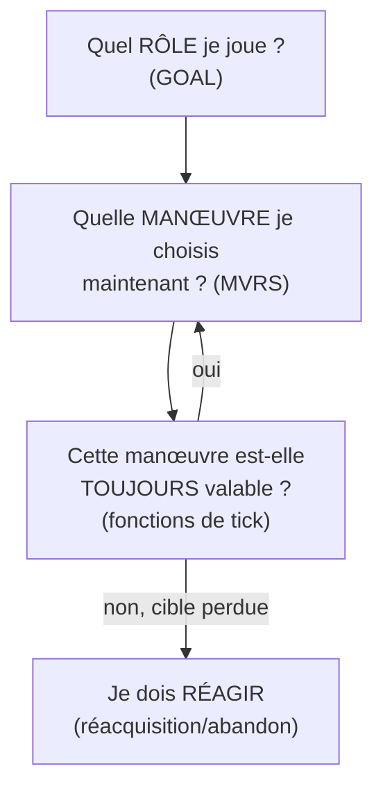

# Glossaire d'intention tactique de l'IA

*Ce document traduit les découvertes techniques (`AI_SYSTEM.md`) en
langage d'intention — ce que chaque mécanisme représente pour un
pilote virtuel, pas comment il est codé. Objectif : donner une base de
conception claire pour l'implémentation, indépendamment des noms de
fonction et des adresses mémoire.*

*Chaque entrée renvoie vers sa référence technique pour qui a besoin de
vérifier ou d'aller plus loin dans le code d'origine.*

---

## 1. Les trois grandes familles de décision

Un pilote IA raisonne à trois niveaux, du plus abstrait au plus
immédiat :

- **Le rôle** répond à « suis-je en mission, en patrouille libre, ou
  au service direct du joueur ? »
- **La manœuvre** répond à « que dois-je faire à cet instant précis
  du combat ? »
- **La réaction** répond à « ma situation a-t-elle changé pendant que
  j'exécutais cette manœuvre ? »

---

## 2. Le rôle du pilote (référence technique : `GOAL`, §4)

| Intention | Description | Réf. technique |
|---|---|---|
| **Coéquipier** | Suit et protège le joueur activement — position de formation, réagit aux ordres radio du joueur (attaquer ma cible, rentrer à la base...). Réservé aux personnages « actifs » (Billy, Gwen, Stern). | suivi : `Goal_FollowAllyExec` ; le sélecteur `5` (`Goal_MoraleReaction_878F`) est la **réaction au moral** de l'ailier (fuite, abandon, retournement contre le joueur), corrigé 2026-09-25 |
| **En mission** | Exécute un ordre de mission précis assigné par le scénario ou la radio — décoller, atterrir, détruire une cible, défendre une zone. | `Goal_ExecuteAction`, `Goal_SetObjective_A307`, sélecteur `2` |
| **Solo / en attente** | Aucun ordre précis en cours — patrouille ou vagabonde sans intention forte. Comportement de repli. | `Goal_WanderRandom`, sélecteur `3` |
| **Instinct de combat** | La vraie prise de décision moment par moment une fois engagé — voir §3. | `AI_BehaviorStateMachine`, sélecteur `4` |

**Note de conception** : ces quatre rôles ne s'excluent pas — un
pilote essaie ses emplacements `GOAL` dans l'ordre du fichier, et
s'arrête au premier qui « prend la main » ce tick. Un coéquipier qui
n'a rien à faire en formation retombe sur ses ordres de mission, puis
sur son instinct de combat.

---

## 3. L'instinct de combat — quelle manœuvre choisir maintenant

*Référence technique : `AI_SYSTEM.md` §3.5-3.9, le tournoi `MVRS`.*

À chaque tick où l'IA doit décider d'une action tactique, elle évalue
en parallèle plusieurs **instincts candidats**, chacun proposant une
manœuvre avec un niveau d'urgence, et ne retient que le plus urgent.
C'est un peu comme si plusieurs réflexes se manifestaient en même
temps chez un vrai pilote, et que le plus pressant l'emportait.

### Les instincts identifiés

> ⚠️ **Tableau périmé (identifiants décalés et rôles devinés).** Relu le 2026-09-25 : ce que fait
> réellement chaque identifiant est dans `AI_TICK_CALL_GRAPH.md`, « Les actions confirmées des
> manœuvres `MVRS` ». En bref : 1 virage de réacquisition, 2 dégagement, 3 manœuvre d'énergie,
> 4 virage défensif sur alerte, 5 montée verticale + retournement, 6 Split-S, 7 poursuite,
> 13 prise d'altitude à longue distance, 14 évitement du sol, 15 récupération nez haut /
> décrochage, 16 reprendre de la vitesse, 19 attaque au sol. Aucun « carburant » ni « retour à la
> base » dans les manœuvres.

| Intention | Ce qui le déclenche | Ce qu'il fait s'il l'emporte | Réf. technique |
|---|---|---|---|
| **Manœuvre de poursuite** | Une cible est engagée ; l'urgence dépend de l'angle par rapport à elle (suis-je bien placé ?) et de la distance | Ajuste la position/l'orientation vers la cible ; peut choisir une **rupture défensive** (voir ci-dessous) si la position est ambiguë | `MVRS_ID3/4/5/6/7`, famille angulaire |
| **Vigilance capteur** | Variante de la poursuite, mais seulement si une menace est **effectivement détectée** par les capteurs — pas juste théoriquement présente | Même manœuvre, mais gardée par la portée de détection réelle | `MVRS_ID7`, `dword_7203D` |
| **Prudence carburant** | Variante de la poursuite, désactivée si le niveau de carburant est bas | Manœuvre normale seulement si assez de carburant ; sinon cet instinct ne se déclenche pas | `MVRS_ID8` |
| **Anticipation/interception** | Une trajectoire d'interception de la cible est géométriquement réalisable | Engage une manœuvre pour couper la route de la cible plutôt que la suivre | `MVRS_ID15b` (0xF) |
| **Alerte menace** | Un danger est détecté par les capteurs (missile, chasseur ennemi) | Déclenche une réaction défensive/évasive | `MVRS_ID16` (0x10) |
| **Urgence carburant** | Le niveau de carburant/ressource franchit un seuil critique | Prend systématiquement le dessus sur tous les autres instincts (échelle de score bien plus élevée) — signal de retour à la base | `MVRS_ID19` (0x13) |
| **Prêt à tirer** | Un poste d'arme est libre, une cible valide est en vue, aucune autre tâche prioritaire n'occupe le pilote | Prépare/sélectionne une arme, verrouille la cible pendant une durée donnée | `MVRS_ID14` (0x14) |
| **(instincts non encore retracés)** | — | Score nul dans le seul chemin de code lu jusqu'ici — mais la recherche de leur véritable consommateur est incomplète, pas fermée : ne pas conclure à un rôle nul ou à un vestige (cf. `ID=21`, classé ici par erreur dans une version antérieure, qui a en réalité un rôle réel confirmé hors tournoi, voir `AI_SYSTEM.md` §4bis) | `MVRS_ID8` à `ID12` |

### La rupture défensive

Quand la manœuvre de poursuite ne sait pas clairement de quel côté se
replacer (ni franchement devant, ni franchement derrière la cible),
le pilote **choisit une direction de rupture — gauche ou droite —**
et s'il n'y a vraiment aucun indice géométrique pour trancher, **il
tire à pile ou face**. C'est un choix défensif : casser la ligne de
mire de l'adversaire plutôt que de rester prévisible.

*Réf. technique : `MVRS_ID2_ApplyBreakDirection_F2C8`.*

### Les instincts se parlent entre eux

Ce n'est pas une liste de réflexes indépendants : certains instincts
**laissent une trace** que d'autres consultent. Par exemple, la
manœuvre de poursuite peut noter « je suis actuellement dans l'axe de
la cible » — et l'instinct de prudence carburant en tient compte pour
décider combien de temps il peut se permettre de maintenir sa
manœuvre avant de devoir réévaluer. C'est cohérent avec un pilote qui
garde une conscience globale de sa situation plutôt que de réagir
mécaniquement à chaque instinct pris isolément.

*Réf. technique : le champ partagé `entité+0x32`, §3.9.*

---

## 4. Perdre et reprendre une cible

*Référence technique : la classe `NotifiableRef` (`ovr229`), §3.6bis.*

Deux mécanismes symétriques gèrent le suivi de cible dans la durée :

- **Réacquisition** : se déclenche quand la référence actuelle devient
  invalide — la cible a été détruite, elle est sortie de portée, ou
  la référence a simplement été perdue (mise à zéro ailleurs dans le
  code). Le pilote doit alors chercher une nouvelle cible ou un
  nouveau point de référence avant de pouvoir reprendre sa manœuvre.
  *(`NotifiableRef_AttachTarget`)*
- **Abandon volontaire** : le pilote relâche sa cible actuelle de son
  propre chef — typiquement en fin d'engagement, ou lors d'une
  transition d'objectif qui rend cette cible non pertinente.
  *(`NotifiableRef_DetachTarget`)*

C'est le filet de sécurité qui empêche un pilote de rester "accroché"
indéfiniment à une référence qui n'a plus de sens.

---

## 5. Personnalité — ce qui distingue un pilote d'un autre

*Référence technique : `ATRB`, §2.3, noms confirmés par le manuel du
jeu.*

Neuf traits, chacun sur une échelle de 0 à 16, colorent la façon dont
un pilote *exécute* les mécanismes ci-dessus (mais ne changent pas
*quels* instincts existent — voir §6 pour la nuance importante) :

- **Trigger Happy** — tire-t-il facilement, ou économise-t-il ses
  munitions ?
- **Confidence** — s'effraie-t-il facilement face au danger ?
- **Verbosity** — communique-t-il beaucoup à la radio ?
- **Loyalty** — suit-il fidèlement les ordres, ou s'en écarte-t-il ?
- **Flying / Air-to-Ground / Air-to-Air** — ses compétences brutes
  dans chaque domaine.
- **Showmanship** — a-t-il tendance aux manœuvres tape-à-l'œil ?
- **Aggressiveness** — cherche-t-il le combat, ou reste-t-il prudent ?

**Nuance importante** : ces traits n'ont été retrouvés en usage direct
que pour **une seule statistique** dans le code exploré jusqu'ici — la
compétence de vol (`FL`) intervient dans la formule de bonus de
`MVRS_ID14b` (0xE). Les 8 autres traits sont documentés et validés
comme *format de fichier*, mais leur consommation précise dans le
code de décision reste à tracer au cas par cas si nécessaire.

---

## 6. Ce qui rend chaque personnage unique — trois leviers indépendants

Il est tentant de résumer un personnage à ses statistiques `ATRB`
seules, mais **trois leviers séparés** définissent réellement son
comportement, et ils ne se recouvrent pas :

| Levier | Change... | Exemple concret |
|---|---|---|
| **`ATRB`** | l'exécution fine (agressivité affichée, verbosité radio...) | Stern a un profil `ATRB` très irrégulier — un personnage typé, pas un gabarit lisse |
| **`GOAL`** | quels *rôles* sont même accessibles | Un cargo n'a pas le rôle « coéquipier » — il ne peut structurellement pas escorter |
| **`MVRS`** | quels *instincts de combat* sont réglés, et avec quel biais | Le cargo a un malus marqué sur un instinct non encore décodé — probablement une manœuvre offensive qu'il évite |
| **`OPTS`** | quelles commandes le *joueur* peut lui donner à la radio | Stern (toujours chef) n'a qu'une option universelle — le joueur ne peut littéralement pas lui donner d'ordre de suivi |

**Le cas Stern est instructif** : son comportement de « toujours chef,
jamais subordonné » (confirmé par le manuel du jeu) ne vient pas d'un
réglage `MVRS` différent — ses valeurs y sont identiques à celles de
Billy. Il vient du levier `OPTS` : en ne proposant jamais au joueur
les commandes de type « suis-moi »/« obéis », le jeu rend ce
comportement structurellement impossible à déclencher, sans avoir
besoin de coder une règle explicite « Stern n'obéit jamais ».

---

## 7. Pour l'implémentation

Cette hiérarchie d'intention suggère une architecture assez naturelle
à porter :

1. Une machine à états de haut niveau pour le **rôle** (§2)
2. À l'intérieur du rôle « instinct de combat », un **système de
   scoring d'instincts candidats** (§3), chacun avec sa condition
   d'activation et son action associée
3. Un **mécanisme de suivi de référence** générique (§4), utilisable
   par n'importe quel instinct ayant besoin de retenir une cible
4. Des **paramètres de personnalité** (§5) qui modulent l'exécution
   sans changer la structure de décision
5. Une **séparation claire entre capacité et permission** (§6) — ce
   qu'un pilote *peut* faire (`GOAL`/`MVRS`) est distinct de ce que le
   *joueur peut lui demander* (`OPTS`)

Cette dernière séparation (point 5) est probablement la plus facile à
perdre de vue en réimplémentant à partir de zéro, et pourtant celle
qui explique le mieux des comportements de personnage autrement
mystérieux (voir Stern, §6).
