# Graphe d'appels : du tick principal à `AIEntity_MasterTick`, et création des entités

*Établi avec Rémi (2026-09-19) en lisant uniquement `analysis/annotated_segments/`. Tous les noms sont les noms résolus de `known_functions.json`. Trait plein = lu dans le code ; trait pointillé = hypothèse ou lien non prouvé ; case grise = fonction non lue.*

## Le graphe

```mermaid
flowchart TD
    subgraph MAIN["Boucle principale"]
        LOOP["STRIKE_EXE_MAIN_LOOP"]
        TICK["MAIN_GAME_TICK"]
        FRAME["Frame_UpdateTimingAndNotifyTrackedObjects_500F6<br/>delta de temps dword_70458"]
        LOOP --> TICK
        LOOP --> FRAME
    end

    subgraph WORLD["Tick du monde - branche TICK"]
        COMBAT["CombatTarget_WeaponActionSubsystem"]
        RESET["WorldObjects_UpdateFrame_ResetCounters_221C2"]
        UPDALL["WorldObjects_UpdateAllAndRemoveDead_221F2<br/>parcourt la liste 0x59C3<br/>appelle le slot +0x10 de chaque nœud<br/>retire ceux qui renvoient 0"]
        UPD["WorldObject_UpdateWithAIEntity_3D9FB<br/>slot +0x10, vtable 0x2618"]
        ALIVE["WorldObject_IsAlive_3CBB7"]
        TESTALIVE["WorldObject_TestAliveAndUpdateChildren_3800A<br/>renvoie 1 si vivant"]
        MASTER["AIEntity_MasterTick_5ACC<br/>slot +0xC de la vtable 0x110<br/>entité pointée par +0x55"]
        SLOT8["slot +8 de l'entité : loc_4F85<br/>pas de nom, pas lu"]
        MOUNT["objet à +0x51<br/>slot +0x40, pas identifié"]
        EMIT["Emitter_UpdateFromEntitySMOKVec_3D57E<br/>pas lu"]
        CLEAR["AircraftStateBits_Clear_12806<br/>remet à zéro 3 octets de drapeaux<br/>aucun affichage"]
        FOLLOW["Goal_FollowAllyExec_DAA9"]
        TRIGGER["AI_TriggerBehaviorUpdate_5E53<br/>c'est là que se trouve la décision<br/>pas lu"]
        BEHAV["fonction de comportement<br/>sans nom, pas lue"]
        PICK["Picking_ResolveSymbol<br/>autre appelant, pas lu"]

        TICK --> COMBAT
        COMBAT --> RESET
        RESET --> UPDALL
        PICK --> UPDALL
        UPDALL -->|"slot +0x10"| UPD
        UPD --> ALIVE
        ALIVE --> TESTALIVE
        TESTALIVE -->|"liste des sous-objets +0x1E"| UPDALL
        UPD -->|"byte_6D558 = 0"| MASTER
        UPD -->|"puis slot +8"| SLOT8
        SLOT8 --> MOUNT
        UPD --> EMIT
        MASTER --> CLEAR
        MASTER -->|"flags_75 bit5 et +0x28B bit3"| FOLLOW
        MASTER -->|"sinon"| TRIGGER
        TRIGGER -.->|"si +0x28B bit7"| BEHAV
        TOPTHINK["AI_TopLevelThink<br/>appelée par AI_TriggerBehaviorUpdate<br/>lue : début et fin, pas le milieu"]
        REACT["réactions prioritaires<br/>AI_EscortPriorityReactionHandler_9A77<br/>Formation_DamageReactionHandler<br/>avant tout objectif"]
        ACTIVEOBJ["objet à entité+0x0D<br/>si non nul : son slot +0xC<br/>GOAL et tournoi sautés<br/>nature de l'objet inconnue"]
        GROUND["avion au sol :<br/>Goal_ExecuteAction_A8AC direct<br/>tableau GOAL ignoré"]
        SLOTS["avion en vol : emplacements GOAL<br/>entité+0x1B0, 8 octets par emplacement<br/>jusqu'au premier qui renvoie non nul"]
        HANDLERS["gestionnaires choisis par l'octet du fichier<br/>2 Goal_ExecuteAction_A8AC<br/>3 Goal_WanderRandom_AD13<br/>4 AI_BehaviorStateMachine_WeightedOptionSelector_9D05<br/>5 Goal_ActiveWingmanEngagement_878F<br/>1 : valeur abandonnée au chargement"]
        TRIGGER --> TOPTHINK
        TOPTHINK --> REACT
        REACT -->|"aucune réaction"| ACTIVEOBJ
        ACTIVEOBJ -->|"nul, avion au sol"| GROUND
        ACTIVEOBJ -->|"nul, avion en vol"| SLOTS
        SLOTS --> HANDLERS
    end

    subgraph AUTO["Pilotage automatique - byte_6D558"]
        UISCRIPT["UIScript_ParseAndEvaluate_7A054<br/>nom trompeur"]
        CMD["Pilot_LowLevelControlCommand<br/>Pilot_IssueControlCommand_79DA0<br/>ordres directs à l'avion"]
        CAM["EntityTracker_SelectByID<br/>entrée AUTOPILT"]
        FLAG["byte_6D558 = 1<br/>puis boucle imbriquée<br/>puis byte_6D558 = 0"]
        UISCRIPT --> CMD
        UISCRIPT --> CAM
        UISCRIPT --> FLAG
        FLAG -->|"1 : pas de MasterTick"| UPD
        FLAG --> COMBAT
    end

    subgraph SPAWN["Création des entités - branche SPAWN"]
        PART["PartEntry_DispatchMissionUpdateTick_52E51"]
        PROP["Expr_Node_UpdateAndPropagate_52AC6"]
        VMSINGLE["Expr_VM_ExecuteSingleInstruction_51E7E"]
        VM["Expr_VM_Interpreter_51106"]
        RESOLVE["PartEntry_ResolveSpawnPositionAndActivate_51EDC"]
        SPAWNFN["AIAircraft_SpawnAndConditionalLoadProfile_53363<br/>rôle 1 IA, 2 PLAYER, 3 NETWORK"]
        PROTO["ObjectPrototype_FindOrLoadAndInstantiate_38B70<br/>prototype par clé, rôle écrit à +0x34<br/>appelle le slot +4 du prototype"]
        CONSTR["WorldObject_ConstructWithAIEntity_9D2CC<br/>objet de 0x5A octets, vtable 0x2618<br/>écrit l'entité à +0x55"]
        CREATE["AIEntity_CreateByType_12B4E<br/>slot 0 de l'objet à +0x46 du prototype"]
        ECONSTR["AIEntity_Construct_74B43<br/>entité de 0x28E octets, vtable 0x110"]
        RESETBLK["AircraftStateBlock_Reset_12931<br/>bloc de 0x2B octets"]
        ADD["WorldObjects_AddToList_5334D"]
        APPIF["List_AppendIfNonNull_21F8D"]
        APPTAIL["List_AppendTail_22C23"]
        LOADW["WorldObject_LoadAIProfileViaEntity_9D4D2"]
        LOADG["AIAircraft_LoadProfileGuarded_73940"]
        PROF["PilotProfile_LoadFromPROF_VersionGate_8E351<br/>chunk PROF : GOAL, MVRS, ATRB"]

        TICK --> PART
        PART --> PROP
        PROP --> VMSINGLE
        VMSINGLE --> VM
        VM --> RESOLVE
        RESOLVE --> SPAWNFN
        SPAWNFN --> PROTO
        PROTO -.->|"probable"| CONSTR
        CONSTR -.->|"probable"| CREATE
        CREATE --> ECONSTR
        ECONSTR --> RESETBLK
        SPAWNFN --> ADD
        ADD --> APPIF
        APPIF --> APPTAIL
        SPAWNFN -->|"rôle différent de PLAYER"| LOADW
        LOADW -->|"entité lue à +0x55"| LOADG
        LOADG --> PROF
    end

    subgraph MISSION["Chargement de la mission"]
        MLOAD["MissionScenario_LoadMainRecord_A8331"]
        CAST["PLAY_LoadCASTTeamNames_A9956<br/>chunk CAST : 9 octets par entrée<br/>nom sur 8 octets + id"]
        WRLD["World_ParseWrldForm_A767F<br/>ajoute 2 objets à la liste 0x59C3"]
        MLOAD --> CAST
        MLOAD --> WRLD
        CAST -.->|"nom du PROF, lien non lu"| SPAWNFN
        WRLD --> APPIF
    end

    subgraph ORDERS["Ordres de mission - branche script"]
        EXEC["MissionScript_ExecutePROG"]
        RELAY["MissionScript_DispatchOrderToNative"]
        NATIVE["MissionScript_CallNativeHandler<br/>switch à 31 cas"]
        CTRL["controller, slot +0x88<br/>ExecuteFlightCommand"]
        VM --> EXEC
        EXEC --> RELAY
        RELAY --> NATIVE
        NATIVE --> CTRL
        SPAWNFN --> CTRL
    end

    subgraph RENDER["Parcours de la liste des objets suivis - phase affichage"]
        NOTIFY18["TrackedObjects_CallSlot18OnActive_22F10<br/>liste 0x59CD, objets actifs"]
        FSTEP["TrackedObject_FrameStep_2DF0D<br/>slot +0x18 du sous-vtable à +0x50"]
        TOUCH["WorldObjects_CallSlot4OnAllThenRecompute_2214F"]
        SLOT4["WorldObjects_CallSlot4OnAll_22D6C<br/>slot +4 de tous les nœuds, rôle inconnu"]
        NOTIFYW["TrackedObject_NotifyWorldObjects_2DFE4<br/>slot +0x20"]
        WRAP["UIScreen_RenderGraphVGA_Wrapper_50E44"]
        SLOT1C["WorldObjects_CallSlot1COnActive_2217D<br/>slot +0x1C des nœuds actifs, rôle inconnu"]
        FRAME --> NOTIFY18
        NOTIFY18 -->|"slot +0x18"| FSTEP
        FSTEP --> TOUCH
        TOUCH --> SLOT4
        FSTEP -->|"slot +0x20"| NOTIFYW
        NOTIFYW --> WRAP
        WRAP --> SLOT1C
    end

    LIST[("liste chaînée, tag 0x59C3<br/>nœuds = objets monde<br/>vtable à +0, suivant à +2, actif à +5")]
    READERS["Lecteurs de la liste :<br/>AI_ScanForNewTarget, AI_RadarScanTarget<br/>Targeting_AcquireBestThreat<br/>Player_MainUpdate, Radar_ZoomIn ..."]
    APPTAIL --> LIST
    LIST --> UPDALL
    LIST --> SLOT1C
    LIST --> SLOT4
    LIST --> READERS

    UPD -.->|"entité liée +0x55"| ECONSTR
    CONSTR -.->|"écrit +0x55"| UPD

    classDef ok fill:#dcfce7,stroke:#22c55e,color:#1e293b
    classDef prob fill:#fef3c7,stroke:#f59e0b,color:#1e293b
    classDef unread fill:#e5e7eb,stroke:#6b7280,color:#1e293b
    classDef key fill:#dbeafe,stroke:#3b82f6,stroke-width:3px,color:#1e293b
    class LOOP,TICK,FRAME,COMBAT,RESET,UPDALL,UPD,ALIVE,TESTALIVE,MASTER,CLEAR,FOLLOW,SPAWNFN,PROTO,ECONSTR,RESETBLK,ADD,APPIF,APPTAIL,LOADW,LOADG,PROF,CAST,NOTIFY18,FSTEP,TOUCH,SLOT4,NOTIFYW,WRAP,SLOT1C,MLOAD,WRLD ok
    class TOPTHINK,REACT,GROUND,SLOTS,HANDLERS ok
    class CONSTR,CREATE,BEHAV,CAM,CMD,FLAG,UISCRIPT,ACTIVEOBJ prob
    class SLOT8,MOUNT,EMIT,TRIGGER,PICK unread
    class MASTER key
```

## Le chemin vers `AIEntity_MasterTick_5ACC` (lu, maillon par maillon)

| # | Appel | Où c'est lu |
|---|---|---|
| 1 | `STRIKE_EXE_MAIN_LOOP` → `MAIN_GAME_TICK` | déjà dans `MISSION_SCRIPT_OPCODES.md` |
| 2 | `MAIN_GAME_TICK` → `CombatTarget_WeaponActionSubsystem` | `seg114`, appel direct |
| 3 | `CombatTarget_WeaponActionSubsystem` → `WorldObjects_UpdateFrame_ResetCounters_221C2` (argument : tag 0x59C3) | `seg112` |
| 4 | `WorldObjects_UpdateFrame_ResetCounters_221C2` → `WorldObjects_UpdateAllAndRemoveDead_221F2` | `seg039` |
| 5 | `WorldObjects_UpdateAllAndRemoveDead_221F2` appelle le slot +0x10 de chaque nœud | `seg039` |
| 6 | Slot +0x10 de la classe de vtable 0x2618 = `WorldObject_UpdateWithAIEntity_3D9FB` | `seg339` (vtable), `seg085` |
| 7 | `WorldObject_UpdateWithAIEntity_3D9FB` lit le pointeur d'entité à +0x55 et appelle son slot +0xC = `AIEntity_MasterTick_5ACC` | `seg085`, `seg003` |

## `AI_TopLevelThink` : où se décident les objectifs (lu le 2026-09-19)

`AI_TopLevelThink` (`seg004`) est appelée par `AI_TriggerBehaviorUpdate_5E53` (référence de code `AI_TriggerBehaviorUpdate+35`). Ce n'est **pas** une simple boucle sur les emplacements `GOAL` : les objectifs viennent en dernier. Ordre réel, tel que lu (le milieu de la fonction, entre le test de menace et le point `loc_83F0`, n'a **pas** été lu en détail) :

1. **Début** : si `byte_6E4D7` est non nul et `entité+0xB0` ≥ 0xC (`TH` d'après `AI_SYSTEM.md` §1.5), appel de `Targeting_AcquireBestThreat`. Puis `AI_MessageDispatcher` et `Radio_CombatChatterDispatch`.
2. **Le traitement des menaces est sauté** (`jmp loc_83F0`) dans trois cas : `entité+0x11D` vaut `0xA1` (décollage) ou `0xA2` (atterrissage) ; l'avion est au sol (l'octet `+0x20` du sous-objet pointé par le premier champ de l'objet à `entité+0xB` non nul) ; `word_70466` ≤ 3. Sinon, `AI_IncomingThreatWarning` et la mise à jour de la chaîne de cibles (`+0x287` / `+0x289`).
3. **Réactions prioritaires, avant tout objectif** (`loc_83F0`) : si `entité+0x281` est non nul, alors `AI_EscortPriorityReactionHandler_9A77` quand `entité+0x0D` est nul et `entité+0x27F` vaut 2, et `AI_QueryTargetField4B` dans les autres cas. Puis, si rien n'a réagi et `entité+0x27F` ≤ 1, `Formation_DamageReactionHandler`. Si l'un des deux gestionnaires de réaction a réagi, **la fonction se termine ici**.
4. **Objet en cours** : si `entité+0x0D` (pointeur far) est non nul **et** `entité+0x27F` non nul, appel de `[vtable+0xC]` de cet objet, temps cumulé dans `word_704E6+0x5B56`, et **fin de la fonction** : ni `GOAL` ni tournoi. `AI_BehaviorStateMachine_WeightedOptionSelector_9D05` contient le même bloc (si `entité+0x0D` est non nul, pas de nouveau score).
5. **Objectifs** :
   - avion **au sol** (l'octet `+0x20` du sous-objet pointé par le premier champ de l'objet à `entité+0xB` non nul) : `Goal_ExecuteAction_A8AC(entité, 0)` **directement**, quel que soit le tableau `GOAL` ;
   - avion **en vol** : boucle sur les emplacements à `entité+0x1B0` (8 octets chacun), appel de chaque gestionnaire avec `(entité, 0)`, arrêt au premier qui renvoie non nul.
6. **Épilogue** non interprété : si `entité+0x280` non nul et `entité+0x10D` vaut `0x800` et bit 2 de `entité+0x28B` nul, décrémente `entité+0x280`, remet `entité+0x10D` à `0x800` et pose le bit 1 de `[[entité+0x7]+0x1B]`.

Citations : `cmp byte ptr [bx+20h], 0 / jz loc_84E9 / call Goal_ExecuteAction_A8AC` (au sol) ; `mov ax, si / shl ax, 3 / call dword ptr es:[bx+1B0h] / or al, al / jnz loc_850B` (boucle des emplacements) ; `cmp word ptr es:[bx+11Dh], 0A1h` puis `0A2h` (états décollage et atterrissage).

**Valeur `1` du fichier `GOAL`** : dans `PilotProfile_LoadFromPROF`, la boucle de lecture fait `cmp [bp+var_8], 1 / jz loc_73F62`, qui saute le rattachement du gestionnaire **et** l'incrément du compteur d'emplacements. La valeur `1` n'occupe donc aucun emplacement, et `GOAL=1` seul donne un tableau vide (terminé par le bloc `unk_6D188`).

**Ce que `entité+0x0D` n'est pas** : ce n'est pas le nœud `MVRS` gagnant lui-même. `NotifiableRef_AttachTarget_75612` y copie `nœud+4/+6` (`mov es:[bx+0Fh], ax / mov es:[bx+0Dh], dx` sur l'objet pointé par `nœud+8`, qui est l'entité), et `NotifiableRef_DetachTarget_75661` le remet à zéro. La règle de comportement est établie (un objet en cours passe avant tout), sa nature ne l'est pas.

## Faits établis

- **Pourquoi un coéquipier avec `GOAL=1` seul décolle mais ignore ensuite « Follow »** : au sol, `AI_TopLevelThink` appelle `Goal_ExecuteAction_A8AC` sans consulter le tableau `GOAL` ; le décollage s'exécute donc. Une fois en vol, le tableau est vide et aucun gestionnaire ne tourne, d'où l'absence de suivi (il faut `5`, `Goal_ActiveWingmanEngagement_878F`).
- **Liste 0x59C3** : liste chaînée d'objets monde (tête à +0xB de l'en-tête, suivant à +2 du nœud, drapeau actif à +5, pointeur de vtable à +0 de l'objet). Ses nœuds ne sont **pas** des entités IA : le slot +4 de la vtable IA (0x110) est un destructeur, alors que `WorldObjects_CallSlot4OnAll_22D6C` appelle le slot +4 de chaque nœud. L'objet du monde pointe vers son entité IA à +0x55.
- **`AIEntity_MasterTick_5ACC`** n'exécute ni GOAL ni MVRS : il prépare l'état (drapeaux, seuils `dword_7203D` / `dword_72039`, chronomètre +0x175, score de menace `word_6D3BC`) puis aiguille vers `Goal_FollowAllyExec_DAA9` ou `AI_TriggerBehaviorUpdate_5E53`. La décision est dans cette dernière (non lue).
- **`byte_6D558`** : drapeau « pilotage automatique ». Mis à 1 et remis à 0 par `UIScript_ParseAndEvaluate_7A054` autour d'une boucle imbriquée. À 1, `WorldObject_UpdateWithAIEntity_3D9FB` n'appelle pas `AIEntity_MasterTick_5ACC`. Selon Rémi (connaissance du jeu) : en pilotage automatique le jeu est mis en pause, le joueur est téléporté vers la destination, le jeu repart, et la caméra change pendant ce temps.
- **Les nœuds de `WorldObjects_UpdateAllAndRemoveDead_221F2` sont mis à jour de façon hiérarchique** : `WorldObject_TestAliveAndUpdateChildren_3800A` met à jour la liste des sous-objets (+0x1E) avec la même fonction.
- **Le nom du PROF vient de la mission** (chunk `CAST`, 9 octets par entrée : nom sur 8 octets et un identifiant), pas du modèle d'avion (indication de Rémi).
- **Le bloc de 0x2B octets** (`AircraftStateBlock_Reset_12931`, drapeaux +0x1B à +0x1D, un octet de code +0x1E, trois dwords +0x1F/+0x23/+0x27) est commun au joueur et à l'IA. Aucun affichage : les fonctions qui le manipulent s'appelaient à tort `HUD_*`.

## Noms modifiés (ancien → nouveau)

| Ancien | Nouveau |
|---|---|
| `Camera_LookAtSecondaryTarget_3D9FB` | `WorldObject_UpdateWithAIEntity_3D9FB` |
| `WorldObjects_PurgeExpired` | `WorldObjects_UpdateAllAndRemoveDead_221F2` |
| `WorldObjects_PeriodicGC` | `WorldObjects_UpdateFrame_ResetCounters_221C2` |
| `Camera_ConstructWithSecondaryTarget_9D2CC` | `WorldObject_ConstructWithAIEntity_9D2CC` |
| `Debris_TestDestroyedState` | `WorldObject_TestAliveAndUpdateChildren_3800A` |
| `WorldObject_IsDestroyed` | `WorldObject_IsAlive_3CBB7` (le nom d'origine était inversé) |
| `Container_KeyCompare` | `List_AppendTail_22C23` |
| `Container_KeyEquals` | `List_AppendIfNonNull_21F8D` |
| `Expr_Node_RegisterListener_5334D` | `WorldObjects_AddToList_5334D` |
| `Debris_LoadAndInstantiate` | `ObjectPrototype_FindOrLoadAndInstantiate_38B70` |
| `Camera_Helper4_9D4D2` | `WorldObject_LoadAIProfileViaEntity_9D4D2` |
| `UIScreen_ApplyFormFields_500F6` | `Frame_UpdateTimingAndNotifyTrackedObjects_500F6` |
| `WorldObjects_NotifyMissionTriggers` | `TrackedObjects_CallSlot18OnActive_22F10` |
| `Container_NotifyAllActive` | `WorldObjects_CallSlot1COnActive_2217D` |
| `Container_FindByKeyAlt` | `WorldObjects_CallSlot4OnAll_22D6C` |
| `Container_FindAndTouch` | `WorldObjects_CallSlot4OnAllThenRecompute_2214F` |
| `View_RenderFrame_2DF0D` | `TrackedObject_FrameStep_2DF0D` |
| `loc_2DFE4` (sans nom) | `TrackedObject_NotifyWorldObjects_2DFE4` |
| `HUD_EncodeInstruments` | `AircraftStateBits_Clear_12806` |
| `HUD_ResetPanel` | `AircraftStateBlock_Reset_12931` |
| `loc_12B4E` (sans nom) | `AIEntity_CreateByType_12B4E` |

## Corrections de conclusions antérieures

- `AIEntity_MasterTick_5ACC` n'est **pas** « le point d'entrée racine de toute la logique de décision IA » (ancien résumé) : c'est une préparation d'état suivie d'un aiguillage.
- `Expr_Node_RegisterListener_5334D` n'enregistre pas un écouteur `Expr_VM` : elle ajoute l'objet à la liste 0x59C3.
- Le passage de `AIEntity_Construct_74B43` par `AircraftStateBlock_Reset_12931` n'est pas un repli quand l'allocation échoue : c'est l'initialisation du bloc quand l'allocation réussit.
- `Debris_LoadAndInstantiate` ne sert pas qu'aux débris : c'est la fabrique de tous les objets de modèle, dont les avions IA.
- **Le graphe de `MISSION_SCRIPT_OPCODES.md` et `AI_SYSTEM.md` §4.2** faisaient de `AI_TopLevelThink` une simple boucle sur dix emplacements `GOAL` (enchaînement `AI_TopLevelThink` → `Goal_ExecuteAction` → tournoi → `Goal_ActiveWingmanEngagement`). C'est inexact : `Goal_ExecuteAction_A8AC`, `Goal_WanderRandom_AD13`, `AI_BehaviorStateMachine_WeightedOptionSelector_9D05` et `Goal_ActiveWingmanEngagement_878F` sont des **gestionnaires alternatifs**, choisis par l'octet du fichier, et `AI_TopLevelThink` les précède de réactions prioritaires et d'un contournement au sol. Le cas spécial « drapeau générique sur l'aéronef lié » de `AI_SYSTEM.md` §4.2 est en fait le drapeau « au sol ».
- L'explication du `GOAL=1` par « aucune option du tournoi ne consulte `entité+0x11D` » (`MISSION_SCRIPT_OPCODES.md`) est remplacée par le contournement au sol décrit plus haut.

## Non résolu

- `AI_TriggerBehaviorUpdate_5E53` (ce qu'elle fait avant d'appeler `AI_TopLevelThink`, et la fonction de comportement gardée par `+0x28B` bit 7). Le corps de `AI_TopLevelThink` entre le test de menace et `loc_83F0` n'est pas lu.
- La nature de l'objet à `entité+0x0D` et le contenu de `nœud+4` que `NotifiableRef_AttachTarget_75612` copie dedans.
- Ce que fait `ExecuteFlightCommand` (slot `+0x88` du contrôleur) : c'est le seul chemin d'exécution des ordres de script qui ne passe pas par `Goal_ExecuteAction_A8AC`.
- Le slot +8 de l'entité (`loc_4F85`, sans nom), l'objet à +0x51 et son slot +0x40, le rôle de l'octet +0x59 de l'objet monde.
- Le rôle des slots +4, +0x18, +0x1C et +0x20 appelés par la phase d'affichage sur la liste 0x59C3.
- Si `WorldObject_ConstructWithAIEntity_9D2CC` est bien le constructeur d'instance appelé par le slot +4 du prototype, et si l'objet à +0x46 du prototype appelle bien `AIEntity_CreateByType_12B4E`.
- Les autres classes qui écrivent un pointeur d'entité à +0x55 (`ovr311`, `ovr314`, `seg190`, entre autres).
- `Picking_ResolveSymbol`, troisième appelant de `WorldObjects_UpdateAllAndRemoveDead_221F2`.
- Comment le nom du PROF de `CAST` arrive jusqu'à `AIAircraft_SpawnAndConditionalLoadProfile_53363`.
- Ce qui remet l'IA en état d'être ticquée après le pilotage automatique, et l'état de GOAL à ce moment.
