# Graphe d'appels : du tick principal à `AIEntity_MasterTick`, et création des entités

*Établi avec Rémi (2026-09-19) en lisant uniquement `analysis/annotated_segments/`. Tous les noms sont les noms résolus de `known_functions.json`. Trait plein = lu dans le code ; trait pointillé = hypothèse ou lien non prouvé ; case grise = fonction non lue.*

## Le graphe

```mermaid
flowchart TD
    subgraph MAIN["Boucle principale"]
        LOOP["STRIKE_EXE_MAIN_LOOP"]
        TICK["MAIN_GAME_TICK"]
        FRAME["Frame_UpdateTimingAndNotifyTrackedObjects_500F6<br/>delta de temps dword_70458"]
        LOOP --> TICK
        LOOP --> FRAME
    end

    subgraph WORLD["Tick du monde - branche TICK"]
        COMBAT["CombatTarget_WeaponActionSubsystem"]
        RESET["WorldObjects_UpdateFrame_ResetCounters_221C2"]
        UPDALL["WorldObjects_UpdateAllAndRemoveDead_221F2<br/>parcourt la liste 0x59C3<br/>appelle le slot +0x10 de chaque nœud<br/>retire ceux qui renvoient 0"]
        UPD["WorldObject_UpdateWithAIEntity_3D9FB<br/>slot +0x10, vtable 0x2618"]
        ALIVE["WorldObject_IsAlive_3CBB7"]
        TESTALIVE["WorldObject_TestAliveAndUpdateChildren_3800A<br/>renvoie 1 si vivant"]
        MASTER["AIEntity_MasterTick_5ACC<br/>slot +0xC de la vtable 0x110<br/>entité pointée par +0x55"]
        SLOT8["slot +8 de l'entité : loc_4F85<br/>pas de nom, pas lu"]
        MOUNT["objet à +0x51<br/>slot +0x40, pas identifié"]
        EMIT["Emitter_UpdateFromEntitySMOKVec_3D57E<br/>pas lu"]
        CLEAR["AircraftStateBits_Clear_12806<br/>remet à zéro 3 octets de drapeaux<br/>aucun affichage"]
        FOLLOW["Goal_FollowAllyExec_DAA9"]
        TRIGGER["AI_TriggerBehaviorUpdate_5E53<br/>c'est là que se trouve la décision<br/>pas lu"]
        BEHAV["fonction de comportement<br/>sans nom, pas lue"]
        PICK["Picking_ResolveSymbol<br/>autre appelant, pas lu"]

        TICK --> COMBAT
        COMBAT --> RESET
        RESET --> UPDALL
        PICK --> UPDALL
        UPDALL -->|"slot +0x10"| UPD
        UPD --> ALIVE
        ALIVE --> TESTALIVE
        TESTALIVE -->|"liste des sous-objets +0x1E"| UPDALL
        UPD -->|"byte_6D558 = 0"| MASTER
        UPD -->|"puis slot +8"| SLOT8
        SLOT8 --> MOUNT
        UPD --> EMIT
        MASTER --> CLEAR
        MASTER -->|"flags_75 bit5 et +0x28B bit3"| FOLLOW
        MASTER -->|"sinon"| TRIGGER
        TRIGGER -.->|"si +0x28B bit7"| BEHAV
        TOPTHINK["AI_TopLevelThink<br/>appelée par AI_TriggerBehaviorUpdate<br/>lue : début et fin, pas le milieu"]
        REACT["réactions prioritaires<br/>AI_MissileEvasionReaction_9A77<br/>Formation_DamageReactionHandler<br/>avant tout objectif"]
        ACTIVEOBJ["objet à entité+0x0D<br/>si non nul : son slot +0xC<br/>GOAL et tournoi sautés<br/>nature de l'objet inconnue"]
        GROUND["avion au sol :<br/>Goal_ExecuteAction_A8AC direct<br/>tableau GOAL ignoré"]
        SLOTS["avion en vol : emplacements GOAL<br/>entité+0x1B0, 8 octets par emplacement<br/>jusqu'au premier qui renvoie non nul"]
        HANDLERS["gestionnaires choisis par l'octet du fichier<br/>2 Goal_ExecuteAction_A8AC<br/>3 Goal_WanderRandom_AD13<br/>4 AI_BehaviorStateMachine_WeightedOptionSelector_9D05<br/>5 Goal_ActiveWingmanEngagement_878F<br/>1 : valeur abandonnée au chargement"]
        TRIGGER --> TOPTHINK
        TOPTHINK --> REACT
        REACT -->|"aucune réaction"| ACTIVEOBJ
        ACTIVEOBJ -->|"nul, avion au sol"| GROUND
        ACTIVEOBJ -->|"nul, avion en vol"| SLOTS
        SLOTS --> HANDLERS
        BSM["AI_BehaviorStateMachine_WeightedOptionSelector_9D05<br/>tournoi MVRS, exige une cible entité+0x287"]
        BSEL["AI_BehaviorSelector_8D30<br/>tir et guidage vers la cible<br/>renvoie 1 s'il a agi"]
        BSCORE["nœuds MVRS<br/>score [vtable+4], application [vtable+8]"]
        HANDLERS -->|"4"| BSM
        BSM -->|"+0x27F au plus 1"| BSEL
        BSM -->|"BSEL renvoie 0 et objet +0x0D nul"| BSCORE
    end

    subgraph AUTO["Pilotage automatique - byte_6D558"]
        UISCRIPT["UIScript_ParseAndEvaluate_7A054<br/>nom trompeur"]
        CMD["Pilot_LowLevelControlCommand<br/>Pilot_IssueControlCommand_79DA0<br/>ordres directs à l'avion"]
        CAM["EntityTracker_SelectByID<br/>entrée AUTOPILT"]
        FLAG["byte_6D558 = 1<br/>puis boucle imbriquée<br/>puis byte_6D558 = 0"]
        UISCRIPT --> CMD
        UISCRIPT --> CAM
        UISCRIPT --> FLAG
        FLAG -->|"1 : pas de MasterTick"| UPD
        FLAG --> COMBAT
    end

    subgraph SPAWN["Création des entités - branche SPAWN"]
        PART["PartEntry_DispatchMissionUpdateTick_52E51"]
        PROP["Expr_Node_UpdateAndPropagate_52AC6"]
        VMSINGLE["Expr_VM_ExecuteSingleInstruction_51E7E"]
        VM["Expr_VM_Interpreter_51106"]
        RESOLVE["PartEntry_ResolveSpawnPositionAndActivate_51EDC"]
        SPAWNFN["AIAircraft_SpawnAndConditionalLoadProfile_53363<br/>rôle 1 IA, 2 PLAYER, 3 NETWORK"]
        PROTO["ObjectPrototype_FindOrLoadAndInstantiate_38B70<br/>prototype par clé, rôle écrit à +0x34<br/>appelle le slot +4 du prototype"]
        CONSTR["WorldObject_ConstructWithAIEntity_9D2CC<br/>objet de 0x5A octets, vtable 0x2618<br/>écrit l'entité à +0x55"]
        CREATE["AIEntity_CreateByType_12B4E<br/>slot 0 de l'objet à +0x46 du prototype"]
        ECONSTR["AIEntity_Construct_74B43<br/>entité de 0x28E octets, vtable 0x110"]
        RESETBLK["AircraftStateBlock_Reset_12931<br/>bloc de 0x2B octets"]
        ADD["WorldObjects_AddToList_5334D"]
        APPIF["List_AppendIfNonNull_21F8D"]
        APPTAIL["List_AppendTail_22C23"]
        LOADW["WorldObject_LoadAIProfileViaEntity_9D4D2"]
        LOADG["AIAircraft_LoadProfileGuarded_73940"]
        PROF["PilotProfile_LoadFromPROF_VersionGate_8E351<br/>chunk PROF : GOAL, MVRS, ATRB"]

        TICK --> PART
        PART --> PROP
        PROP --> VMSINGLE
        VMSINGLE --> VM
        VM --> RESOLVE
        RESOLVE --> SPAWNFN
        SPAWNFN --> PROTO
        PROTO -.->|"probable"| CONSTR
        CONSTR -.->|"probable"| CREATE
        CREATE --> ECONSTR
        ECONSTR --> RESETBLK
        SPAWNFN --> ADD
        ADD --> APPIF
        APPIF --> APPTAIL
        SPAWNFN -->|"rôle différent de PLAYER"| LOADW
        LOADW -->|"entité lue à +0x55"| LOADG
        LOADG --> PROF
    end

    subgraph MISSION["Chargement de la mission"]
        MLOAD["MissionScenario_LoadMainRecord_A8331"]
        CAST["PLAY_LoadCASTTeamNames_A9956<br/>chunk CAST : 9 octets par entrée<br/>nom sur 8 octets + id"]
        WRLD["World_ParseWrldForm_A767F<br/>ajoute 2 objets à la liste 0x59C3"]
        MLOAD --> CAST
        MLOAD --> WRLD
        CAST -.->|"nom du PROF, lien non lu"| SPAWNFN
        WRLD --> APPIF
    end

    subgraph ORDERS["Ordres de mission - branche script"]
        EXEC["MissionScript_ExecutePROG"]
        RELAY["MissionScript_DispatchOrderToNative"]
        NATIVE["MissionScript_CallNativeHandler<br/>switch à 31 cas"]
        CTRL["controller, slot +0x88<br/>ExecuteFlightCommand"]
        VM --> EXEC
        EXEC --> RELAY
        RELAY --> NATIVE
        NATIVE --> CTRL
        SPAWNFN --> CTRL
        EFC["ExecuteFlightCommand, slot +0x88 de l'objet monde<br/>classe 0x27BC : loc_3E419, transmet à l'entité<br/>classes 0x26A4, 0x2618, 0x2730 : loc_38342, renvoie 0"]
        SETOBJ["Goal_SetObjective_A307<br/>slot +0x10 de l'entité, lue à +0x55<br/>pose entité+0x11D, cibles et positions"]
        CTRL --> EFC
        EFC -->|"entité +0x55, slot +0x10"| SETOBJ
        SETOBJ -->|"état entité+0x11D lu par"| HANDLERS
    end

    subgraph RENDER["Parcours de la liste des objets suivis - phase affichage"]
        NOTIFY18["TrackedObjects_CallSlot18OnActive_22F10<br/>liste 0x59CD, objets actifs"]
        FSTEP["TrackedObject_FrameStep_2DF0D<br/>slot +0x18 du sous-vtable à +0x50"]
        TOUCH["WorldObjects_CallSlot4OnAllThenRecompute_2214F"]
        SLOT4["WorldObjects_CallSlot4OnAll_22D6C<br/>slot +4 de tous les nœuds, rôle inconnu"]
        NOTIFYW["TrackedObject_NotifyWorldObjects_2DFE4<br/>slot +0x20"]
        WRAP["UIScreen_RenderGraphVGA_Wrapper_50E44"]
        SLOT1C["WorldObjects_CallSlot1COnActive_2217D<br/>slot +0x1C des nœuds actifs, rôle inconnu"]
        FRAME --> NOTIFY18
        NOTIFY18 -->|"slot +0x18"| FSTEP
        FSTEP --> TOUCH
        TOUCH --> SLOT4
        FSTEP -->|"slot +0x20"| NOTIFYW
        NOTIFYW --> WRAP
        WRAP --> SLOT1C
    end

    LIST[("liste chaînée, tag 0x59C3<br/>nœuds = objets monde<br/>vtable à +0, suivant à +2, actif à +5")]
    READERS["Lecteurs de la liste :<br/>AI_ScanForNewTarget, AI_RadarScanTarget<br/>Targeting_AcquireBestThreat<br/>Player_MainUpdate, Radar_ZoomIn ..."]
    APPTAIL --> LIST
    LIST --> UPDALL
    LIST --> SLOT1C
    LIST --> SLOT4
    LIST --> READERS

    UPD -.->|"entité liée +0x55"| ECONSTR
    CONSTR -.->|"écrit +0x55"| UPD

    classDef ok fill:#dcfce7,stroke:#22c55e,color:#1e293b
    classDef prob fill:#fef3c7,stroke:#f59e0b,color:#1e293b
    classDef unread fill:#e5e7eb,stroke:#6b7280,color:#1e293b
    classDef key fill:#dbeafe,stroke:#3b82f6,stroke-width:3px,color:#1e293b
    class LOOP,TICK,FRAME,COMBAT,RESET,UPDALL,UPD,ALIVE,TESTALIVE,MASTER,CLEAR,FOLLOW,SPAWNFN,PROTO,ECONSTR,RESETBLK,ADD,APPIF,APPTAIL,LOADW,LOADG,PROF,CAST,NOTIFY18,FSTEP,TOUCH,SLOT4,NOTIFYW,WRAP,SLOT1C,MLOAD,WRLD ok
    class TOPTHINK,REACT,GROUND,SLOTS,HANDLERS,EFC,SETOBJ,BSM,BSEL,BSCORE ok
    class CONSTR,CREATE,BEHAV,CAM,CMD,FLAG,UISCRIPT,ACTIVEOBJ prob
    class SLOT8,MOUNT,EMIT,TRIGGER,PICK unread
    class MASTER key
```

## Le chemin vers `AIEntity_MasterTick_5ACC` (lu, maillon par maillon)

| # | Appel | Où c'est lu |
|---|---|---|
| 1 | `STRIKE_EXE_MAIN_LOOP` → `MAIN_GAME_TICK` | déjà dans `MISSION_SCRIPT_OPCODES.md` |
| 2 | `MAIN_GAME_TICK` → `CombatTarget_WeaponActionSubsystem` | `seg114`, appel direct |
| 3 | `CombatTarget_WeaponActionSubsystem` → `WorldObjects_UpdateFrame_ResetCounters_221C2` (argument : tag 0x59C3) | `seg112` |
| 4 | `WorldObjects_UpdateFrame_ResetCounters_221C2` → `WorldObjects_UpdateAllAndRemoveDead_221F2` | `seg039` |
| 5 | `WorldObjects_UpdateAllAndRemoveDead_221F2` appelle le slot +0x10 de chaque nœud | `seg039` |
| 6 | Slot +0x10 de la classe de vtable 0x2618 = `WorldObject_UpdateWithAIEntity_3D9FB` | `seg339` (vtable), `seg085` |
| 7 | `WorldObject_UpdateWithAIEntity_3D9FB` lit le pointeur d'entité à +0x55 et appelle son slot +0xC = `AIEntity_MasterTick_5ACC` | `seg085`, `seg003` |

## `AI_TopLevelThink` : où se décident les objectifs (lu le 2026-09-19)

`AI_TopLevelThink` (`seg004`) est appelée par `AI_TriggerBehaviorUpdate_5E53` (référence de code `AI_TriggerBehaviorUpdate+35`). Ce n'est **pas** une simple boucle sur les emplacements `GOAL` : les objectifs viennent en dernier. Ordre réel, tel que lu (le milieu de la fonction, entre le test de menace et le point `loc_83F0`, n'a **pas** été lu en détail) :

1. **Début** : si `byte_6E4D7` est non nul et `entité+0xB0` ≥ 0xC (`TH` d'après `AI_SYSTEM.md` §1.5), appel de `Targeting_AcquireBestThreat`. Puis `AI_MessageDispatcher` et `Radio_CombatChatterDispatch`.
2. **Le traitement des menaces est sauté** (`jmp loc_83F0`) dans trois cas : `entité+0x11D` vaut `0xA1` (décollage) ou `0xA2` (atterrissage) ; l'avion est au sol (l'octet `+0x20` du sous-objet pointé par le premier champ de l'objet à `entité+0xB` non nul) ; `word_70466` ≤ 3. Sinon, `AI_IncomingThreatWarning` et la mise à jour de la chaîne de cibles (`+0x287` / `+0x289`).
3. **Réactions prioritaires, avant tout objectif** (`loc_83F0`) : si `entité+0x281` est non nul, alors `AI_MissileEvasionReaction_9A77` quand `entité+0x0D` est nul et `entité+0x27F` vaut 2, et `AI_QueryTargetField4B` dans les autres cas. Puis, si rien n'a réagi et `entité+0x27F` ≤ 1, `Formation_DamageReactionHandler`. Si l'un des deux gestionnaires de réaction a réagi, **la fonction se termine ici**.
4. **Objet en cours** : si `entité+0x0D` (pointeur far) est non nul **et** `entité+0x27F` non nul, appel de `[vtable+0xC]` de cet objet, temps cumulé dans `word_704E6+0x5B56`, et **fin de la fonction** : ni `GOAL` ni tournoi. `AI_BehaviorStateMachine_WeightedOptionSelector_9D05` contient le même bloc (si `entité+0x0D` est non nul, pas de nouveau score).
5. **Objectifs** :
   - avion **au sol** (l'octet `+0x20` du sous-objet pointé par le premier champ de l'objet à `entité+0xB` non nul) : `Goal_ExecuteAction_A8AC(entité, 0)` **directement**, quel que soit le tableau `GOAL` ;
   - avion **en vol** : boucle sur les emplacements à `entité+0x1B0` (8 octets chacun), appel de chaque gestionnaire avec `(entité, 0)`, arrêt au premier qui renvoie non nul.
6. **Épilogue** non interprété : si `entité+0x280` non nul et `entité+0x10D` vaut `0x800` et bit 2 de `entité+0x28B` nul, décrémente `entité+0x280`, remet `entité+0x10D` à `0x800` et pose le bit 1 de `[[entité+0x7]+0x1B]`.

Citations : `cmp byte ptr [bx+20h], 0 / jz loc_84E9 / call Goal_ExecuteAction_A8AC` (au sol) ; `mov ax, si / shl ax, 3 / call dword ptr es:[bx+1B0h] / or al, al / jnz loc_850B` (boucle des emplacements) ; `cmp word ptr es:[bx+11Dh], 0A1h` puis `0A2h` (états décollage et atterrissage).

**Valeur `1` du fichier `GOAL`** : dans `PilotProfile_LoadFromPROF`, la boucle de lecture fait `cmp [bp+var_8], 1 / jz loc_73F62`, qui saute le rattachement du gestionnaire **et** l'incrément du compteur d'emplacements. La valeur `1` n'occupe donc aucun emplacement, et `GOAL=1` seul donne un tableau vide (terminé par le bloc `unk_6D188`).

**Ce que `entité+0x0D` n'est pas** : ce n'est pas le nœud `MVRS` gagnant lui-même. `NotifiableRef_AttachTarget_75612` y copie `nœud+4/+6` (`mov es:[bx+0Fh], ax / mov es:[bx+0Dh], dx` sur l'objet pointé par `nœud+8`, qui est l'entité), et `NotifiableRef_DetachTarget_75661` le remet à zéro. La règle de comportement est établie (un objet en cours passe avant tout), sa nature ne l'est pas.

## `ExecuteFlightCommand` : le script pose l'objectif, il ne pilote pas (lu le 2026-09-19)

Chaîne lue : `MissionScript_CallNativeHandler_52513` empile `(contrôleur, opcode, compétence, pointeur de position, dword)` puis fait `les bx, es:[bx+52h] / mov bx, [bx] / call dword ptr [bx+88h]`. Le contrôleur (`PartEntry+0x52`) est l'objet renvoyé par `AIAircraft_SpawnAndConditionalLoadProfile_53363` (`mov ax, di ... retf`), c'est-à-dire l'objet monde créé par `ObjectPrototype_FindOrLoadAndInstantiate_38B70`.

Les objets monde forment une hiérarchie de classes (tables de `seg339`, base `0x6D0B0` + décalage de classe) : `0x26A4` → `0x2618` (entité IA à `+0x55`) → `0x2730` → `0x27BC`. Contenu du slot `+0x88` :

| Classe | `+0x88` | Effet |
|---|---|---|
| `0x26A4`, `0x2618`, `0x2730` | `loc_38342` (`xor ax, ax / retf`) | ne fait rien, renvoie 0 |
| `0x27BC` | `loc_3E419` (`seg087`) | `call dword ptr [bx+10h]` sur l'entité lue à `[si+55h]` |

Le slot `+0x10` de l'entité (table `0x110`) est **`Goal_SetObjective_A307`**. Elle reçoit `(entité, opcode, cible, pointeur de position, dword)`, écrit `entité+0x11D` (l'état d'objectif lu par `Goal_ExecuteAction_A8AC`) et les références de cible / positions, puis, dans sa queue commune (`loc_A641`) :
1. si l'état vaut `0xAA` (suivi) ou si le bit 3 de `entité+0x28B` est posé, appelle `Goal_FollowAllyExec_DAA9` immédiatement ;
2. sauf si le bit 5 de `entité+0x28B` est posé, appelle `Goal_IsComplete_A6D3` sur le nouvel état et **renvoie ce booléen**, qui remonte jusqu'à l'instruction de script (`taskState`).

Si le bit 5 de `entité+0x28B` est déjà posé à l'entrée (`shr ax, 5 / and ax, 1 / jz` puis `jmp loc_A641`), le `switch` est sauté : le nouvel ordre n'est pas enregistré.

**Conséquence** : la chaîne est script → `ExecuteFlightCommand` → `Goal_SetObjective_A307` (pose l'intention sur l'entité) ; l'exécution est ensuite faite par `AI_TopLevelThink` / `Goal_ExecuteAction_A8AC`. Rien dans ce chemin ne pilote l'avion. La complétion vue par le script est le résultat de `Goal_IsComplete_A6D3` évalué **au moment où l'ordre est (re)posé**, pas un booléen mémorisé par l'exécution.

## Le tournoi `MVRS` : conditions d'entrée, et `AI_BehaviorSelector_8D30` (lu le 2026-09-19)

Le scoring des nœuds `MVRS` n'est pas la première chose que fait `AI_BehaviorStateMachine_WeightedOptionSelector_9D05` (`seg004`, argument : l'entité et un octet `arg_4` passé par l'appelant, non interprété). Ordre lu :

1. **`AI_MissileEvasionReaction_9A77`** : si elle réagit, la fonction renvoie 1.
2. **Obtenir une cible.**
   - Avec `entité+0x287` non nul (l'objet cible courant : sa position est lue à `+0x12`, comme dans `AI_BehaviorSelector_8D30`) : si l'aéronef de cette cible a le bit 5 de `flags_75` posé, `Targeting_AcquireBestThreat` est rappelée et, sans résultat, la fonction renvoie 0.
   - Sans `+0x287` : si `+0x281` est non nul, ou si `+0x283` est non nul et `arg_4` non nul, un minuteur (`Timer_OneShotEvent_A288` sur `entité+0x174`) limite les rappels ; sinon `Targeting_AcquireBestThreat` est appelée directement. Sans résultat, renvoie 0.
3. **Branche sans cible** (`+0x287` nul après l'étape 2) : si `+0x281` est non nul, renvoie le résultat de `AI_MissileEvasionReaction_9A77` ; si `+0x283` est nul, ou `arg_4` nul, renvoie 0 ; sinon applique **directement** le nœud permanent à `entité+0xD9` (`call [vtable+8]`, sans passer par le tournoi) et renvoie 1.
4. **Branche avec cible** (`+0x287` non nul) : si `entité+0x27F` ≤ 1, appelle **`AI_BehaviorSelector_8D30`** ; s'il renvoie non nul, la fonction s'arrête (avec détachement de `entité+0x0D` si non nul, `NotifiableRef_DetachTarget_75661`) et renvoie 1.
5. Sinon : si `entité+0x0D` est non nul, appel de son `[vtable+0xC]` et fin ; **c'est seulement si `entité+0x0D` est nul que la boucle de score s'exécute**.

Boucle de score (`entité+0x202`, 5 octets par entrée, `entité+0x200` entrées), citations : `call dword ptr [bx+4]` (score, un octet), `call CRT_Rand / test ax, 1 / mov cx, 1` ou `mov cx, 0FFFFh` (bruit **±1**, jamais 0), `add dx, ax` avec l'octet signé `es:[bx+4]` (valeur du fichier), `cmp cx, di / jle` avec `di` initialisé à `0FC18h` (**−1000**). Un score nul exclut l'entrée avant le bruit ; un perdant voit son mot `+2` remis à 0 ; le gagnant reçoit `call dword ptr [bx+8]` (application), et la fonction renvoie 1. Le deuxième argument des scores est un petit contexte construit sur la pile : la cible `entité+0x287` et un pointeur vers une copie du vecteur de `entité+0x1A4`.

**`AI_BehaviorSelector_8D30` (313 lignes)** est le **tir et le guidage vers la cible courante**, pas un choix d'instinct. Sans `+0x287` elle renvoie 0. Sinon, dans l'ordre :
1. vecteur cible moins position propre (positions à `+0x12` de la cible et de l'objet lié `entité+0x102`) ; pose le bit 2 de `entité+0x28B` ;
2. efface les bits 6 et 1 de l'octet `+0x1B` du bloc d'état (`[[entité+0x7]+0x1B]`, le bloc de `AircraftStateBlock_Reset_12931` commun au joueur et à l'IA) ; le bit 1 est le bit de tir posé plus bas ;
3. `AI_RadarScanTarget` ; s'il renvoie non nul, fin ;
4. **rafale en cours** : si `entité+0x280` non nul et `entité+0x10D` vaut `0x800`, décrémente `+0x280`, pose le bit de tir, et saute au guidage ;
5. sinon `AI_SelectWeaponMask_9665` (résultat rangé à `+0x1A2`), `AI_ManeuverSolution_Major`, `AI_ComputeFireSolutionQuality_91DF` (résultat `si`, rangé à `+0x1A0`), puis `AI_FireWeaponTrigger`. Quand `+0x1A2` vaut `0x800` : `si` est ramené à 10 si `AI_ManeuverSolution_Major` a répondu non nul et `si` > 5 ; si `si` ≥ 2 et `Pilot_ReactionThreshold_B6(entité, si)` réussit, la longueur de rafale `+0x280` vaut `((rand & 3) + 4) * si / 10`, avec bit de tir si elle est supérieure à 1. Quand `+0x1A2` est différent de `0x800` et `si` > 0 : si `AI_FireWeaponTrigger` renvoie non nul et que l'objet suivi par l'arme sélectionnée (`[[entité+0x104]+0xD]`) est la cible, `WeaponStation_TestTargetLock` (nom trompeur) décide du bit de tir ; si ce n'est pas la cible, c'est le bit 6 qui est posé ;
6. si le bit de tir est posé : `+0x10D = +0x1A2`, message radio `0x20` (`Radio_PlayMessage`) si la cible est le joueur ;
7. **guidage** : sauf si `AI_ManeuverSolution_Major` a répondu non nul, appelle `AI_Sensor_WeaponVelocityCache` puis `AI_GuidanceSolution_Major` (poursuite vers la cible) ; renvoie 1 s'il a tiré ou guidé, 0 sinon.

Les temps sont cumulés dans `word_704E6+0x5B56` (objet en cours), `+0x5B60` (score) et `+0x5B6A` (`AI_BehaviorSelector_8D30`) : des compteurs de mesure de durée par composant, sans effet de jeu apparent.

**Conséquence** : tant qu'il y a une cible et que `entité+0x27F` ≤ 1, le tir et la poursuite sont faits par `AI_BehaviorSelector_8D30`, **avant** le tournoi. Le tournoi ne score que si cette fonction ne fait rien (renvoie 0) et qu'aucun objet n'est en cours à `entité+0x0D`. Le rôle de `entité+0x27F` (valeurs 0, 1, 2) n'est pas établi.

## Le choix de cible et le traitement des menaces : `Targeting_AcquireBestThreat` (lu le 2026-09-20)

`Targeting_AcquireBestThreat` (`seg001`, 1347 lignes, argument : l'entité et un octet `arg_4`) est **le sélecteur de cible et de menace** de l'IA. Ce n'est pas un tick physique (ancien nom faux). Appelée par `AI_TopLevelThink`, par `AI_BehaviorStateMachine_WeightedOptionSelector_9D05` et par une méthode de vtable de `seg339` (quand son argument `arg_2` est non nul). À chaque appel elle **note tous les objets du monde** et retient le meilleur. Les lectures du chronomètre PIT (`+0x5B2E`) ne servent qu'au profilage.

### Les catégories d'objet (résolues le 2026-09-20)

La fonction lit une **catégorie** par `call [vtable+8]` sur l'objet modèle du candidat. Cette méthode est, dans toutes les classes lues, un `mov al, <constante> ; retf`. La classe est fixée au chargement du fichier `OBJECTS\<nom>.IFF` par `IFF_LoadModelMain` (`seg083`) : elle teste les chunks dans un ordre fixe, **le premier présent** choisit la classe (taille allouée + suite d'écritures du mot de vtable, la dernière gagne).

| Chunk présent | Vtable finale (`seg339`) | Catégorie (`vtable+8`) | Rôle |
|---|---|---|---|
| `BOBJ` / `ORNT` (base) | `1B6F` | 0 | objet de base |
| `MOBL` | `2504` | 2 | non testée par la fonction |
| `OMOB` | `252C` | 3 | — |
| `GUID` | `24F0` | 4 | inconnu (seul `MISS` sert aux missiles dans le jeu, fait vérifié côté données) |
| `ARMG` | `24DC` | 5 | — |
| **`JETP`** | `24C8` | **6** | **avion à réaction** |
| `WEAP` | `2540` | 7 | — |
| **`MISS`** | `2498` | **8** | **missile** |
| `BOMB` / `DURD` | `2460` / `2444` | 9 | — |
| `PODR` | `247C` | 0x0A | — |
| `TRCR` | `255C` | 0x0D | — |
| `AFTB` | `2518` | 0x0E | — |
| `DECY` | `2430` | 0x10 | leurres (fait vérifié côté données) |
| **`SWPN`** | `241C` | **0x13** | **défenses fixes : AA, batteries, SAM, navires** (fait vérifié côté données : objets chargés et codés dans libRealSpace) |
| `GRND` | `2408` | 0x14 | — |
| `XMIT` | `24B4` | 0x15 | — |

Corrections : l'ancien commentaire de la fonction (« 2 = aéronef, 6 = missile, 8 = contre-mesure ») était **faux**. C'est 6 = avion, 8 = missile. Le mapping chunk → vtable finale est lu dans `IFF_LoadModelMain` (dernier `mov word ptr es:[bx], …` de chaque bloc). Que les objets du monde utilisent ces mêmes classes est très vraisemblable, mais n'est pas suivi jusqu'à `ObjectPrototype_FindOrLoadAndInstantiate_38B70`.

### Deux niveaux d'objets

Un candidat est un **nœud de la liste 0x59C3** (pointeur near, mot de vtable à `+0`, `call [vtable]` = résolution vers l'objet modèle far). Les champs sont sur deux objets :
- **nœud** : camp `+0x50`, pointeur `+0x51`, dword `+0x53`, référence `+0x55`, pointeur far `+0x5A` (dont `+0x0D`). `+0x55` dépend de la classe : pour un missile, il désigne visiblement sa cible.
- **objet modèle** (résolu) : `+0x11`, `+0x3E` (portée), `+0x4B` (masque), `+0x4E`, `+0x52` (octet de classe), et la catégorie par `vtable+8`.

Le nœud de mon avion est à `entité+0x102` (sa position, à `+0x12`, sert de point de départ).

### Entrée

1. Efface le bit `0x08` de `entité+0x28D` ; si `entité+0x27F` vaut 2, le remet à 0.
2. **Court-circuit** : si `byte_6E33B` est non nul (mis à 1 par `IFF_LoadModelMain`), `entité+0x287` reçoit `word_722E6` (le joueur), `+0x281` et `+0x283` sont vidés, et la fonction renvoie `word_722E6`.
3. Prépare : score initial **−5000** (`0EC78h`), deux poids issus de la copie `ATRB` (`+0xB0` = `TH`, `+0xB8` = `AR`) : `var_16 = (AR − TH) + 16` (multiplie le score A) et `var_18 = (TH − AR) + 16` (multiplie le score B), et **quatre tests d'arme chargée** par `WeaponStation_FindLoadedCompatible` sur `entité+0x104` : masques `1`, `3`, `0x700`, `0x83C`. Efface `entité+0x17A`.

### Qui est candidat

Chaque objet de la liste 0x59C3 est ignoré s'il est nul ou s'il s'agit de l'entité elle-même. Un objet est **candidat** si l'un de ces cas est vrai :

- **Missile (catégorie 8)** dont `nœud+0x55` est mon avion et dont `+0x4E` (objet modèle, `target_domain`) vaut 1 : un missile guidé anti-avion qui me vise.
- **Avion (catégorie 6) hostile**, si le propriétaire du nœud (`nœud+0x51`, méthode `vtable+0x48`) n'a pas le bit 5 de `flags_75`, et si ma propre classe (`+0x52`) est ≥ 6.
- **Objet hostile avec `+0x11` = 2**, seulement si `arg_4` est non nul **et** qu'une arme du masque `0x83C` est chargée.

**Hostile** = `nœud+0x50` du candidat est l'opposé (signe inversé) du mien.

### Deux notes par candidat

Le calcul produit un score **A** (`di`), un score **B** (`var_12`) et une **aptitude** `si`. Le score final est `var_16·A + var_18·B`. Les distances utilisent `Math_VectorLength3D_Raw` ; les angles d'aspect `Targeting_ComputeBearingElevation`. Les portées `dword_72020/24/28/2C/30` viennent de `NUMS` (24.8, comparées par `shl 8`).

**Objets à `+0x11` = 2** (dont les défenses fixes `SWPN`) :
- si le candidat est la cible de mission `entité+0x137` : `si +3`, `A +6` ;
- **catégorie 0x13 avec `nœud+0x53` > 0** : portée R = `objet+0x3E`. Hors de R : B = 0. Dans R : `B = 10·(1 − d/R) + 5` ; `+4` si aucune arme `0x83C` n'est chargée ;
- puis, avec `dword_72030` : hors portée, `si −4` ; dans la portée et l'angle < 45° : `si +5`, `A +6` ; entre 45° et 90° : `si +3`, `A +3` ; au-delà : rien.

**Autres objets** (missiles, avions) : un angle d'aspect > 90° du côté du candidat met B à 0.
- **Missile (8)**, seulement s'il est dans `dword_72024` (et dans `dword_7202C` quand le masque `+0x4B & 0x700` est nul) : `B += 16·(1 − d/R) + 24` ; `si += TH²/16 − 8` ; `si +4` si `entité+0x287` ou `+0x283` désigne l'objet renvoyé par `vtable+0x38` du nœud ; `si −4` si l'angle > 135° et le bit `0x02` de `entité+0x28B` est absent ; encore `si −4` si la géométrie (`Targeting_LineOfSightCheck` puis `Targeting_ComputeGeometryHelperA`) donne une valeur < −180 et que ce même bit est absent.
- **Avion (6)** : bandes d'angle (> 135°, > 90°, > 30°, sinon) qui ajoutent à `si`, `A` et `B` (de −4 à +8), une seconde géométrie < −180 (`si −4`), des bandes sur le second angle (80–100° : `A −5` ; 60–120° : `A −3`), puis des bandes de distance selon les armes chargées : au-delà de `dword_72024` `si −3`, `A −5` ; au-delà de `dword_72020` avec masque `0x700` `si −1`, `A +3` ; avec masque `3` : au-delà de `dword_7202C` `A −2`, `si −1`, en deçà de `dword_72028` `A −1`, `B +4` ; sans masque `1`, l'angle > 150° donne `A −3`, > 60° `A −1`.
- **Persistance (avions seulement)** : candidat = `entité+0x287` → `A +3`, `si +5` ; candidat = `+0x289` → `si +3`, `B +5` ; l'avion qui me vise déjà (`nœud+0x5A` → `+0x0D` = mon nœud) → `si +2`, `B +1` ; terme de classe comparant `objet+0x52` à `byte_72038` et à ma classe (B = 0 si `byte_72038` ≥ classe).
- **Tous** : bit `0x02` de `entité+0x28B` posé → `si +4` ; candidat = `entité+0x285` → `A +10`, `si +5`.

### Filtre de compétence et sélection

`Pilot_SkillCheck_B0(entité, si)` est **une porte** : un candidat qui échoue est ignoré. Lue le 2026-09-20 (31 lignes) : `seuil = (octet signé entité+0xB0, c'est-à-dire TH) + si` ; `tirage = (CRT_Rand & 0x0F) + 1` (1 à 16) ; **réussite si `tirage ≤ seuil`**. Un `seuil` ≤ 0 échoue toujours, un `seuil` ≥ 16 réussit toujours. Le tirage est refait à chaque candidat et à chaque appel. `Pilot_SkillCheck_B1`, `_B7` et l'homologue de `+0xB8` sont identiques sur `CN`, `SM` et `AR`. Pour un **missile** qui réussit, `entité+0x281` reçoit le candidat **tout de suite**, même s'il ne gagne pas. Le candidat dont le score final dépasse le meilleur (départ −5000) devient le meilleur.

### Résultat : trois champs, selon la catégorie du gagnant

| Gagnant | `+0x281` | `+0x283` | `+0x287` | `+0x27F` |
|---|---|---|---|---|
| **missile (8)** | le missile | vidé | vidé | **2** |
| objet à `+0x11` = 2 | inchangé | le gagnant | vidé | inchangé |
| autre (avion…) | inchangé | vidé | le gagnant | inchangé |

Sans gagnant, **rien n'est modifié** : la cible précédente persiste. La fonction renvoie le gagnant (0 si aucun).

### Ce que ça change pour le tick

- **Un missile qui me vise peut retirer la cible d'attaque.** S'il gagne, `+0x287` et `+0x283` sont vidés et `+0x27F` passe à 2. Pour ce tick : `AI_BehaviorStateMachine_WeightedOptionSelector_9D05` n'appelle pas `AI_BehaviorSelector_8D30` (il exige `+0x27F` ≤ 1) et, sans `+0x287`, ne score pas les instincts (renvoie 0, ou applique directement le nœud `+0xD9` si `+0x283` et `arg_4` sont non nuls). `+0x27F` est remis à 0 à l'appel suivant. **La fonction ne largue rien et ne détruit rien** : elle désigne la menace. La réaction défensive est ailleurs (non lue : lecteurs de `+0x281` et de `+0x27F == 2`).
- **L'attaque est aussi sélectionnée ici** : les avions hostiles et les défenses fixes en concurrence, avec persistance de la cible courante, pondérés par les traits `ATRB` et filtrés par la compétence.
- **La priorité des défenses fixes** dépend de leur portée `objet+0x3E` : elles comptent quand j'y entre.

### Les masques d'armes sont des ensembles d'identifiants d'arme (lu le 2026-09-20)

`Weapon_LoadWDATChunk_A0700` (chargeur du chunk `WDAT`) convertit le `weapon_id` du chunk en masque de bit par `WeaponId_ToTypeMask_9DE60` (`bit = id − 1`) et le range dans le mot `objet+0x4B` de l'arme. `WeaponStation_FindLoadedCompatible` teste ce masque sur chaque station d'armement chargée. Les quatre masques de `Targeting_AcquireBestThreat` sont donc des ensembles d'armes (identifiants confirmés par Rémi) :

| Masque | Bits | Armes |
|---|---|---|
| `1` | 0 | AIM-9J |
| `3` | 0, 1 | AIM-9J, AIM-9M (missiles infrarouge courte portée) |
| `0x700` | 8, 9, 10 | AIM-120, SA-2, SA-6 (missiles longue portée) |
| `0x83C` | 2, 3, 4, 5, 11 | AGM-65D, LAU-3, MK-20, MK-82, canon 20 mm (armes sol et canon) |
| `0xFC` | 2 à 7 | AGM-65D, LAU-3, MK-20, MK-82, Durandal, GBU-15 (armement sol) |

Le canon n'entre dans aucun masque air-air : pour un candidat avion, il n'est jamais testé. Pour un missile qui me vise, `objet+0x4B & 0x700` distingue les missiles longue portée (seuil `dword_72024` = 45000) des infrarouge (seuil `dword_7202C` = 17700).

### `objet+0x11` = `target_type` (lu le 2026-09-20)

`Debris_LoadFieldMix_9BA85` (`ovr302`, chargeur de la base de **tous** les objets modèle) lit le chunk **`TRGT`** (`push large 54475254h`) : son premier octet va dans `objet+0x11` (0 si le chunk est absent). C'est le champ `target_type` de `RSEntity` (que `parseREAL_OBJT_JETP_TRGT` remplit pour les `JETP`). Le même chargeur lit le chunk `SIGN` dans `objet+0x12`, `+0x13`, `+0x14` (3 octets : `RADAR_SIGN`).

Rapprochement avec le champ `WDAT` `+0x4E` (`target_domain`, voir la section des deux octets de classe) : la valeur 2 de `target_type` est celle des cibles qu'on attaque avec des armes qui ne sont pas des missiles anti-avion (canon, bombes, AGM-65D, GBU-15). Le test `+0x11 == 2` de `Targeting_AcquireBestThreat`, de `Goal_ExecuteAction` et de `MVRS_ID14_ScoreWeaponReadiness` signifie donc « cible sol ». Ces deux dernières exigent alors une arme du masque `0xFC`, et `Targeting_AcquireBestThreat` une arme du masque `0x83C`. Les masques d'armes (`WeaponStation_FindLoadedCompatible`) testent le mot `+0x0D` de chaque station d'armement (35 octets, quantité en `+0x13`) ; `WeaponStation_SelectForTarget` choisit la station dont `+0x0D` égale `objet+0x4B` de la cible.

### Restes non lus

`nœud vtable+0x38` et `+0x48`, le sens exact de la valeur 2 de `objet+0x11` (voir « `objet+0x11` = `target_type` » ci-dessus), `objet+0x4B`/`+0x4E`/`+0x52`, les bits de `entité+0x28B`, les champs `+0x281`/`+0x283`/`+0x285`/`+0x287`/`+0x289` côté lecteurs, la valeur de `arg_4`.

## Le tir : choix de l'arme, rafale, seuil de réaction (lu le 2026-09-20)

**Choix de l'arme — `AI_SelectWeaponMask_9665`** (ancien nom `AI_Cluster_9665`). Elle renvoie un masque de type d'arme (bit = `weapon_id` − 1), rangé dans `entité+0x1A2` ; 0 veut dire « aucune arme ». Sans cible aérienne, 0. Pour la cible (`air_target`), elle calcule la distance `d` et deux angles : `di`, l'écart entre mon nez et la cible ; `si`, l'écart entre le cap de la cible et la direction vers elle (0 = la cible me tourne le dos, 180 = face à face). Un « aspect croisé » vaut 40 < `si` < 140. Règles, dans l'ordre :
1. `di` ≥ 90° : aucune arme.
2. `d` < 1800 et canon (`0x800`, AIM ID 12) chargé : **le canon**.
3. `d` > 4000 (`range_medium`) et missile longue portée (`0x700`) chargé : **ce missile**.
4. Missile infrarouge (`0x3`) chargé et `d` < 17 700 (`range_long`) : **AIM-9J (`0x1`)** si l'aspect est croisé et que l'AIM-9J est chargé, sinon **AIM-9J ou AIM-9M (`0x3`)**.
5. Sinon aucune arme.
Les masques `0x1`, `0x3` et `0x700` ne sont testés que si le bit 0 de `entité+0x28B` est posé (valeur par défaut de `NUMS`). Si la cible est le joueur, `di` < 30, `si` < 30 et `d` < 17 700, elle pose aussi la référence globale `0x523A` sur mon nœud (« un IA est dans les six heures du joueur » : rôle non lu).

**Déclenchement — `AI_FireWeaponTrigger`** : efface le bit `0x08` de `entité+0x28D` et appelle `WeaponStation_ValidateReady` avec le chargement d'armes et le masque de `+0x1A2`. Cette fonction parcourt les points d'emport (stride `0x12`), retient le premier dont l'arme a un masque de type compatible et lance la routine d'engagement de ce point d'emport ; elle renvoie 1 si un point d'emport a été engagé.

**Seuil de réaction — `Pilot_ReactionThreshold_B6`** : test **sans hasard**. Il renvoie 1 si `2 × si` ≥ `AA` (trait air-air, `entité+0xB6`), avec `si` la qualité de solution de tir. Plus `AA` est élevé, plus le pilote attend une bonne solution avant de tirer ; un pilote faible tire dès qu'il a une solution médiocre.

**Rafale de canon** (`AI_BehaviorSelector_8D30`) : si le masque vaut `0x800`, `si` est ramené à 10 quand la manœuvre principale répond non nul et que `si` > 5. Si `si` ≥ 2 et que le seuil de réaction réussit, la longueur de rafale vaut `((rand & 3) + 4) × si / 10` (en appels de contrôle de tir, donc en 25e de seconde) ; le bit de tir est posé si elle dépasse 1. Elle est ensuite décrémentée à chaque appel.

**Ce que ça dit des traits** : ni `TH` ni `AR` n'interviennent dans le choix de l'arme, le seuil de réaction ou la rafale. Le trait qui décide du tir est **`AA`**. `TH` et `AR` agissent sur le choix de cible (`Targeting_AcquireBestThreat`).

**Qualité de solution de tir — `AI_ComputeFireSolutionQuality_91DF`** (ancien nom `AI_ManeuverSolution_91DF`). Elle renvoie un entier `si` de 0 à 10 pour la cible aérienne et l'arme choisie.
- Cible à 90° ou plus du nez : 0. Base : `10 − (écart_nez × 10) / 35`. Aspect croisé (cap de la cible entre 50° et 130° de la direction vers elle) : −4.
- **Canon** : 0 si `d` ≥ 1800 (`range_gun`). Sinon la valeur de base est **écrasée** par une qualité de visée : `erreur` est l'écart angulaire entre la direction vers la cible et le vecteur vitesse **de ma propre arme** (`AI_Sensor_WeaponVelocityCache`, ancien nom `AI_Sensor_TargetVelocityCache` faux ; c'est pratiquement l'écart entre mon nez et la cible) ; `tolérance = arctan(vitesse_cible / d)` ; `écart = erreur − tolérance` ; `si = 8 − 2·écart/tolérance` si l'écart est négatif (donc de 8 à 10), `si = 8 − 4·écart/tolérance` sinon ; puis −4 si l'aspect est croisé.
- **Missiles** : courte portée (masques 1, 2, 3) : `d` ≥ 17 700 : −10 ; `d` < 1800 : −3 (−10 si aspect croisé). Longue portée (0x100, 0x700) : `d` ≥ 45 000 : −10 ; `d` < 4000 : −3 (−10 si croisé). Autre masque : 0.
- Résultat borné à [0, 10]. C'est cette valeur qui est comparée à `2 × si ≥ AA` par `Pilot_ReactionThreshold_B6`.
- Non lus : `Math_AngleBetweenVectors_552E1`, `AI_ComputeApproachAngles_553CF` (la différence d'azimut et d'élévation est reproduite dans libRealSpace par l'angle entre mon nez et la direction vers la cible). L'unité de la vitesse de la cible (`nœud+0x20`) n'est pas établie : libRealSpace utilise `airspeed` (nœuds).

**Encore à lire pour le tir** : `AI_ManeuverSolution_Major`, la routine d'engagement du point d'emport (stub `6C434`), le contrôle de verrouillage des missiles (`WeaponStation_TestTargetLock`, nom trompeur) et la poursuite (`AI_Sensor_WeaponVelocityCache`, `AI_GuidanceSolution_Major`, `AI_RadarScanTarget`).

## `Goal_ExecuteAction` : le répartiteur qui relie l'ordre du script au comportement (lu le 2026-09-20)

`Goal_ExecuteAction_A8AC` lit l'objectif posé par le script (`entité+0x11D`) et **aiguille vers le bon comportement**. C'est elle qui fait le lien entre « détruire la cible » et le tir, la poursuite ou l'attaque au sol. Cas lus (les codes sont ceux de `prog_op`) :
- **`0xA7` détruire la cible** : si un objet est déjà en cours (`+0x0D`), elle l'applique et s'arrête. Sinon, elle résout la **cible de mission** (`+0x137`) ; si cette cible est du type sol (`+0x11 == 2`), elle passe par le **nœud permanent d'attaque au sol** (`+0xD9`) ; sinon (cible aérienne ou aucune) elle appelle **`AI_BehaviorStateMachine_WeightedOptionSelector_9D05` avec `arg_4` = 0**, c'est-à-dire le contrôle de tir, la poursuite et le tournoi.
- **`0xA8` défendre la cible** : navigation vers un point (`AI_NavSolutionToPoint`) ; si elle n'agit pas, `AI_BehaviorStateMachine_WeightedOptionSelector_9D05` (`arg_4` = 0) ; si elle n'agit pas non plus, `Goal_WanderRandom`.
- **`0xAC`** (code non nommé dans libRealSpace) : objet en cours, sinon `AI_BehaviorStateMachine_WeightedOptionSelector_9D05` avec `arg_4` = **1** ; s'il agit et qu'une cible sol a été acquise (`+0x283`), elle est **recopiée dans la cible de mission** (`+0x137`) ; sinon navigation.
- **`0xFFFF` (aucun objectif)** : navigation, puis `Goal_WanderRandom`.
- **`0xAA` suivre l'allié** : `Goal_SelectTransition`. **`0xA4`** : `Goal_ReturnToBase`. **`0xA1`, `0xA2`, `0xA5`, `0xA9`, `0xBF`** : non lus en détail (préparation d'un point, création d'un objet contrôleur pour `0xA1`/`0xA2`).

**Ce que ça établit** : l'ordre « détruire la cible » n'agit sur le combat aérien que par deux voies : la cible de mission entre comme **bonus de score** dans `Targeting_AcquireBestThreat` (l'IA peut donc tirer sur un autre avion mieux placé), et **le répartiteur route l'objectif vers le contrôle de tir** (`AI_BehaviorStateMachine_WeightedOptionSelector_9D05`). Le contrôle de tir n'est donc appelé ni seulement par le sélecteur `4` ni par le tournoi seul : `Goal_ExecuteAction` l'appelle aussi pour les ordres de combat. Un acteur sans `4` dans son `GOAL` mais avec `2` combat donc quand même. Pour une cible **sol**, l'ordre de mission est plus contraignant : le nœud d'attaque au sol est appliqué directement, sans passer par le ciblage.

**Le gestionnaire de tir et de tournoi, relu dans son ordre exact d'appels (2026-09-20)** — `AI_BehaviorStateMachine_WeightedOptionSelector_9D05(entité, arg_4)` :
- **`arg_4` est le drapeau « nouvelle cible autorisée »** : il est passé tel quel à `Targeting_AcquireBestThreat`. Valeurs vues : 0 depuis les cas « détruire la cible » et « défendre la cible » de `Goal_ExecuteAction` (donc pas de cible sol acquise seule), 1 depuis le cas `0xAC`.
- Ordre : (1) `AI_MissileEvasionReaction_9A77` ; (2) obtention de la cible : avec une cible aérienne dont l'aéronef de l'acteur suivi a le bit 5 de `flags_75`, `Targeting_AcquireBestThreat` est rappelée (sans résultat, retour 0) ; sans cible aérienne, elle est appelée directement ou limitée par `Timer_OneShotEvent_A288` (`entité+0x174`) quand une cible aérienne, une référence missile ou (une cible sol et `arg_4`) existe déjà ; (3) **sans cible aérienne** : si une **référence missile** est posée, **c'est `AI_MissileEvasionReaction_9A77` qui répond** (la réaction à un missile n'est donc pas dans le ciblage, mais dans ce gestionnaire de réactions prioritaires, appelé ici et en tête) ; sinon, si une cible sol est posée et `arg_4` non nul, le nœud d'attaque au sol est appliqué ; sinon retour 0 ; (4) **avec cible aérienne** : `AI_BehaviorSelector_8D30` (tir et poursuite) si `entité+0x27F` ≤ 1 ; s'il agit, retour 1 ; (5) sinon objet en cours, ou tournoi `MVRS`.

## La réaction à un missile : `AI_MissileEvasionReaction_9A77` (lue le 2026-09-20)

Ancien nom `AI_EscortPriorityReactionHandler_9A77`, faux : `entité+0x281` est la **menace missile** posée par `Targeting_AcquireBestThreat` (et non une référence d'escorte), et `entité+0x27F == 2` est l'état « missile en approche ». La fonction est la **manœuvre d'esquive** :
1. **Nettoyage** : si la référence missile est nulle ou si le missile n'a plus mon nœud pour cible, `+0x27F` et `+0x108` repassent à 0, la référence est vidée, retour 0. Elle n'agit que si `+0x27F == 2` avec une référence non nulle.
2. **Vecteur d'esquive** : vecteur vers le missile, dont la composante verticale est remplacée selon mon altitude et un seuil global (`dword_7203D`) : trop bas, on **monte** (`2 × seuil − altitude`) ; sinon on **descend** (`seuil − altitude`).
3. **Bande de distance du missile** (`AI_ClassifyDistanceBand`, sur le type d'arme du missile) :
   - **bande 1 (proche)** : composante verticale annulée, puis manœuvre **perpendiculaire** à la direction du missile (virage du côté qui demande le moins de rotation par rapport au cap actuel) ;
   - **bande 2 (moyenne)** : perpendiculaire en gardant le changement d'altitude ;
   - **bande 3 (loin)** : les trois composantes sont inversées et `+0x108` passe à 1 : **fuir** le missile ;
   - **bande 0** : aucune réaction, retour 0.
   Pour les bandes 1 et 2, si le missile vient du **joueur** et que mon camp est « ami », un message radio `0x0E` est envoyé au joueur (la fameuse plainte de tir ami), puis `AI_EvalTargetAttribute` (non lue).
4. **Exécution** : `AI_GuidanceCmd_FromOwnPos(entité, vecteur, 10)` (guidage vers ce vecteur) ; la manette est mise à la vitesse maximale de l'avion (`+0x80`) si le guidage renvoie non nul, sinon à la vitesse de croisière (`+0x84`) ; retour 1.
Elle n'utilise **ni leurres ni contre-mesures** : l'esquive est purement manœuvrière. Le rôle exact du seuil `dword_7203D` (calculé à chaque tick par `AIEntity_MasterTick_5ACC`) et de `AI_EvalTargetAttribute` reste à lire.

## La poursuite et l'esquive jusqu'au manche (chaîne déjà lue, rappel 2026-09-20)

La poursuite (`AI_BehaviorSelector_8D30`, étape guidage) et l'esquive (`AI_MissileEvasionReaction_9A77`) passent toutes deux par `AI_GuidanceCmd_FromOwnPos` (ou directement `AI_GuidanceSolution_Major`) avec **un vecteur de direction désiré**. La chaîne, lue lors d'une session précédente (`AI_SYSTEM.md` §4bis, `known_functions.json`) :
1. **`AI_GuidanceSolution_Major`** (géométrie et anticipation) : normalise le vecteur, calcule les deltas d'angle (cap et élévation) par rapport à mon avion avec gestion du repli à ±180°, limite l'inclinaison verticale (bornes de −90° et ±45°), prend en compte une garde d'altitude (`dword_7203D`), ma vitesse propre et la capacité de manœuvre de l'avion (`avion+0x67`), puis appelle la décision.
2. **`AI_CombatDecision_Major`** : remet à zéro les commandes partagées, limite les deltas à ±10° en « poursuite fine », puis choisit : écart total < 20° : aucune correction ; ≤ 145° : correction proportionnelle (`AI_TurnToHeadingCmd`, taux 5) ; > 145° : correction extrême pondérée par le taux de roulis de l'avion (`avion+0x71`, bornée à 16°) ; repli : commande neutre.
3. **`AI_TurnToHeadingCmd` / `AI_PitchRollController_Heading`** : convertissent l'écart de cap en commande de roulis et de tangage et l'**écrivent dans le champ de commande que lit aussi le joueur** (entrée manche/souris). L'IA et le joueur alimentent donc le même point d'entrée de la physique `JDYN`.

C'est le pendant, côté libRealSpace, du couple `SCPilot` (qui produit le manche) et de la physique de l'avion.

**Exécution finale, lue le 2026-09-20** : `AI_TurnToHeadingCmd(entité, cap voulu, zone morte)` calcule `écart = cap voulu − cap courant` (`AI_Sensor_HeadingNormalized`) et appelle `AI_PitchRollController_Heading(entité, &écart, zone morte)`. Celle-ci remet à 0 la commande partagée avec le joueur, ramène l'écart à ±180°, et **seulement si l'écart dépasse la zone morte** (5° en correction normale, 2° en commande neutre) elle appelle `JDYN_HighLevelPhysicsCalc(avion, sortie, écart)` (le modèle de vol convertit l'écart en valeur de manche), négate la valeur et l'écrit comme entrée de manche. **L'IA de l'original ne tient donc aucune altitude** : elle commande le manche à partir d'écarts d'angle, avec une zone morte. C'est ce que fera l'option B dans `SCPilot`.

## Le tir de missile : engagement, suivi et verrouillage (lu le 2026-09-20)

Pour un masque d'arme autre que le canon, si `si` > 0, `AI_BehaviorSelector_8D30` fait :
1. **`AI_FireWeaponTrigger`** : engage le premier point d'emport dont l'arme correspond au masque. Sans point d'emport engagé, rien.
2. **Suivi** : le point d'emport engagé porte un objet suivi (`+0x0D`). S'il n'est **pas** la cible aérienne, l'IA pose le bit 6 (`0x40`) de l'octet de commande du bloc d'état commun : « demande de suivi ». Le tir n'a pas lieu ce tick.
3. **Verrouillage** : s'il est déjà la cible, l'IA appelle **`WeaponStation_TestTargetLock`** (ancien nom `HUD_RenderReticleByWeaponType`) ; si elle renvoie non nul, le bit de tir est posé, sinon rien.

`WeaponStation_TestTargetLock` aiguille selon `weapon_aspec` (`+0x4F`) et appelle **`Targeting_SelectAndPrioritize`**, le modèle de chercheur : filtre des candidats par cône et portée du chercheur, conservation de la cible déjà suivie, sinon évaluation de la **signature** de la cible (les trois octets du chunk `SIGN`, `+0x12` à `+0x14`) contre un seuil (`0xD2` = 210 pour l'aspec 1, `0xF5` = 245 pour l'aspec 3), avec un tirage `RandomScale(10)` comparé à un poids de 3 (5 si le lanceur du candidat est le joueur). Il n'y a **aucun test sur le nombre de missiles déjà en l'air** : rien de tel dans ces fonctions. Le rythme entre deux missiles vient donc du suivi (il faut que l'objet suivi redevienne la cible) et du délai d'engagement du point d'emport.

## Faits établis

- **Pourquoi un coéquipier avec `GOAL=1` seul décolle mais ignore ensuite « Follow »** : au sol, `AI_TopLevelThink` appelle `Goal_ExecuteAction_A8AC` sans consulter le tableau `GOAL` ; le décollage s'exécute donc. Une fois en vol, le tableau est vide et aucun gestionnaire ne tourne, d'où l'absence de suivi (il faut `5`, `Goal_ActiveWingmanEngagement_878F`).
- **Liste 0x59C3** : liste chaînée d'objets monde (tête à +0xB de l'en-tête, suivant à +2 du nœud, drapeau actif à +5, pointeur de vtable à +0 de l'objet). Ses nœuds ne sont **pas** des entités IA : le slot +4 de la vtable IA (0x110) est un destructeur, alors que `WorldObjects_CallSlot4OnAll_22D6C` appelle le slot +4 de chaque nœud. L'objet du monde pointe vers son entité IA à +0x55.
- **`AIEntity_MasterTick_5ACC`** n'exécute ni GOAL ni MVRS : il prépare l'état (drapeaux, seuils `dword_7203D` / `dword_72039`, chronomètre +0x175, score de menace `word_6D3BC`) puis aiguille vers `Goal_FollowAllyExec_DAA9` ou `AI_TriggerBehaviorUpdate_5E53`. La décision est dans cette dernière (non lue).
- **`byte_6D558`** : drapeau « pilotage automatique ». Mis à 1 et remis à 0 par `UIScript_ParseAndEvaluate_7A054` autour d'une boucle imbriquée. À 1, `WorldObject_UpdateWithAIEntity_3D9FB` n'appelle pas `AIEntity_MasterTick_5ACC`. Selon Rémi (connaissance du jeu) : en pilotage automatique le jeu est mis en pause, le joueur est téléporté vers la destination, le jeu repart, et la caméra change pendant ce temps.
- **Les nœuds de `WorldObjects_UpdateAllAndRemoveDead_221F2` sont mis à jour de façon hiérarchique** : `WorldObject_TestAliveAndUpdateChildren_3800A` met à jour la liste des sous-objets (+0x1E) avec la même fonction.
- **Le nom du PROF vient de la mission** (chunk `CAST`, 9 octets par entrée : nom sur 8 octets et un identifiant), pas du modèle d'avion (indication de Rémi).
- **Catégories d'objet** (`vtable+8` de la classe modèle, fixée par le chunk présent dans `OBJECTS\<nom>.IFF`) : table complète dans la section `Targeting_AcquireBestThreat`. `SWPN` modélise les défenses fixes (AA, batteries, SAM, navires) : fait vérifié côté données.
- **Le bloc de 0x2B octets** (`AircraftStateBlock_Reset_12931`, drapeaux +0x1B à +0x1D, un octet de code +0x1E, trois dwords +0x1F/+0x23/+0x27) est commun au joueur et à l'IA. Aucun affichage : les fonctions qui le manipulent s'appelaient à tort `HUD_*`.

## Noms modifiés (ancien → nouveau)

| Ancien | Nouveau |
|---|---|
| `Camera_LookAtSecondaryTarget_3D9FB` | `WorldObject_UpdateWithAIEntity_3D9FB` |
| `WorldObjects_PurgeExpired` | `WorldObjects_UpdateAllAndRemoveDead_221F2` |
| `WorldObjects_PeriodicGC` | `WorldObjects_UpdateFrame_ResetCounters_221C2` |
| `Camera_ConstructWithSecondaryTarget_9D2CC` | `WorldObject_ConstructWithAIEntity_9D2CC` |
| `Debris_TestDestroyedState` | `WorldObject_TestAliveAndUpdateChildren_3800A` |
| `WorldObject_IsDestroyed` | `WorldObject_IsAlive_3CBB7` (le nom d'origine était inversé) |
| `Container_KeyCompare` | `List_AppendTail_22C23` |
| `Container_KeyEquals` | `List_AppendIfNonNull_21F8D` |
| `Expr_Node_RegisterListener_5334D` | `WorldObjects_AddToList_5334D` |
| `Debris_LoadAndInstantiate` | `ObjectPrototype_FindOrLoadAndInstantiate_38B70` |
| `Camera_Helper4_9D4D2` | `WorldObject_LoadAIProfileViaEntity_9D4D2` |
| `UIScreen_ApplyFormFields_500F6` | `Frame_UpdateTimingAndNotifyTrackedObjects_500F6` |
| `WorldObjects_NotifyMissionTriggers` | `TrackedObjects_CallSlot18OnActive_22F10` |
| `Container_NotifyAllActive` | `WorldObjects_CallSlot1COnActive_2217D` |
| `Container_FindByKeyAlt` | `WorldObjects_CallSlot4OnAll_22D6C` |
| `Container_FindAndTouch` | `WorldObjects_CallSlot4OnAllThenRecompute_2214F` |
| `View_RenderFrame_2DF0D` | `TrackedObject_FrameStep_2DF0D` |
| `loc_2DFE4` (sans nom) | `TrackedObject_NotifyWorldObjects_2DFE4` |
| `HUD_EncodeInstruments` | `AircraftStateBits_Clear_12806` |
| `HUD_ResetPanel` | `AircraftStateBlock_Reset_12931` |
| `loc_12B4E` (sans nom) | `AIEntity_CreateByType_12B4E` |

## Corrections de conclusions antérieures

- `AIEntity_MasterTick_5ACC` n'est **pas** « le point d'entrée racine de toute la logique de décision IA » (ancien résumé) : c'est une préparation d'état suivie d'un aiguillage.
- `Expr_Node_RegisterListener_5334D` n'enregistre pas un écouteur `Expr_VM` : elle ajoute l'objet à la liste 0x59C3.
- Le passage de `AIEntity_Construct_74B43` par `AircraftStateBlock_Reset_12931` n'est pas un repli quand l'allocation échoue : c'est l'initialisation du bloc quand l'allocation réussit.
- `Debris_LoadAndInstantiate` ne sert pas qu'aux débris : c'est la fabrique de tous les objets de modèle, dont les avions IA.
- **Le graphe de `MISSION_SCRIPT_OPCODES.md` et `AI_SYSTEM.md` §4.2** faisaient de `AI_TopLevelThink` une simple boucle sur dix emplacements `GOAL` (enchaînement `AI_TopLevelThink` → `Goal_ExecuteAction` → tournoi → `Goal_ActiveWingmanEngagement`). C'est inexact : `Goal_ExecuteAction_A8AC`, `Goal_WanderRandom_AD13`, `AI_BehaviorStateMachine_WeightedOptionSelector_9D05` et `Goal_ActiveWingmanEngagement_878F` sont des **gestionnaires alternatifs**, choisis par l'octet du fichier, et `AI_TopLevelThink` les précède de réactions prioritaires et d'un contournement au sol. Le cas spécial « drapeau générique sur l'aéronef lié » de `AI_SYSTEM.md` §4.2 est en fait le drapeau « au sol ».
- **`Targeting_AcquireBestThreat`** : l'ancien commentaire (« 2 = aéronef, 6 = missile, 8 = contre-mesure ») est faux. La catégorie vient du chunk IFF de l'objet (`IFF_LoadModelMain`, `vtable+8`) : **6 = `JETP` (avion), 8 = `MISS` (missile), 0x13 = `SWPN` (défenses fixes)**. Un objet de catégorie 8 qui pointe mon avion est un **missile en approche**, pas un leurre.
- Le tournoi **n'est pas « remporté »** quand un missile me vise : `Targeting_AcquireBestThreat` vide les cibles d'attaque et pose `+0x27F = 2` ; le tir et le tournoi sont court-circuités pour ce tick.
- L'explication du `GOAL=1` par « aucune option du tournoi ne consulte `entité+0x11D` » (`MISSION_SCRIPT_OPCODES.md`) est remplacée par le contournement au sol décrit plus haut.

## Non résolu

- `AI_TriggerBehaviorUpdate_5E53` (ce qu'elle fait avant d'appeler `AI_TopLevelThink`, et la fonction de comportement gardée par `+0x28B` bit 7). Le corps de `AI_TopLevelThink` entre le test de menace et `loc_83F0` n'est pas lu.
- La nature de l'objet à `entité+0x0D` et le contenu de `nœud+4` que `NotifiableRef_AttachTarget_75612` copie dedans.
- `AI_EvalTargetAttribute`, `AI_RadarScanTarget`, `AI_ManeuverSolution_Major`, `AI_Sensor_WeaponVelocityCache` (appelées par `AI_BehaviorSelector_8D30`, non relues ici) ; le rôle de `entité+0x27F` ; l'octet `arg_4` du tournoi ; le rôle des champs `entité+0x281/0x283/0x285/0x287/0x289` côté lecteurs (`Targeting_AcquireBestThreat` les écrit, voir sa section) ; le sens de `objet+0x11 == 2` ; la réaction défensive à un missile qui me vise (lecteurs de `+0x281` et de `+0x27F == 2`).
- Quelle classe d'objet monde est réellement celle des avions IA : seule la classe `0x27BC` transmet l'ordre à l'entité, les trois autres ont un `+0x88` qui ne fait rien. Ce n'est pas vérifié pour les prototypes d'avions.
- Le slot +8 de l'entité (`loc_4F85`, sans nom), l'objet à +0x51 et son slot +0x40, le rôle de l'octet +0x59 de l'objet monde.
- Le rôle des slots +4, +0x18, +0x1C et +0x20 appelés par la phase d'affichage sur la liste 0x59C3.
- Si `WorldObject_ConstructWithAIEntity_9D2CC` est bien le constructeur d'instance appelé par le slot +4 du prototype, et si l'objet à +0x46 du prototype appelle bien `AIEntity_CreateByType_12B4E`.
- Les autres classes qui écrivent un pointeur d'entité à +0x55 (`ovr311`, `ovr314`, `seg190`, entre autres).
- `Picking_ResolveSymbol`, troisième appelant de `WorldObjects_UpdateAllAndRemoveDead_221F2`.
- Comment le nom du PROF de `CAST` arrive jusqu'à `AIAircraft_SpawnAndConditionalLoadProfile_53363`.
- Ce qui remet l'IA en état d'être ticquée après le pilotage automatique, et l'état de GOAL à ce moment.

## Le chunk `SIGN` (RADAR_SIGN) : chargement et usage (lu 2026-09-20)

Chargement : `Debris_LoadFieldMix_9BA85` (ovr302) cherche `SIGN` (`4E474953h`) ; si présent, **3 lectures d'un octet** (`ResourceRecord_ReadFinalField_64B51`) vers modèle `+0x12`, `+0x13`, `+0x14` ; absent = 0, 0, 0. Nommons-les S0, S1, S2.

Copie à l'instance : `Debris_BodyAttachToSubpart` recopie S0 dans `instance+0x28` et S2 dans `instance+0x29`. S1 reste lu dans le modèle (`Debris_GetSubpartAttrib`).

Lecteurs (tous des octets 0-255, comparés à un seuil : plus grand = plus visible pour le chercheur) :
- S0 (`instance+0x28`) : méthode virtuelle `+0x7C` (`loc_381E5`), utilisée par le chercheur `weapon_aspec` 1 (seuil > 210) ;
- S1 (`modèle+0x13`) : `Debris_GetSubpartAttrib`, utilisé par `weapon_aspec` 3 (seuil >= 245) ; `WeaponStation_TestTargetLock` l'appelle pour l'aspec 4 ;
- S2 (`instance+0x29`) : `Debris_GetStateFlag`, utilisé pour l'aspec 2 par `WeaponStation_TestTargetLock`/`Targeting_FilterByWeaponType`.

## Les deux octets de classe du chunk `WDAT` (fichiers RAW décodés, 2026-09-20)

`Weapon_LoadWDATChunk_A0700` lit, après `weapon_id`, un octet rangé à `+0x4D` puis un octet rangé à `+0x4E`, puis `weapon_aspec` (`+0x4F`). Les noms du parseur libRealSpace sont `weapon_category` (`+0x4D`) et `target_domain` (`+0x4E`, ex-`radar_type`). Valeurs lues dans les 11 fichiers `data/*.WDAT.DAT` :

| Arme | `weapon_id` | `+0x4D` (`weapon_category`) | `+0x4E` (`target_domain`) | `weapon_aspec` | target_range | cone | effective_range | `+0x5A` |
|---|---|---|---|---|---|---|---|---|
| 20MM (`TRCR`) | 12 | 0 | 2 | 0 | 10000 | 45 | 1000 | 0 |
| AIM-9M (`MISS`) | 1 | 1 | 1 | 2 | 17700 | 45 | 8000 | 256 |
| AIM-9J (`MISS`) | 2 | 1 | 1 | 1 | 14500 | 40 | 5000 | 256 |
| AIM-120 (`MISS`) | 9 | 2 | 1 | 4 | 74000 | 45 | 45000 | 256 |
| SA-2 (`MISS`) | 10 | 2 | 1 | 4 | 25000 | 60 | 0 | 3840 |
| SA-6 (`MISS`) | 11 | 2 | 1 | 4 | 30000 | 60 | 0 | 2560 |
| AGM-65D (`MISS`) | 3 | 3 | 2 | 5 | 6000 | 25 | 15000 | 256 |
| GBU-15 (`BOMB`) | 8 | 3 | 2 | 5 | 6000 | 25 | 0 | 256 |
| MK-20 (`BOMB`) | 5 | 4 | 2 | 0 | 0 | 45 | 40 | 256 |
| MK-82 (`BOMB`) | 6 | 4 | 2 | 0 | 0 | 0 | 40 | 256 |
| LAU-3 (`PODR`) | 4 | 7 | 2 | 0 | 0 | 45 | 0 | 25 |

- **`+0x4D` (`weapon_category`)** : famille du chercheur ou de l'arme : 0 canon, 1 IR (AIM-9), 2 radar (AIM-120, SA-2, SA-6), 3 guidée sol (AGM-65D, GBU-15), 4 bombe libre, 7 roquettes. Signification des valeurs 3, 4, 7 par déduction des armes concernées, non lue dans le code.
- **`+0x4E` (`target_domain`)** : vaut 1 pour les cinq missiles guidés qui visent un avion (AIM-9J/9M, AIM-120, SA-2, SA-6 : donc pas « lancé depuis un avion »), 2 pour toutes les autres (canon, roquettes, bombes, AGM-65D, GBU-15). Nom `air_only` / `other` = **inférence** ; l'assembleur ne teste que `== 1` (`Targeting_AcquireBestThreat` pour « missile qui me vise », `HUD_RenderSymbologyMain`, `seg092`), la valeur 2 n'est lue nulle part ; `WeaponStation_ResolveStateA` prend 1 par défaut si le point d'emport est vide. `other` ne signifie pas « n'attaque pas les avions » (le canon en fait partie).
- **Le missile et la bombe ne se distinguent pas par le `WDAT`** : AGM-65D (`MISS`) et GBU-15 (`BOMB`) ont exactement les mêmes octets de chercheur ; seule la classe IFF (catégorie d'objet 8 ou 9) diffère.
- **`weapon_aspec` 0** (canon, bombes libres, roquettes) sort de la table de sauts de `WeaponStation_TestTargetLock` et `Targeting_SelectAndPrioritize` (cas `default`) : pas de test de verrouillage. Les aspecs des missiles guidés : 1 (AIM-9J), 2 (AIM-9M), 4 (AIM-120, SA-2, SA-6), 5 (AGM-65D, GBU-15, cas non lu).
- Les ids des armes correspondent aux masques : `0x83C` = ids 3, 4, 5, 6, 12 ; `0x700` = ids 9, 10, 11 ; la GBU-15 (id 8) est dans `0xFC` mais pas dans `0x83C`.
- Le dernier champ (`+0x5A`) suit la famille d'arme (256, 3840, 2560, 25, 0) ; sens inconnu.

### La signature du 1er octet est calculée à l'exécution pour les avions (lu 2026-09-20)

Le slot `+0x7C` vaut `WorldObject_GetSignatureByte0_381E5` (octet `instance+0x28`) dans presque toutes les tables de méthodes, sauf deux surcharges : `WorldObject_GetSignatureByte0_ModelDirect_451F1` (renvoie le 1er octet du modèle) et **`Aircraft_ComputeSeekerSignature_3E2F1`** (classe d'objet piloté, composant pilote en `+0x55`). Cette dernière, appelée avec l'objet suivi du chercheur, **ne lit pas le 1er octet `SIGN`** : `signature = 10 + v·100 (aspect arrière) ou v·50 (sinon) + 100 (arrière) ou 50 (sinon) si l'octet +0x1E du pilote > 5`, avec `v` = vitesse de la cible / 602, aspect arrière = produit `Targeting_ComputeGeometryHelperA_5505B(vitesse du chercheur, vitesse de la cible) > 0`. Plus de 210 (seuil de l'aspec 1) exige donc, en aspect arrière, une vitesse d'environ 602 avec l'octet pilote > 5 (post-combustion ?). Lecture par écrivains directs : aucun autre code n'écrit `instance+0x28/+0x29` de cette famille de classes (les autres écrivains trouvés sont des widgets d'interface, le terrain, `Flare_PhysicsTick` et des accumulateurs de force d'un autre objet).
