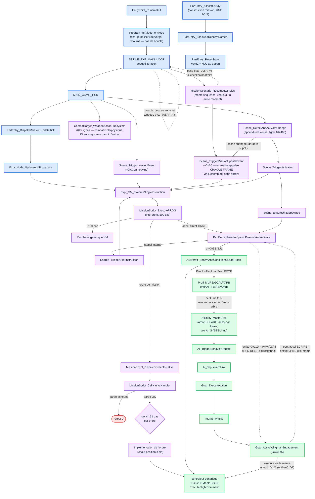

# Ordres de mission — comment le script les exécute réellement

*Convention adoptée pour ce document : pseudocode C, pas d'assembleur
brut. Chaque fonction est désignée par son nom sémantique (voir
`known_functions.json`), jamais par sa seule adresse (`sub_XXXXX`) —
l'adresse est indiquée une fois, entre parenthèses, pour qui veut
retrouver le code source.*

*Terminologie corrigée en cours de session : ce qu'on appelait
`MissionObject` (structure de 85 octets) est en réalité une entrée du
chunk **`PART`** (participants/factions), confirmé par recoupement
avec `DATA_MODEL.md` et l'implémentation C de Rémi — renommé
`PartEntry` partout dans ce document.*

## Graphe d'appels — construit progressivement au fil des sessions

*Chaque nouvelle fonction lue en profondeur est ajoutée ici, pas
seulement décrite en texte — pour garder une vue d'ensemble de
l'architecture à mesure qu'elle se précise.*



**Ce que ce graphe montre maintenant** : le contrôleur générique est
**résolu** (vert) — une entité avion/pilote IA complète, avec son
propre profil `MVRS`, créée à la demande par
`PartEntry_ResolveSpawnPositionAndActivate`. Cette dernière n'est pas un
système séparé : elle est appelée par l'interprète, et le **rappelle**
en interne (flèche pointillée) pour une sous-évaluation — un appel
récursif contrôlé sur la même structure, pas deux systèmes distincts
qui convergent par coïncidence.

## CORRIGÉ : cette chaîne tourne en fait À CHAQUE FRAME — `STRIKE_EXE_MAIN_LOOP`
contient la boucle principale du jeu

*Rémi a signalé une erreur dans une conclusion précédente de ce
document (qui affirmait à tort que toute cette chaîne n'était que de
l'initialisation) : `Program_InitVideoFontArgs` n'est pas un simple
init isolé — c'est ce qui lance le jeu, et la boucle réelle vit plus
bas dans la chaîne. Vérifié par lecture complète des deux fonctions
concernées.*

```
EntryPoint_RuntimeInit
    Program_InitVideoFontArgs   (init police/video/args — SE TERMINE, pas de boucle ici)
        STRIKE_EXE_MAIN_LOOP_53896   <-- CONTIENT LA VRAIE BOUCLE (verifiee : jmp loc_538A1, "tant que byte_706AF != 6")
            MAIN_GAME_TICK_536F7   (appelee A CHAQUE ITERATION)
                PartEntry_DispatchMissionUpdateTick_52E51
                    Expr_Node_UpdateAndPropagate_52AC6
                        Expr_VM_ExecuteSingleInstruction_51E7E
                            Expr_VM_Interpreter_51106
                                PartEntry_ResolveSpawnPositionAndActivate_51EDC
                                    Shared_TriggerExprInstruction
```

## Autre vérification dans la même séquence, découverte par Rémi :
`MissionScenario_RecomputeFields`, appelée depuis `STRIKE_EXE_MAIN_LOOP`

*Trouvaille de Rémi : un second déclencheur de `Scene_TriggerMissionUpdateEvent`,
appelé juste après `MAIN_GAME_TICK` dans la même itération de la boucle
principale — pas une chaîne séparée, une vérification supplémentaire au
même passage.*

```c
void MissionScenario_RecomputeFields(MissionScenario *scenario)
{
    if (scenario->currentScene != 0)   // +0x50
        Scene_TriggerMissionUpdateEvent(scenario->currentScene);
    if (scenario->pendingScene != 0)    // +0x4E
        Scene_TriggerMissionUpdateEvent(scenario->pendingScene);

    if (PositionMatchesGlobalCheckpoint()) {
        byte_706AF = 5;   // LE MEME OCTET QUI CONTROLE STRIKE_EXE_MAIN_LOOP !
    }

    MissionScenario_ResolveAndBindExpressions(scenario);   // ecrit MISN2OP.IFF
    sub_A8124(scenario);
    sub_6CDBE();
}
```

**Deux découvertes majeures** :

1. **`+0x4E` et `+0x50` sur `MissionScenario` sont des pointeurs de
   `SceneRecord`** — corrige une documentation antérieure de
   `DATA_MODEL.md` qui les décrivait comme un "handle de nœud" et un
   "flag HOME". `+0x50` correspond exactement au champ rempli par
   `Scene_DetectAndActivateChange`.
2. **Cette fonction manipule directement `byte_706AF`** — l'octet qui
   contrôle la sortie de la boucle principale du jeu
   (`STRIKE_EXE_MAIN_LOOP`, `tant que byte_706AF != 6`). C'est un lien
   direct, jamais tracé jusqu'ici, entre la logique de scénario et le
   contrôle du jeu à son plus haut niveau. Elle appelle aussi la
   fonction d'écriture des résultats de fin de mission
   (`MissionScenario_ResolveAndBindExpressions` → `MISN2OP.IFF`).

**Appelée directement depuis `STRIKE_EXE_MAIN_LOOP`**, à la suite de
`MAIN_GAME_TICK` dans la **même séquence** de la même itération de la
boucle principale — pas un chemin parallèle, juste une vérification
faite à un autre moment de ce même passage.


*Question de Rémi : après `PART` (via `PROG`/opcode et via
`PartEntry_DispatchMissionUpdateTick`), où est le chemin équivalent
pour les scènes ?*

**Confirmé : pas une boucle sur toutes les scènes, mais une
vérification à chaque frame qui déclenche l'exécution quand la scène
active change.**

```
MAIN_GAME_TICK (chaque frame)
    Scene_DetectAndActivateChange (chaque frame)
        Scene_FindMatchingByAreaContainment -> resout la scene active courante
        si elle a change depuis le dernier appel :
            si une ancienne scene existait : declenche son +0x10 (on_mission_update)
            si une nouvelle scene existe :   Scene_TriggerActivation -> +0x08 (on_is_activated)
                                              + fait apparaitre ses unites (Scene_EnsureUnitsSpawned)
        sinon (scene inchangee) : rien ne se declenche
```

**Précision corrigée sur `on_mission_update` d'une scène** — d'abord
mal caractérisée, puis corrigée par Rémi : en ne regardant que l'appel
depuis `Scene_DetectAndActivateChange` (uniquement sur changement de
scène), on aurait pu croire que c'était un événement ponctuel. Mais
**`Scene_TriggerMissionUpdateEvent_53211` elle-même n'a aucune
garde** — c'est **`MissionScenario_RecomputeFields_A9382`**, appelée
sans condition à chaque frame, qui la déclenche tant que `+0x50`
(la scène active courante) reste non nul. **`on_mission_update` d'une
scène tourne donc bien en continu, une fois par frame, exactement
comme celui de `PART`** (voir `PartEntry_DispatchMissionUpdateTick`).

L'appel depuis `Scene_DetectAndActivateChange` (uniquement quand la
scène change) est une **garantie supplémentaire** — s'assurer que
l'ancienne scène reçoit un dernier appel avec sa propre référence,
juste avant que `+0x50` ne soit remplacé par la nouvelle — pas le
mécanisme principal.

Un troisième champ, `+0x0C` (`on_leaving`), est déclenché séparément
par `Scene_TriggerLeavingEvent_531F2` — appelé directement depuis `MAIN_GAME_TICK`, pas
depuis `Scene_DetectAndActivateChange`.


*Erreur de nommage identifiée en cherchant qui parcourt la liste des
`SCNE` (scènes de mission).*

En cherchant une boucle au pas `0x27` (39 octets, taille exacte d'un
enregistrement `SCNE`), on retrouve `Scene_FindMatchingByAreaContainment`
(`sub_53236`) :

```c
SceneRecord *Scene_FindMatchingByAreaContainment(PlayObject *play, uint16_t param)
{
    for (uint16_t i = 0; i < play->sceneCount; i++) {
        SceneRecord *scene = play->sceneArray + i * 0x27;
        if (scene->is_active && scene->areaHandle) {
            bool matches = (scene->areaHandle == 0)
                ? true
                : scene->areaHandle->vtable->TestContainment(param);
            if (matches) return scene;
        }
    }
    return NULL;
}
```

**Cette fonction est appelée par ce qu'on avait nommé à tort
`MissionFormation_HandleGroupSelectionChange`** — il n'y a jamais eu
de "formation" ou de "groupe" : le "groupe" détecté et activé, c'était
**la scène active courante**. Toute la chaîne a été renommée :

| Ancien nom (erroné) | Nouveau nom |
|---|---|
| `MissionFormation_HandleGroupSelectionChange` | `Scene_DetectAndActivateChange` |
| `MissionFormation_TickGroup` | `Scene_TriggerActivation` |
| `MissionFormation_EnsureAllSlotsFilled` | `Scene_EnsureUnitsSpawned` |

`Scene_EnsureUnitsSpawned` (`sub_530FF`) prend maintenant tout son
sens : son paramètre est très probablement **la scène elle-même**, et
`+0x14`/`+0x16` correspondent à la **liste d'unités** documentée en
queue du chunk `SCNE` (`DATA_MODEL.md` — liste de `u16`, index dans
`PART`) — elle s'assure que toutes les unités associées à la scène
existent bel et bien au moment où celle-ci s'active.

**Chaîne complète, maintenant cohérente** : le joueur/une entité se
déplace → `Scene_DetectAndActivateChange` détecte que la scène
correspondante a changé → `Scene_TriggerActivation` fait apparaître
les unités manquantes de la nouvelle scène (`Scene_EnsureUnitsSpawned`
→ `PartEntry_ResolveSpawnPositionAndActivate`) et déclenche l'exécution de
son script `on_is_activated`.

tableau des `PartEntry`

*Question de Rémi : quel est le type d'objet parcouru par cette
fonction ?*

Deux preuves convergentes permettent de trancher avec confiance :

1. **Le pas de la boucle est exactement `0x55` (85 octets)** — la
   taille exacte confirmée de `PartEntry` (`PartEntry_AllocateArray`)
2. **Le bit testé est le bit 0 de `+0x39`** — le même champ de statut
   manipulé par `PartEntry_ResetState`

```c
void PartEntry_DispatchMissionUpdateTick(PartEntry *partTable, uint16_t count)
{
    for (uint16_t i = 0; i < count; i++) {
        if (partTable[i].statusFlags & 0x01) {   // bit "on_mission_update actif"
            Expr_Node_UpdateAndPropagate(&partTable[i]);
        }
        partTable += 1;   // += 0x55 octets
    }
}
```

**C'est le vrai déclencheur, à chaque frame, de l'événement
`on_mission_update`** pour chaque participant de mission dont le bit
correspondant est actif — le point d'entrée de toute la chaîne qui
suit (`Expr_Node_UpdateAndPropagate` → `Expr_VM_ExecuteSingleInstruction`
→ `MissionScript_ExecutePROG`) et qui finit par exécuter le script
`on_mission_update` de ce participant (`PartEntry+0x46/0x48`).


(vérifiée en entier, 289 lignes) charge la police, configure la
vidéo, parse les arguments de ligne de commande, appelle
`STRIKE_EXE_MAIN_LOOP` **une seule fois**, puis se termine (`retf`) —
jusque-là, pas de boucle. Mais **`STRIKE_EXE_MAIN_LOOP` elle-même**
(vérifiée en entier, 254 lignes) contient une **vraie boucle** :
`loc_538A1` est une cible de saut arrière (`jmp loc_538A1` à la ligne
correspondant à `sub_53896+12B`), avec condition de sortie
`byte_706AF == 6`. **C'est la boucle principale du jeu** — elle
appelle `MAIN_GAME_TICK` à chaque itération, donc
tout ce qui en découle (jusqu'à `PartEntry_ResolveSpawnPositionAndActivate`
et au-delà) s'exécute **à chaque frame**, pas une seule fois.

**Conséquence** : toute la chaîne de gestion de formation/script de
mission qu'on a tracée en profondeur cette session **est bien exécutée
en continu pendant le jeu** — pas seulement à l'initialisation de la
mission. C'est très probablement **la vraie réponse** à la question
initiale ("que se passe-t-il à chaque frame pour la gestion de
mission ?"), pas une impasse comme on l'avait conclu à tort.

**Ce qui reste vrai malgré cette correction** : on n'a toujours pas
trouvé de lien direct par appel de fonction entre cette chaîne et
`AI_TopLevelThink`/`Goal_ExecuteAction` (les deux boucles tournent en
parallèle, chacune à chaque frame, sans s'appeler l'une l'autre) —
mais l'explication n'est plus "l'une est init, l'autre est
exécution" ; c'est que ce sont **deux boucles per-frame distinctes**
qui communiquent par état partagé sur l'entité, pas par appel direct.

**Pour continuer à comprendre l'exécution par frame de la mission
elle-même** (pas l'initialisation), il faut repartir de
`AIEntity_MasterTick` ou d'un point situé dans son propre arbre — pas
de la chaîne de formation/spawn documentée ci-dessus.

## Découverte architecturale : ce n'est pas un système de mission, c'est
un moteur générique d'évaluation de nœuds

*Correction majeure : en cherchant tous les appelants de l'adaptateur
(pas un seul exemple), on découvre que ce système dépasse largement
les scripts de mission.*

**12 fonctions complètement différentes** appellent
`Expr_VM_ExecuteSingleInstruction`, couvrant des domaines sans aucun
rapport entre eux :

| Fonction appelante | Domaine |
|---|---|
| `Expr_Node_RecomputeIfDirty` | Graphe de nœuds générique |
| `Expr_Node_UpdateAndPropagate` | Graphe de nœuds générique |
| `Expr_Node_RecomputeFieldA/B/C` | Graphe de nœuds générique |
| `Expr_Node_EvaluateVisibility` | Graphe de nœuds générique |
| `STRIKE_EXE_MAIN_LOOP` | **Boucle principale du jeu** (corrigé — pas une simple interface) |
| `Weapon_HUDBox_UpdateAndRender` | HUD d'armement |
| `AITargeting_ComputeOrientationExtended` | Ciblage IA |
| `UIScript_ParseAndEvaluate` | Script d'interface |
| `Gauge_ComputeAndRenderNeedle` | Instruments de bord |
| `PartEntry_ResolveSpawnPositionAndActivate` | Mission (celui qu'on a tracé) |

**Conclusion** : `MissionScript_ExecutePROG` (l'interprète à 209 cas)
n'est pas un interprète de script de mission au sens strict — c'est
un **moteur générique d'évaluation de nœuds/expressions**, réutilisé
dans une grande partie du moteur du jeu (interface, jauges, HUD,
ciblage IA, ET scripts de mission). Les ordres de mission (`Take
off`, `Destroy target`...) ne sont qu'**un domaine parmi d'autres**
que ce moteur générique sait évaluer.

**Ça renforce fortement l'hypothèse notée précédemment** : les
identifiants `MVRS` (`1` à `21`) pourraient bien être des nœuds de ce
même graphe générique, pas de simples champs C indépendants — puisque
ce moteur gère déjà, de façon prouvée, plusieurs familles de nœuds
totalement différentes (interface, jauges, ciblage) sous une seule et
même infrastructure. À vérifier directement contre `AI_SYSTEM.md`.

---

## Fonction : `MissionScript_CallNativeHandler` (`sub_52513`, `seg114`)

**Rôle** : point d'aiguillage central pour tous les ordres de mission
sémantiques (Take off, Land, Destroy target, etc.). Vérifie d'abord
si l'exécution est possible, puis distingue l'ordre demandé, puis
délègue systématiquement l'exécution tactique réelle à un contrôleur
générique.

### Signature

```c
int16_t MissionScript_CallNativeHandler(
    PartEntry *missionObject,  // arg_0 (dword) — objet reference par [instruction+0x12]
    uint16_t opcode,                 // arg_4 (word)  — le code d'ordre, ex. ORDER_TAKE_OFF
    uint16_t param1,                 // arg_6 (word)  — [instruction+8]
    uint16_t param2                  // arg_8 (word)  — [instruction+0xA]
);
```

### Variables locales notables

| Nom dans ce document | Rôle |
|---|---|
| `resolvedPosition` | Position 3D calculée par le cas de l'ordre (x,y,z, virgule fixe 24.8) |
| `resolvedTargetObject` | Pointeur vers l'objet cible/allié résolu, si l'ordre en implique un |
| `skillValue` | Valeur de "compétence" transmise au contrôleur générique — copiée depuis `resolvedTargetObject->performanceStat` (le champ `+0x52` scalaire, issu du sous-chunk `TOFF`) si un objet a été résolu |

### Pseudocode

```c
int16_t MissionScript_CallNativeHandler(PartEntry *missionObject,
                                          uint16_t opcode,
                                          uint16_t param1,
                                          uint16_t param2)
{
    // --- Garde d'entree : determine si QUOI QUE CE SOIT s'execute ---
    if (missionObject->controller == NULL) {
        return 0;   // pas de controleur associe -> echec immediat
    }
    if ((missionObject->statusFlags & STATUS_BIT_BUSY) != 0) {
        return 0;   // objet indisponible -> echec immediat, quel que soit l'ordre
    }

    missionObject->completionFlag = 0xFF;   // pose l'etat "ordre en cours"

    Vec3 resolvedPosition = {0};
    PartEntry *resolvedTargetObject = NULL;
    int skillValue = 0;

    switch (opcode) {
        case ORDER_TAKE_OFF:
            resolvedPosition = LookupNamedWaypoint(g_waypointTable, WAYPOINT_TAKEOFF_INDEX);
            break;

        case ORDER_LAND:
            resolvedPosition = LookupNamedWaypoint(g_waypointTable, param1);  // source differente de Take off
            break;

        case ORDER_FLY_TO_MISSION_POINT:
        case ORDER_FLY_TO_RELATIVE_POINT:      // partage le meme code (0xAC)
            // resout DEUX positions successives (depart + arrivee ?)
            Vec3 posA = LookupNamedWaypoint(g_waypointTable, param2);
            Vec3 posB = LookupNamedWaypoint(g_waypointTable, missionObject->localPositionRef);
            resolvedPosition = posB;   // la seconde ecrase la premiere dans ce qu'on a lu
            break;

        case ORDER_DESTROY_TARGET:
            resolvedTargetObject = ResolveObjectById(g_objectTable, param1);
            if (resolvedTargetObject == NULL) return 0;
            resolvedPosition = GetCurrentPosition(resolvedTargetObject);  // repete a chaque appel, donc a jour
            break;

        case ORDER_DEFEND_TARGET:
            resolvedTargetObject = ResolveObjectById(g_objectTable, param1);
            if (resolvedTargetObject == NULL) return 0;
            resolvedPosition = GetCurrentPosition(resolvedTargetObject);
            // + une seconde resolution de position, non elucidee precisement
            break;

        case ORDER_DEFEND_AREA:
            resolvedPosition = LookupNamedWaypoint(g_waypointTable, param1);  // zone = coordonnee fixe
            break;

        case ORDER_FOLLOW_ALLY: {
            uint16_t allyId = (param1 == 0xFF) ? missionObject->defaultAllyId : param1;
            resolvedTargetObject = ResolveObjectById(g_objectTable, allyId);
            if (resolvedTargetObject != NULL) {
                resolvedPosition = resolvedTargetObject->rawPosition;  // lecture directe, pas GetCurrentPosition
            }
            break;
        }

        // 0xA3, 0xAB, 0xB1-0xB5 : mecanismes proches (resolution d'objet
        // ou table de positions) mais nature tactique precise non
        // confirmee empiriquement — voir table plus bas

        default:
            return 0;
    }

    if (resolvedTargetObject != NULL) {
        skillValue = resolvedTargetObject->performanceStat;   // champ +0x52 scalaire (TOFF)
    }

    // --- Sortie commune : delegation a l'execution tactique reelle ---
    // AUCUN calcul de poursuite/tir ne vit ici ni dans aucun cas ci-dessus
    return missionObject->controller->vtable->ExecuteFlightCommand(
        resolvedPosition, skillValue, opcode, param2 /* duree ? */
    );   // [controller->vtable+0x88] — methode generique, PAS specifique au vol
          // (le meme slot est aussi appele par PartEntry_ResolveSpawnPositionAndActivate
          // avec un opcode different, 0xB3 — confirme un dispatcheur
          // multi-usage, pas un controleur de vol dedie)
}
```

### Points de retour

| Condition | Valeur retournée |
|---|---|
| Pas de contrôleur associé à l'objet de mission | `0` |
| Objet marqué occupé/indisponible | `0` |
| Ordre non reconnu par le switch | `0` |
| Résolution d'objet cible échouée (Destroy/Defend target) | `0` |
| Succès | résultat de `ExecuteFlightCommand` (contrôleur générique) |

### Ce qui reste incertain

- **`ExecuteFlightCommand`** (`[vtable+0x88]`) — la méthode réellement
  responsable de l'exécution tactique n'a pas été identifiée. Elle
  est générique (utilisée aussi par un système de rendu/géométrie
  sans rapport, avec un opcode différent), donc probablement un
  "bus de commande" d'entité plutôt qu'un contrôleur de vol dédié.
- Le champ `controller` (`+0x52` comme pointeur) — aucun site de
  construction retrouvé par recherche textuelle à ce stade.
- **Piège à ne pas refaire** : ce même décalage `+0x52` est aussi un
  champ **scalaire** (`performanceStat`, issu du sous-chunk `TOFF`)
  sur un objet totalement différent (la définition d'avion chargée
  au parsing `JETP`) — deux structures distinctes, même décalage.

---

## Fonction : `MissionScript_DispatchOrderToNative` (`loc_51C09`, `seg114`)

**Rôle** : relais partagé par presque tous les ordres du premier
switch (209 cas) — prépare les paramètres et appelle
`MissionScript_CallNativeHandler`, puis mémorise le résultat sur
l'instruction elle-même.

### Pseudocode

```c
void MissionScript_DispatchOrderToNative(ScriptInstruction *instr)
{
    instr->taskState = MissionScript_CallNativeHandler(
        instr->missionObjectRef,   // [instr+0x12]
        instr->opcode,               // [instr+6]
        instr->param1,                // [instr+8]
        instr->param2                 // [instr+0xA]
    );
    // instr->taskState ([instr+0xE]) devient l'etat "ordre en cours"
    // -> relu par IsOrderActive/IsOrderComplete (voir plus bas)
}
```

---

## Table des ordres — noms en référence principale

| Ordre | Mécanisme | Détail |
|---|---|---|
| **Take off** | Table de positions | `LookupNamedWaypoint` sur un index fixe |
| **Land** | Table de positions | Même table, source de paramètre différente |
| **Vol vers point de mission** | Table de positions (double) | Résout deux positions successives |
| **Destroy target** | Résolution d'objet | Position de la cible relue à jour à chaque appel |
| **Defend target** | Résolution d'objet (double) | Cible à défendre + une seconde résolution non élucidée |
| **Defend area** | Table de positions | Coordonnée fixe, pas d'objet suivi |
| **Follow ally** | Résolution d'objet + lecture directe | `0xFF` = allié par défaut ; lit la position brute, pas via résolution différée |

### Ordres non identifiés dans la table externe de Rémi

| Code | Mécanisme | Hypothèse |
|---|---|---|
| `0xA3` | Résolution d'objet + relecture d'une position "Take off" | Possible "escorter X puis continuer" |
| `0xAB` | Copie directe de `completionFlag`, pas de résolution | Possible "vérifier si l'ordre précédent est terminé" |
| `0xB1` | Table indexée, écrit un axe (Y ?) | Possible "définir l'altitude depuis une liste" |
| `0xB2` | Même table, axe différent | Complément de `0xB1` |
| `0xB3` | Résolution d'objet | Variante de ciblage non déterminée |
| `0xB4` | Table de positions | Variante de positionnement non déterminée |
| `0xB5` | Résolution d'objet | Variante de ciblage non déterminée |

---

## Le mécanisme de suivi "ordre en cours / ordre terminé"

`ScriptInstruction->taskState` (`[instr+0xE]`) — un champ sur
l'**instruction elle-même**, pas une variable globale — porte cet
état. Deux opcodes dédiés le consultent :

```c
// "L'ordre en cours est-il actif ?"
bool IsOrderActive(ScriptInstruction *instr) {
    return instr->taskState != 0;
}

// "L'ordre en cours est-il termine ?"
bool IsOrderComplete(ScriptInstruction *instr) {
    return instr->taskState == 0;
}
```

**Point important** : ces tests servent à **l'auteur du script** pour
décider explicitement d'avancer au prochain ordre — ce n'est **pas**
un blocage automatique. La fonction qui avance la lecture du script
(`ScriptAdvanceToNextInstruction`, `sub_50F85`) ne vérifie jamais cet
état — rien n'empêche mécaniquement d'enchaîner deux ordres sans test
entre eux.

## Une trace unique de l'ordre en cours, pas une file

| Champ | Rôle |
|---|---|
| `entité+0x11D` | Code de l'ordre en cours (consulté par `GOAL`/`Goal_ExecuteAction`) |
| `entité+0x54` | Drapeau d'état/achèvement (`completionFlag`, `0xFF` = posé) |
| `entité+0x11` | Nœud construit à la demande (même mécanisme que `MVRS`) |
| `entité+0x137` | Référence de cible (ordres type "détruire/défendre") |
| `entité+0x11F`/`+0x12B` | Coordonnées de point de mission, partagées script/`GOAL` |

Si deux ordres s'enchaînent sans test explicite, le second **écrase**
l'état du premier dans ces mêmes champs.

## Script et `GOAL` : qui fait le vrai travail ?

**Le script résout une intention (position/cible) ; il n'exécute
aucune tactique lui-même.** Toute la logique de poursuite, d'approche
et de tir est déléguée à `ExecuteFlightCommand` — un point unique et
générique, identique pour tous les ordres, non encore identifié
précisément.

## RÉSOLU : le contrôleur `+0x52` est une entité avion/pilote IA
complète — le même objet que toute la documentation `MVRS`

*Trouvaille majeure qui referme la question ouverte, et relie
directement ce document à `AI_SYSTEM.md`.*

En lisant intégralement `sub_51EDC` (deux noms précédents erronés :
d'abord "GeomNode_BuildOrRefreshCluster" — supposait à tort un lien
avec la géométrie sur la seule foi des noms de ses callees —, puis
"MissionFormation_ComputeSlotAndSpawn" — trop spécifique, puisqu'elle
est aussi appelée depuis la chaîne des scènes) :

```c
// Extrait central, PartEntry_ResolveSpawnPositionAndActivate (sub_51EDC, seg114)
Vec3 spawnPosition = ComputeWeightedPositionOffset(partEntry);
                       // combine plusieurs points nommes ponderes
                       // (Formation_ComputeGeometryHelper, AI_ComputeApproachAngles —
                       // utile pour un ordre de formation, mais la fonction
                       // elle-meme est generique)

AircraftEntity *spawned = AIAircraft_SpawnAndConditionalLoadProfile(
    g_waypointTable, partEntry->localRef, spawnPosition
);

SetReference(&partEntry->controller, spawned);   // +0x52 assigne ICI
```

**`AIAircraft_SpawnAndConditionalLoadProfile` (`sub_53363`) est la
fabrique de l'entité avion/pilote elle-même** — la MÊME entité sur
laquelle repose toute la documentation `MVRS`/`ATRB`/`GOAL`
(`AI_SYSTEM.md`) :
- Détermine le type de contrôle (joueur/réseau/IA par comparaison de
  chaîne)
- Instancie l'entité, la positionne
- **Appelle `PilotProfile_LoadFromPROF` — la même fonction lue
  intégralement dans la session `MVRS`** — chargeant `GOAL`/`MVRS`/
  `ATRB`, mais **uniquement pour les avions IA/réseau, jamais pour le
  joueur**
- Enregistre l'entité comme auditeur du système `Expr_VM` (le même
  interprète à 209 cas documenté ici) **avant** le chargement du
  profil

**Conséquence directe** : `[+0x52 → vtable+0x88]`
(`ExecuteFlightCommand`) est une méthode de **cette même classe
d'entité avion/pilote** — pas un système séparé et mystérieux. Que ce
soit un ordre de script direct ou l'activation d'une scène, le
mécanisme **fait apparaître un avion IA complet avec son propre profil
de comportement**, puis lui délègue l'exécution du vol via cette
méthode.

**Piste ouverte, notée par une lecture antérieure de
`AIAircraft_SpawnAndConditionalLoadProfile`** : l'entité est
enregistrée comme auditeur `Expr_VM` **avant** le chargement de son
profil `MVRS` — ce qui suggère que les identifiants de nœuds `MVRS`
(`1` à `21`) pourraient correspondre à des identifiants de nœuds du
graphe `Expr_VM` plutôt qu'à de simples champs C indépendants. Non
vérifié — candidat pour une prochaine session, avec un lien direct
vers `AI_SYSTEM.md`.

## RÉSOLU : le lien entre script et `GOAL` — `entité+0x11D` est un canal
bidirectionnel, pas un drapeau à sens unique

*Question empirique posée par Rémi : avec seulement `GOAL=1`, son
coéquipier décolle (premier ordre du script) mais ignore ensuite
l'ordre "Follow Leader" (monte simplement dans le ciel). Avec `GOAL=1`
et `GOAL=5`, il suit immédiatement et précisément le vol du joueur.
Ça prouve qu'un vrai mécanisme relie script et `GOAL` — la conclusion
précédente ("le script délègue directement, sans passer par `GOAL`")
était incomplète.*

En lisant intégralement `Goal_ActiveWingmanEngagement_878F` (l'option
de tournoi liée à `GOAL=5`) :

```c
// Extrait central de Goal_ActiveWingmanEngagement (GOAL=5)
void Goal_ActiveWingmanEngagement(Entity *self, Context *ctx)
{
    // ... conditions de garde (portee, delai anti-spam byte_6E4CD) ...

    if (self->currentOrder == ORDER_FOLLOW_ALLY) {   // entite+0x11D == 0xAA
        // execute le suivi actif, continu, image par image
        RadioAnnounce(self, ...);
        self->flags_28B |= 0x20;
        currentOrder->vtable->ExecuteViaID21(self);   // entite+0xD1 -> vtable+8
    }
    else if (/* cible verrouillee correspond a self->allyRef */) {
        // PEUT ELLE-MEME poser l'ordre :
        self->currentOrder = ORDER_FOLLOW_ALLY;         // entite+0x11D = 0xAA
        SetReference(&self->allyRef, word_722E6);        // entite+0x145
        currentOrder->vtable->ExecuteViaID21(self);
    }
    else if (/* autre condition */) {
        self->currentOrder = ORDER_FLY_TO_MISSION_POINT;  // entite+0x11D = 0xA5
        currentOrder->vtable->ExecuteViaID21(self);
    }
}
```

**Deux découvertes en une** :

1. **`entité+0x11D` est un canal à double sens** : le script peut le
   poser (via `Goal_SetObjective`), et `Goal_ActiveWingmanEngagement`
   (`GOAL=5`) le **lit** pour décider d'agir — mais elle peut **aussi
   l'écrire elle-même**, avec le même vocabulaire de codes (`0xAA`,
   `0xA5`), selon ses propres observations (correspondance avec
   `word_722E6`, la cible/leader couramment sélectionné).

2. **Les deux chemins (script direct, et `GOAL=5`) convergent vers la
   même exécution finale** : l'appel à `entité+0xD1 → vtable+8` — le
   nœud `MVRS` `ID=21` qu'on avait déjà identifié comme exécuteur de
   navigation caché, utilisé aussi bien par
   `PartEntry_ResolveSpawnPositionAndActivate` (côté script) que par cette
   fonction (côté `GOAL`).

**Ça explique précisément l'observation empirique** : avec `GOAL=1`
seul, le script pose bien `entité+0x11D=0xAA`, mais **aucune option du
tournoi ne consulte ce champ** — rien ne réagit, l'avion garde son
dernier état (monter, après le décollage). Avec `GOAL=5` présent, le
tournoi peut sélectionner cette option, qui consulte le champ, le
trouve à `0xAA`, et déclenche l'exécution réelle et continue.

**Donc la réponse complète à "comment sont reliés script et GOAL"** :
ce n'est ni "flag posé puis lu passivement" ni "exécution 100% directe
sans GOAL" — c'est une **collaboration bidirectionnelle sur un champ
partagé**, où certaines options du tournoi (`GOAL=5` pour l'escorte,
probablement d'autres pour d'autres ordres) sont les seules capables
de traduire l'intention en comportement de vol continu et réactif.


- Confirmer `0xA3`, `0xAB`, `0xB1`-`0xB5` par observation empirique.
- Le mécanisme précis reliant le script à `Goal_SetObjective` (système
  à nœuds séparé, tag `0x120`) — jugé secondaire, le résultat
  fonctionnel (champs partagés) étant déjà confirmé.
- Les ~130 cas de plomberie générique du premier switch — hors
  périmètre "ordres de mission" sauf indication contraire.
- Vérifier l'hypothèse "identifiants `MVRS` = nœuds `Expr_VM`"
  ci-dessus contre ce qu'on a déjà établi dans `AI_SYSTEM.md`.

## Découverte architecturale : l'interprète est un utilitaire générique,
pas exclusif aux scripts de mission

En cherchant l'assignation du contrôleur, on a tracé la chaîne de
construction complète des objets de mission — et découvert au passage
que `MissionScript_ExecutePROG` (l'interprète à 209 cas) est appelé
**via un adaptateur générique**, pas uniquement depuis un vrai buffer
de script persistant :

```c
// Expr_VM_ExecuteSingleInstruction (sub_51E7E) — 48 lignes, lue integralement
int16_t Expr_VM_ExecuteSingleInstruction(uint16_t opcode,
                                           PartEntry *object,
                                           Vec3 position)
{
    if (object == NULL) return 0;

    // Construit une fausse instruction TEMPORAIRE sur sa propre pile —
    // pas dans un vrai buffer de script persistant
    ScriptInstruction fakeInstr = {0};
    fakeInstr.missionObjectRef = object;
    fakeInstr.positionOrParams = position;
    fakeInstr.opcode = opcode;

    return MissionScript_ExecutePROG(&fakeInstr);
}
```

**Cet adaptateur est aussi appelé par `PartEntry_ResolveSpawnPositionAndActivate_51EDC`
elle-même**, en interne, via `Shared_TriggerExprInstruction_5247D`
(renommée — le nom précédent, `GeomNode_TriggerExprInstruction`,
supposait à tort un lien avec la géométrie sur la seule foi du nom de
son appelante). **Ce n'est pas un second système sans rapport qui
converge par coïncidence** — `PartEntry_ResolveSpawnPositionAndActivate`
est elle-même appelée par l'interprète (`+0x6FB`), et rappelle
l'interprète en interne pour une sous-évaluation, sur la **même**
structure à 85 octets (`+0x39`, `+0x3A`). C'est un appel récursif
contrôlé, pas une convergence entre deux systèmes distincts.

**Conséquence** : la structure à 85 octets qu'on a tracée
(`PartEntry_AllocateArray_AA23D`) et son champ de statut
(`+0x39`/`+0x3A`/`+0x52`/`+0x54`) forment probablement un patron
**générique de "nœud exécutable"**, réutilisé par plusieurs systèmes
du moteur (mission ET géométrie), pas une structure conçue
uniquement pour les ordres de mission — cohérent avec tout ce qu'on a
observé ailleurs dans ce binaire (destructeurs partagés, registre de
références faibles unique, etc.).

## Fonction : `PartEntry_AllocateArray` (`sub_AA23D`, `seg457`)

**Rôle** : construit le tableau complet des objets de mission au
chargement, un enregistrement de 85 octets par objet.

```c
void PartEntry_AllocateArray(ScriptHeader *header, PartEntry **outArray)
{
    int count = header->totalScriptBytes / 0x3E;
    // (verification de coherence omise ici, presente dans le code reel)

    PartEntry *array = (PartEntry *)AllocateTyped(
        TAG_MISSION_OBJECT, count * sizeof(PartEntry) /* 0x55 = 85 octets/element */
    );
    *outArray = array;

    for (int i = 0; i < count; i++) {
        PartEntry_LoadAndResolveNames(header, &array[i]);
    }
}
```

## Fonction : `PartEntry_LoadAndResolveNames` (`sub_A9E3C`, `seg457`)

**Rôle** : initialise une entrée `PART` (participant/faction de la
mission — confirmé par recoupement avec `DATA_MODEL.md`) depuis les
données brutes du chunk. **Découverte majeure** : c'est ici que les 4
identifiants de script (`progs_id[0..3]` dans l'implémentation de
Rémi) sont résolus en pointeurs directs vers le `PROG` réel.

```c
void PartEntry_LoadAndResolveNames(MissionScenario *scenario, PartEntry *part)
{
    PartEntry_ResetState(part);   // +0x32, +0x39, +0x3A, +0x52, +0x54

    uint8_t rawData[62];
    ReadFieldGroupA(chunk, rawData, 62);   // lecture brute du chunk PART
    part->flagA = rawData[0];                // +0x1B

    part->nameA = ResolveNameAt(part, +9);    // +0x8  (role precis non elucide)
    part->nameB = ResolveNameAt(part, +0x12); // +0x11 (role precis non elucide)
    part->nameC = ResolveNameAt(part, +0x1A); // +0x1A (role precis non elucide)

    part->position = LookupNamedWaypoint(scenario->areaTable, rawData[...]);
    // ecrit +0x1C a +0x37 (position + metadonnees associees, roles
    // precis de chaque sous-champ non tous elucides)

    // --- LES 4 progs_id, resolus en pointeurs directs vers PROG ---
    part->on_is_activated  = Expr_LookupNamedValue(scenario->progTable, rawData_id0); // +0x42/+0x44
    part->on_mission_update = Expr_LookupNamedValue(scenario->progTable, rawData_id1); // +0x46/+0x48
    part->on_is_destroyed   = Expr_LookupNamedValue(scenario->progTable, rawData_id2); // +0x4A/+0x4C
    part->on_missions_init  = Expr_LookupNamedValue(scenario->progTable, rawData_id3); // +0x4E/+0x50

    part->field_0x3E = 0;
    part->field_0x40 = 0;
    // part->controller (+0x52) reste NUL — jamais assigne ici
}
```

**Correspondance confirmée avec l'implémentation de Rémi** :
```c
prt->on_is_activated   = prt->progs_id[0];   // -> PartEntry+0x42
prt->on_mission_update = prt->progs_id[1];   // -> PartEntry+0x46
prt->on_is_destroyed   = prt->progs_id[2];   // -> PartEntry+0x4A
prt->on_missions_init  = prt->progs_id[3];   // -> PartEntry+0x4E
```

Chaque champ est un **pointeur lointain déjà résolu** vers le script
réel dans `PROG` — pas l'identifiant brut conservé tel quel. La
résolution se fait **une fois**, au chargement de la mission, pas à
chaque déclenchement de l'événement.

**Point ouvert** : `+0x3E`/`+0x40`, remis à zéro juste après les 4
`progs_id`, sont des candidats plausibles pour l'état d'exécution
courant (quel script actif, quelle instruction) — distinct de
`entité+0x11D` qu'on avait tracé côté `GOAL`/entité complète. Le lien
exact entre ces deux champs (`PartEntry+0x3E/0x40` vs `entité+0x11D`)
reste à établir.

## Fonction : `PartEntry_ResetState` (`sub_A9DFD`, `seg457`)

**Rôle** : remet une entrée `PART` à son état de repos initial.

```c
void PartEntry_ResetState(PartEntry *obj)
{
    obj->aspectBits = 0xFF;         // +0x32
    obj->extraData = 0;               // +0x3A (dword)
    obj->statusFlags &= ~0x3F;        // +0x39, efface 6 bits (dont le bit "occupe")
    obj->controller = NULL;            // +0x52
    obj->completionFlag = 0xFF;         // +0x54
}
```

## Le chunk `PROG` — chargé comme un bloc brut, pas pré-parsé

*Question de Rémi : comment est parsé le chunk `PROG` (celui que les
4 `progs_id` d'une `PartEntry` référencent) ?*

Réponse, par lecture complète de `ProgBuffer_LoadRawAndCountMarkers`
(`sub_AA31D`, le vrai lecteur confirmé par `DATA_MODEL.md`) :

```c
// ProgBuffer_ResetState (sub_AA2F4)
void ProgBuffer_ResetState(ProgBuffer *buf) {
    buf->markerCount = 0;   // +0x00
    buf->chunkSize = 0;      // +0x06
}

// ProgBuffer_ResetAndSetSize (sub_AA307)
void ProgBuffer_ResetAndSetSize(ProgBuffer *buf, uint16_t size) {
    ProgBuffer_ResetState(buf);
    buf->chunkSize = size;   // +0x06
}

// ProgBuffer_LoadRawAndCountMarkers (sub_AA31D) — LE VRAI LECTEUR
void ProgBuffer_LoadRawAndCountMarkers(ProgBuffer *buf, uint16_t chunkSize,
                                          MissionScenario *scenario)
{
    ProgBuffer_ResetAndSetSize(buf, chunkSize);

    buf->data = AllocateTyped(TAG_0x5C44, chunkSize);   // meme allocateur generique
    ReadFieldGroupA(chunk, buf->data, chunkSize);          // copie BRUTE, sans parsing

    buf->markerCount = 0;
    for (uint16_t i = 0; i < chunkSize; i += 2) {
        if (buf->data[i] == 0) {
            buf->markerCount++;   // compte les octets nuls a positions paires
        }
    }
}
```

**`PROG` n'est pas découpé en instructions à ce stade** — c'est chargé
comme **un seul bloc brut**, avec juste un comptage préliminaire des
octets nuls à positions paires. Le vrai découpage en instructions
(opcode, paramètres, état `[instr+0xE]`) n'a lieu qu'à l'exécution,
dans `MissionScript_ExecutePROG`.

**Confirmé** (voir section suivante) : ces mots nuls sont bien des
**séparateurs** entre plusieurs mini-programmes empaquetés dans le
même bloc — les 4 `progs_id` d'une `PartEntry` sont des **index
séquentiels** dans cette liste (pas des offsets), résolus par
`Expr_LookupNamedValue`/`ProgBuffer_FindSubProgramByIndex`.

**Structure du conteneur `ProgBuffer`** (confirmée) :

| Offset | Champ |
|---|---|
| `+0x00` | compteur de marqueurs (word) |
| `+0x02`/`+0x04` | pointeur lointain vers le tampon brut |
| `+0x06` | taille du chunk (word) |

## Comment les `progs_id` retrouvent leur script — le vrai découpage du bloc `PROG`

*Question de Rémi : comment ce bloc brut est-il découpé pour que la
résolution des `progs_id` d'une `PartEntry` fonctionne ?*

Réponse, par lecture complète de la chaîne `Expr_LookupNamedValue` →
`ProgBuffer_FindSubProgramByIndex` :

```c
// Expr_LookupNamedValue (sub_51E4A) — simple garde de bornes
void far *Expr_LookupNamedValue(ProgBuffer *buf, uint16_t rawId)
{
    if (rawId >= buf->markerCount) return NULL;
    return ProgBuffer_FindSubProgramByIndex(buf->data, rawId);
}

// ProgBuffer_FindSubProgramByIndex (sub_50E94) — LE VRAI DECOUPAGE
void far *ProgBuffer_FindSubProgramByIndex(void far *bufferBase, uint16_t index)
{
    uint16_t far *cursor = bufferBase;
    while (index != 0) {
        while (*cursor++ != 0) { /* avance jusqu'au prochain mot nul */ }
        index--;
    }
    return cursor;   // debut du sous-programme #index
}
```

**Le bloc `PROG` est une séquence de mini-programmes consécutifs,
chacun terminé par un mot nul (`0x0000`, 2 octets)** — un format
classique d'enregistrements empaquetés à la suite, avec un séparateur
à taille fixe plutôt qu'un octet. Pour retrouver le script `#N`, on
saute par-dessus les `N` premiers séparateurs depuis le début du bloc.

**Ça confirme et remplace l'hypothèse précédente** ("offset différent
à l'intérieur du bloc") : ce sont bien des **index séquentiels dans la
liste des mini-programmes**, pas des offsets bruts. Le compteur posé
par `ProgBuffer_LoadRawAndCountMarkers` (`+0x00`) est donc le **nombre
total de mini-programmes empaquetés** dans le bloc `PROG` d'une
mission.

## Ce qui reste ouvert
 (`vtable+0x88`) — reste non identifiée
  précisément, mais on sait maintenant qu'elle coexiste avec le
  mécanisme `entité+0x11D`/`GOAL=5` plutôt que de le remplacer ; les
  deux chemins convergent vers le nœud `ID=21` (`entité+0xD1`).
- Confirmer `0xA3`, `0xAB`, `0xB1`-`0xB5` par observation empirique.
- Vérifier si **d'autres options du tournoi** (pas seulement `GOAL=5`)
  lisent/écrivent `entité+0x11D` pour d'autres ordres du script
  (`Destroy target`, `Defend target`, etc.) — probable vu le motif
  confirmé sur `Follow Ally`.
- Vérifier l'hypothèse "identifiants `MVRS` = nœuds `Expr_VM`" notée
  plus haut, à la lumière de la découverte du canal `entité+0x11D`.
- Les ~130 cas de plomberie générique du premier switch — hors
  périmètre "ordres de mission" sauf indication contraire.
