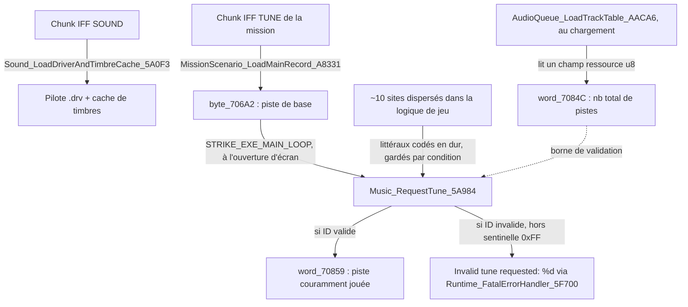
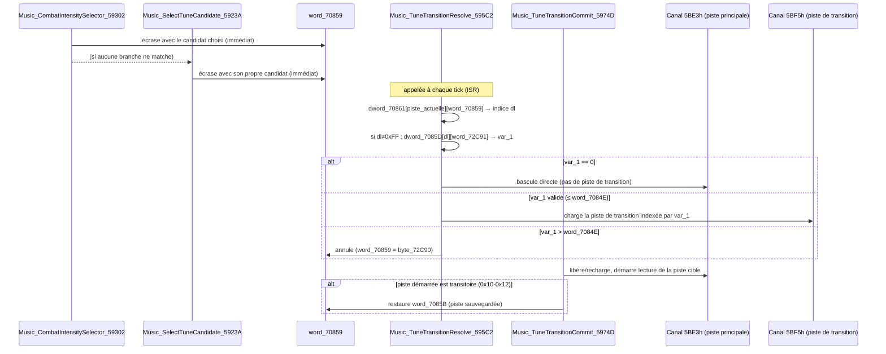

# Strike Commander — Système musical dynamique (XMIDI/AIL)

Document de référence autonome, consolidant l'ensemble des découvertes sur
le moteur de musique dynamique du jeu : chargement du pilote son, sélection
de piste, et déclenchement contextuel par les événements de jeu. Rédigé à
partir de l'analyse ligne à ligne du désassemblage de `STRIKE.EXE`.

**Statut des affirmations** : chaque section précise le niveau de confiance
— *confirmé* (lu ligne à ligne), *fortement déduit* (motif cohérent, xrefs
directes, non lu exhaustivement), ou *hypothèse ouverte* (piste plausible,
non vérifiée).

---

## 0. Corrections et intégration du 2026-10-06 (à lire en premier)

Ce document vient d'une session menée sur une copie plus ancienne du dépôt ; il a été intégré le
2026-10-06, noms mis à jour, et corrigé sur les points suivants.

1. **Le jeu est un programme AIL 2.0 classique.** Tout le seg161 est la bibliothèque `AIL.ASM`
   compilée, dans l'ordre exact du source (`analysis/ail_sources/AIL.ASM`) : `AIL_find_proc_5FB6E`,
   `AIL_call_driver_5FBA6`, l'interruption timer `AIL_API_timer_ISR_5FBBE`, les minuteries
   (`AIL_register_timer_5FF08`, `AIL_set_timer_frequency_600DB`…), les pilotes
   (`AIL_register_driver_6015A`, `AIL_init_driver_60254`…) puis un thunk par fonction pilote :
   `mov ax, N / jmp call_driver`, avec `N` = numéro de `AIL.INC` (ex. `0x97` = 151 =
   `AIL_register_sequence_60396`, `0xAA` = 170 = `AIL_start_sequence_603CC`, `0xB1` = 177 =
   `AIL_set_relative_volume_603F0`). Les anciens noms `ModuleRegistry_*` / `Opcode_XX` sont remplacés.
2. **Les fonctions `Sequencer_*` sont la couche musique du jeu** (pas une infrastructure
   générique) : `Music_ChannelInit_59F87` (table d'état XMIDI), `Music_ChannelRegisterSequence_59FF5`
   (`AIL_register_sequence` + installation des timbres demandés), `Music_ChannelStopSequence_59F1D`,
   `Music_InstallTimbre_5A62A`, `Music_LoadTimbreFromLibrary_5A577` (bibliothèque de timbres au
   format Global Timbre Library : entrées de 6 octets `patch, banque, offset`, fin sur banque
   `0xFF`), `Music_ShutdownDriver_5A856`.
3. **L'interpréteur XMIDI est dans le pilote, pas dans le jeu** (contrairement à ce que disait
   `ADLIB_DRIVER.md` §9). `ADLIB.ADV` contient le shell `XMIDI.ASM` : sa recherche de séquence
   (`cmp word ptr [si], 4F46h` = « FO », `cmp word ptr [si+8], 4D58h` = « XM », adlib.asm l. 8564)
   et l'en-tête `EVNT` sont dans le binaire. Le jeu passe au pilote un pointeur sur la piste XMI ;
   le pilote la joue lui-même à 120 Hz (`QUANT_RATE`). Pour le portage : lecteur XMIDI standard +
   émulateur OPL2. Seule la partie « voix OPL » du pilote (équivalent de `YAMAHA.INC`, absent des
   sources) est propre à cette version.
4. **Le cluster `AudioQueue_*` gère aussi le son numérisé** : `AIL_play_VOC_file_6034E`,
   `AIL_VOC_playback_status_6035A`, `AIL_start_digital_playback_60360` y sont appelés
   (`AudioQueue_MainProcessEntry_ABBEF`, `AudioQueue_OpcodeHelper_ABDAF`). Catalogue de musique
   **et** voix radio coexistent.
5. **§8.1bis était faux** : la fonction appelée « déclencheur missile » est la **décision
   d'éjection** (`AI_EjectDecision_50FF`, ex-`AI_MissileThreatTrigger_A`). Le chemin vers la piste
   `0x13` part donc de l'éjection / destruction d'un avion (`Combat_TeamOpposedCheckAndDispatch_53A94`),
   pas d'une alerte missile. Voir §8.1bis corrigé.
6. **§5.2, pistes `0x10` / `0x11` / `0x12`** : ce sont des **ponctuations de victoire** jouées
   quand **le joueur** a détruit l'objet (`cmp di, word_722E6`), selon la **catégorie** de l'objet
   détruit (`6` = avion → `0x10` ; `0x13`/`0x14` → `0x11` ; autre → `0x12`), pas l'« ID d'un
   widget ». Cohérent avec §8.4 : ces trois pistes sont temporaires, la piste précédente reprend.
7. **§8.1 relu le 2026-10-06** : l'intensité de la musique de combat dépend bien des **dégâts du
   joueur** (7 au-delà de 75 %, 6 au-delà de 35 %), mais seulement après deux priorités : missile
   qui vise le joueur ou avion qui l'attaque (9), ennemi dans ses six heures (5). Voir §8.1.
8. **Les `Weapon_HUDBox_*` n'avaient rien à voir avec le HUD** : ce sont les tests de combat de la
   musique (seg121), le **système d'effets sonores 3D joués en XMIDI** (seg122 : passage d'avion,
   son moteur avec pitch-bend selon la manette) et les façades musique / effets / voix (seg125).
   Tous renommés ; voir §8.1 et §10.

---

## 1. Vue d'ensemble



Le jeu utilise la bibliothèque **AIL (Audio Interface Library, Miles
Design — ancêtre de Miles Sound System)** et son format de musique
**XMIDI**. Deux volets distincts, à ne pas confondre :

1. **Le chargement/pilote** (`Sound_LoadDriverAndTimbreCache_5A0F3`) : lit
   le pilote son (`.drv`), initialise le cache de timbres — se produit une
   fois, au démarrage.
2. **La sélection de piste** (`Music_RequestTune_5A984`) : appelée en
   continu par toute la logique de jeu pour changer la piste en cours
   selon le contexte — c'est le cœur du système "musique dynamique".

---

## 2. Preuves d'identification (confirmé)

Le pool de chaînes global (seg339) contient :

| Chaîne | Rôle |
|---|---|
| `"No mem for XMIDI state table."` | Erreur d'allocation de la table d'état XMIDI |
| `"No memory for timbre cache."` | Erreur d'allocation du cache de timbres |
| `"No memory for sound driver."` | Erreur d'allocation du pilote |
| `"Invalid tune requested: %d"` | Erreur de `Music_RequestTune` (ID hors borne) |
| `".drv"` | Extension du fichier pilote |
| Chunk IFF `SOUND` | Chunk contenant le nom du pilote |
| `"soundfx"` | Dossier des ressources audio |

Ces chaînes n'ont pas d'équivalent dans le format `PROF`/mission déjà
documenté ailleurs dans le projet — elles sont exclusives à ce
sous-système.

---

## 3. Chargement du pilote — `Sound_LoadDriverAndTimbreCache_5A0F3`

*Confirmé, lu ligne à ligne intégralement (493 lignes, seg124).*
Anciennement mal étiquetée `TextRenderer_InputFieldHandler_5A0F3` (classée
par erreur car référencée deux fois par `TextRenderer_Main` — coïncidence
d'appelant, sans lien fonctionnel réel).

Séquence :

1. Lit le chunk IFF `SOUND` via `ResourceRecord_ReadFieldGroupC_64A54`-like
   (`Path_ResolveDataFile`) pour obtenir le nom du pilote.
2. Concatène `.drv` (chaîne à l'offset `3894h`) pour former le nom de
   fichier complet.
3. Ouvre/charge le fichier pilote, puis taille et installe le cache de timbres (`AIL_default_timbre_cache_size_603A2`, `AIL_define_timbre_cache_603A8`) ; détection de la carte par `AIL_detect_device_6024E`.
4. Alloue le **cache de timbres** (`Memory_TypedFreeWrapperB_5C774`),
   message d'erreur `"No memory for timbre cache."` (offset `38B6h`) en
   cas d'échec.
5. Enregistre en interne l'état auprès du mécanisme générique de slots
   temporisés (`Music_ChannelInit_59F87`, `Music_ChannelRegisterSequence_59FF5`,
   `Music_ChannelStopSequence_59F1D`, seg123) — voir §6.

Appelée par `Program_InitVideoFontArgs` (`Program_InitVideoFontArgs`), donc au démarrage du
programme, avant toute mission.

---

## 4. Sélecteur de piste — `Music_RequestTune_5A984`

*Confirmé, lue ligne à ligne intégralement (seg125).* Anciennement mal
étiquetée `TextObject_AllocateVariantA_5A984`.

```
Music_RequestTune(tune_id: word)
    si tune_id < word_7084C :        ; borne = nb de pistes déclarées
        word_70859 = tune_id          ; piste couramment jouée (init 0xFFFF)
    sinon si tune_id != 0xFF :        ; 0xFF = sentinelle valide (probable "stop"/"aucune")
        log "Invalid tune requested: %d" via Runtime_FatalErrorHandler_5F700
```

C'est **le seul point d'entrée** du jeu pour changer de piste — toute la
logique de déclenchement décrite en §5 converge ici. Aucun appel indirect
(vtable/pointeur de fonction) n'a été trouvé ; les 10 sites listés plus bas
sont exhaustifs (recherche textuelle exhaustive sur toutes les mentions de
l'adresse `5A984` dans `strike.asm`).

### Borne `word_7084C` (nombre total de pistes)

*Confirmé.* Contrairement aux tune ID eux-mêmes (voir §5), cette valeur
n'est **pas** codée en dur : elle est lue dynamiquement comme un champ u8
d'un enregistrement ressource au chargement, dans `AudioQueue_LoadTrackTable_AACA6`
(`Handle_ReadByteField_63534`). Voir §7.3 pour la structure complète.

---

## 5. Comment l'ID de piste est déterminé (le point clé)

**Il n'y a pas de calcul algorithmique.** Deux mécanismes, aucun des deux
n'est une fonction event → tune_id centralisée :

### 5.1 Piste de base de mission — lecture directe

Le chunk IFF `TUNE` du FORM `MISN` est lu en u8 par
`MissionScenario_LoadMainRecord_A8331` dans `byte_706A2` (déjà documenté
en §6.6 de `DATA_MODEL.md`). C'est une valeur **fixée par le designer**
dans le fichier de mission, pas dérivée d'un état de jeu. Elle est jouée à
l'ouverture d'écran par `STRIKE_EXE_MAIN_LOOP` : `Music_RequestTune(byte_706A2)`.

### 5.2 Pistes dynamiques — littéraux codés en dur, gardés par condition

*Fortement déduit — les fonctions appelantes elles-mêmes ne sont pas lues
exhaustivement, seul l'appel à `Music_RequestTune` et son contexte
immédiat le sont.* Chaque site pousse une **constante immédiate** choisie
à l'écriture du code, encadrée par un test d'état de jeu :

| Tune (hex) | Fonction appelante (segment) | Condition de déclenchement |
|---|---|---|
| 0x0B | `MissionRecord_LoadEntityDatabase_7B035` — machine à états d'initialisation de mission (caméra jouée dans le simulateur, ovr239) | Inconditionnel, à l'étape (0) OUVERTURE. **Non confirmé** : l'étiquette "musique d'intro" était une hypothèse non vérifiée — retirée après retour terrain de Rémi confirmant que c'est bien `byte_706A2` (`TUNE`, via `STRIKE_EXE_MAIN_LOOP`) qui joue au démarrage réel de la mission. Le rôle exact de `0x0B` dans cette séquence de caméra reste à déterminer. |
| 0x0A | `MissionRecord_LoadAndBuildWidgetTree_7D31A` — chargement + arbre de widgets mission (ovr240) | Inconditionnel, après construction de la caméra de contexte |
| **0x14** | `AITargeting_ComputeOrientationExtended_765B2` — AI targeting étendu (ovr230) **et** `Gauge_ComputeAndRenderNeedle_9D910` — jauge/aiguille (ovr316) | `[word_706A0+0xA1] == 0` (objet mission courant) — hypothèse : *condition/objectif de mission non rempli*. Dans ovr316, gardé par un délai (`word_70466 > 100` tics) |
| 0x08 / **0x15** | `HUDSymbol_DrawWithLineOfSight_80971` — dessin symbole HUD avec ligne de vue (ovr243) | `si [si+9Eh]==9 alors 0x15 sinon 0x08` (sélection binaire sur un état d'arme) — hypothèse : *indicateur de verrouillage/suivi de menace (missile)*. Garde anti-retrigger : `word_70859 != 0x13` |
| 0x0E / 0x0F | `Combat_TeamOpposedCheckAndDispatch_53A94` — construction arbre de widgets UI (seg114) | `si position_mission_courante == valeur_captée alors 0x0E sinon 0x0F` |
| 0x10 / 0x11 / 0x12 | `Combat_TeamOpposedCheckAndDispatch_53A94` (même fonction, second site) | Chaîne `cmp` sur l'ID du widget sélectionné : `6 → 0x10`, `0x13 ou 0x14 → 0x11`, sinon `0x12` |

Le site `Combat_TeamOpposedCheckAndDispatch_53A94` (0x10/0x11/0x12) est le seul qui ressemble à une
"table de correspondance" — en réalité une suite de `cmp`/`jz` compilée en
dur (équivalent d'un petit `switch`), pas une table de données en mémoire
indexée par un code d'événement.

**Conclusion** : le "calcul" de piste est en réalité une logique métier
dispersée dans 7 fonctions à vocation première différente (ciblage IA,
rendu HUD, chargement de mission, construction de widgets UI) — chacune
décide en dur "si tel état, alors telle piste", sans passerelle centrale
event→musique. Design typique de câblage direct plutôt que table de
données, cohérent avec un jeu DOS de 1993.

---

## 6. Le cluster générique de slots temporisés (seg121-124) — précision importante

> ⚠️ **Dépassé (2026-10-06)** : les fonctions `Sequencer_*` ont été lues et renommées `Music_Channel*` /
> `Music_InstallTimbre_5A62A` (voir §0) : ce sont des appels de l'API AIL (séquences, timbres), donc
> bien la couche musique. La table à 5 emplacements partagée avec les `Weapon_HUDBox_*` du seg122 reste
> à relire, ces dernières portant probablement de faux noms (§0, point 8).

**Ce cluster n'est PAS exclusif à l'audio dans son ensemble**, mais une
partie significative de seg121 l'est désormais, avec des preuves solides
(§8).

`Sound_LoadDriverAndTimbreCache_5A0F3` appelle en interne les fonctions du
cluster `Sequencer_*` (seg123, `Music_ChannelInit_59F87`/
`Music_ChannelRegisterSequence_59FF5`/`Music_ChannelStopSequence_59F1D`) — ce
triptyque reste nommé génériquement car `SoundFX_StopEffect_59A8A` (« TimerCaseF », seg122),
par exemple, est appelée à la fois par le lecteur son (`SoundFX_Stop_5A95E`) et par
`SoundFX_Tick_59CFA` — la même table à 5 emplacements (stride
`0x11` octets, base `+0x92` de l'objet) est réutilisée par au moins deux
consommateurs distincts (audio + boîte HUD armement). **`Sequencer_*` reste
donc nommé comme infrastructure générique**, ce serait une sur-affirmation
de le renommer `Music_*`.

**En revanche**, la chaîne complète ISR → dispatch → cas de transition/commit
(`Music_SequencerTickISR_5940B`, `Music_SequencerTickDispatch_59436`,
`Music_TuneTransitionResolve_595C2`, `Music_TuneTransitionCommit_5974D`,
`Music_SequencerTickInit_597C2`, `Music_SequencerTickCleanup_59817`) ainsi que
les deux sélecteurs de piste (`Music_CombatIntensitySelector_59302`,
`Music_SelectTuneCandidate_5923A`) ont été **renommés avec confiance forte**
après lecture ligne à ligne intégrale (§8) : ces fonctions manipulent
`word_70859`/`byte_72C90`/les canaux fixes `5BE3h`/`5BF5h` de façon
exclusivement musicale, sans aucun appel ou usage partagé avec le rendu HUD
armement identifié ailleurs dans le même segment (`Weapon_HUDBox_DrawElementA/
B/C_58ED5/59061/590E0`, `Music_IsEnemyOnPlayerSix_58F42`, qui elles
restent des fonctions de rendu HUD — simplement *consommées* comme signaux
d'entrée booléens par le sélecteur de musique de combat, §8.1).

---

## 7. Cluster `AudioQueue_*` (seg458-461)

*Fortement déduit, non lu exhaustivement — sauf le point 7.1 à 7.4,
confirmés.* Anciennement documenté avec l'hypothèse de travail « chatter
radio/Betty » (voir Découverte 12 du `README.md`) — hypothèse à réviser à
la lumière de ce document : ce cluster référence directement le chunk
`SOUND` et le dossier `soundfx` (`AudioQueue_LoadAndPlayEntry_AB592`), et c'est lui qui lit le
nombre de pistes (`word_7084C`, §4) et construit l'index des offsets de
pistes (`dword_70861`, §4).

**Hypothèse révisée** : ce cluster gère le **catalogue et le chargement**
des pistes/samples audio (côté données), en complément de
`Music_RequestTune` (côté sélection) et `Sound_LoadDriverAndTimbreCache`
(côté pilote).

### 7.1 Deux fichiers par catégorie : métadonnées + données matérielles — confirmé sur le terrain

*Confirmé — Rémi a localisé le fichier réel dans les données du jeu :
`data/sound/combat.adl`, ainsi qu'un fichier `combat.dat` associé.*

`AudioQueue_ProcessMain_AA84E` construit les noms de fichiers catalogue en
lisant le chunk `SOUND` (via `Path_ResolveDataFile`/`Path_ResolveDataFile`, le même
lecteur que `Sound_LoadDriverAndTimbreCache_5A0F3`) puis en les associant
à des extensions retrouvées dans le pool de chaînes seg339, regroupées
avec les noms de cartes son (`roland`, `adlib`, `sb`, `pas`) :

| Extension | Rôle confirmé | Condition d'ouverture |
|---|---|---|
| `.dat` | **Métadonnées / index de transition** (contient la table de correspondance lue en `dword_70861`/`dword_7085D`, §8.2) | Toujours ouvert en premier, inconditionnellement |
| `.adl` | Données audio matérielles — synthèse FM AdLib | Si `byte_70996 == 2` |
| `.rol` | Données audio matérielles — synthèse FM Roland (MT-32/LAPC-I) | Si `byte_70996 == 1` |

**Ce ne sont pas des alternatives entre elles** : `.dat` et le fichier
matériel (`.adl` ou `.rol`) sont **tous les deux chargés à chaque
initialisation** — le `.dat` porte les métadonnées communes à toutes les
déclinaisons matérielles, le fichier matériel porte les pistes/samples
réels pour la carte son détectée.

Le nom de base (`combat`) est très vraisemblablement le nom de la
**catégorie** de musique — cohérent avec `byte_72C90`, la « catégorie
courante » qui indexe `dword_70861[catégorie]` dans
`Music_TuneTransitionResolve_595C2` (§8.2). Chaque catégorie de musique
(combat, et probablement d'autres — cruise/ambiance, victoire, défaite,
menu — à confirmer en explorant `data/sound/`) aurait donc sa propre paire
de fichiers `.dat` + matériel.

### 7.2 Séquence de chargement complète — `AudioQueue_ProcessMain_AA84E`

*Confirmé, lu ligne à ligne.*

1. **Ouverture de `combat.dat`** (inconditionnelle) :
   `Path_ResolveDataFile("combat", ".dat")` → `IndexedRecordReader_ConstructVariantB_65A4A`
   ouvre le fichier. Un enregistrement est lu à l'index `arg_4`
   (paramètre transmis depuis l'init — `0xFFFF` au premier chargement) via
   `IndexedRecordReader_AdvanceIndex_65E2C`, donnant `(offset, taille)`.
   `StreamReader_ConstructVariantA_63A39` + `StreamReader_ConstructAndBind_63B23` lient un lecteur
   de flux à cette plage précise du `.dat` — **ce lecteur est conservé
   pour toute la suite du chargement**.
2. **Sélection matérielle** : lit `byte_70996` (type de carte détectée),
   choisit `.adl` ou `.rol` par `strcpy` de la chaîne correspondante.
3. **Ouverture du fichier matériel** (`combat.adl`/`combat.rol`) :
   même mécanisme d'ouverture indexée.
4. **Extraction de la première entrée du fichier matériel** — *ta
   découverte de l'archive imbriquée de pistes de transition* : si
   c'est le premier chargement (`word_70865 == 0xFFFF`), lit
   l'enregistrement à l'**index 0** du fichier matériel
   (`IndexedRecordReader_AdvanceIndex_65E2C(handle_matériel, 0)`),
   construit un lecteur borné à cette seule plage
   (`IndexedRecordReader_ConstructVariantA_65A1A` + `StreamReader_ConstructAndBind_63B23`) —
   **ce sous-flux est l'archive imbriquée de pistes de transition.**
5. **Traitement de l'archive de transitions (niveau 2) — deux passes
   distinctes, voir §7.3 pour le détail complet** :
   - `AudioQueue_LoadTrackTable_AACA6(sous-flux_niveau2, flux_dat,
     handle)` — lit `word_7084C` (nombre de pistes) directement depuis
     `combat.dat`, alloue et remplit `word_70854` (table des pistes
     **principales**).
   - `AudioQueue_LoadTransitionTable_AAFA0(sous-flux_niveau2, handle)` —
     extrait un **niveau 3** (l'entrée 0 du niveau 2), alloue et remplit
     `word_70856` (table des pistes de **transition**).
   - Le sous-flux de niveau 2 est libéré (`IndexedRecordReader_Destruct_659D0`).
6. Si ce n'est **pas** le premier chargement (`word_70865` déjà connu) :
   court-circuite l'étape 4-5, repositionne simplement le flux `.dat` en
   relisant séquentiellement `word_70867` enregistrements (cache déjà
   construit auparavant).
7. **Construction de l'index de transition** : alloue `dword_70861`
   (`word_7084C × 4` octets) et le remplit en lisant le flux `.dat`
   enregistrement par enregistrement — c'est la table qu'utilise ensuite
   `Music_TuneTransitionResolve_595C2` (§8.2).

### 7.3 Trois niveaux d'imbrication — `AACA6` et `AAFA0` lues ligne à ligne

*Confirmé, les deux fonctions lues intégralement.* Découverte majeure :
il n'y a pas deux niveaux d'archives imbriquées mais **trois**, et ça
identifie précisément l'origine de `word_7084E` (la limite testée dans
`Music_TuneTransitionResolve_595C2`, §8.2).

```
combat.adl (niveau 1 — le fichier matériel, IndexedRecordReader)
├── entrée 0 ──────────────► NIVEAU 2 : "archive de transitions" (brute)
│                             extraite en §7.2 étape 4
│                             ├── SA PROPRE entrée 0 ──► NIVEAU 3 : la
│                             │    (extraite par AAFA0)  vraie table des
│                             │                           pistes de
│                             │                           transition,
│                             │                           word_7084E
│                             │                           entrées
│                             └── (reste non utilisé à ce niveau)
├── entrée 1 → piste principale 0   ┐
├── entrée 2 → piste principale 1   ├─ chargées par AACA6, table
├── ...                              │  word_70854 (word_70867 entrées
└── entrée N → piste principale N−1 ┘  remplies sur word_7084C allouées)
```

**`AudioQueue_LoadTrackTable_AACA6(archive_niveau2, flux_dat, handle)`**
— pistes **principales** :
1. `word_7084C = Handle_ReadByteField_63534(flux_dat, -1)` — lit
   directement un octet depuis `combat.dat` (lecture séquentielle).
   **Confirme sans ambiguïté que le nombre de pistes vient du `.dat`.**
2. Alloue `word_70854` = tableau de `word_7084C` descripteurs de
   **12 octets** (voir struct ci-dessous), via `CRT_Doprnt_Dispatch` (allocateur +
   enregistreur générique, *actuellement mal étiquetée
   `CRT_Doprnt_Dispatch` — mislabel à corriger en session dédiée*),
   callback `VROOMM_StubThunk_6CFA5` dans l'overlay `seg335`.
3. `word_70867 = [archive_niveau2 + 0x5D] − 1` — nombre d'entrées du
   fichier matériel (niveau 1) moins 1, lu sur le champ `current_index`
   de l'archive niveau 2 (qui, en tant que sous-vue du niveau 1, porte le
   même compte total).
4. Boucle sur les entrées **1 à `word_70867`** du niveau 1 (l'entrée 0
   est sautée — déjà extraite séparément comme niveau 2) :
   - Lit 2 octets supplémentaires depuis `combat.dat` (séquentiel) →
     champs `+0xA`/`+0xB` du descripteur (**résolu le 2026-10-06** : longueur de phrase en mesures et position sur la dernière mesure, §8.2bis)
   - `IndexedRecordReader_AdvanceIndex_65E2C(niveau1, i)` → taille de
     l'entrée
   - Alloue un buffer de cette taille (tag `0x5C44`, même pool que le
     cache de timbres, §3), charge les données réelles
     (`IndexedRecordReader_SeekToIndex_65C6D`)
   - Enregistre le descripteur dans le séquenceur
     (`Music_ChannelRegisterSequence_59FF5` + `Music_ChannelStopSequence_59F1D`)

**`AudioQueue_LoadTransitionTable_AAFA0(archive_niveau2, handle)`** —
pistes de **transition** :
1. Relit **l'entrée 0 de l'archive niveau 2 elle-même**
   (`IndexedRecordReader_AdvanceIndex_65E2C(niveau2, 0)`), puis construit
   un lecteur de **niveau 3** borné à cette plage
   (`IndexedRecordReader_ConstructVariantC_65A8A`).
2. `word_7084E = [niveau3 + 0x5D]` (`current_index`, déjà calculé par la
   construction) — **c'est la limite exacte testée dans
   `Music_TuneTransitionResolve_595C2` (`cmp var_1, word_7084E`, §8.2).**
   `word_7084E` est donc **le nombre d'entrées du niveau 3**, un compteur
   totalement indépendant de `word_7084C` — rien dans le code n'impose
   qu'ils soient égaux.
3. Alloue `word_70856` = tableau de `word_7084E` descripteurs de
   **10 octets** (pas 12 — pas de champs `.dat` ici), via le même
   `CRT_Doprnt_Dispatch`, callback `VROOMM_StubThunk_6ADAA` dans l'overlay `stub239` (différent
   de `seg335` utilisé pour les pistes principales — cohérent avec un
   canal de sortie séparé).
4. Boucle sur les `word_7084E` entrées du niveau 3, même mécanique de
   chargement (alloc + `IndexedRecordReader_SeekToIndex_65C6D` +
   enregistrement séquenceur) que ci-dessus, avec des descripteurs à
   10 octets.

**Structures de descripteur** (confirmées par lecture directe) :

```c
struct TrackDescriptor {       // word_70854[i], 12 octets — PISTES PRINCIPALES
    void far* data_ptr;         // +0x0 : pointeur vers les données chargées
    uint8_t    type;            // +0x4 : constante 3
    uint8_t    loaded;          // +0x5 : constante 1
    uint32_t   size;             // +0x6 : taille du buffer
    uint8_t    field_a;          // +0xA : lu depuis combat.dat (rôle inconnu)
    uint8_t    field_b;          // +0xB : lu depuis combat.dat (rôle inconnu)
};

struct TransitionDescriptor {  // word_70856[i], 10 octets — PISTES DE TRANSITION
    void far* data_ptr;         // +0x0 : pointeur vers les données chargées
    uint8_t    type;            // +0x4 : constante 3
    uint8_t    loaded;          // +0x5 : constante 1
    uint32_t   size;             // +0x6 : taille du buffer
    // pas de champs +0xA/+0xB : rien n'est lu depuis combat.dat pour les
    // pistes de transition, tout vient du fichier matériel uniquement
};
```

**Réponse à la question de comptage (résolue)** : ce n'est **pas**
`word_7084C` qu'il faut comparer au nombre de pistes de transition —
c'est **`word_7084E`**, dérivé d'un troisième niveau d'archive distinct.
Pour compter les entrées de transition dans `combat.adl`, il faut donc
regarder à l'intérieur de l'entrée 0 de l'entrée 0 (niveau 3), pas
directement l'entrée 0 (niveau 2).

### 7.4 Format de fichier — `IndexedRecordReader` (générique au moteur)

*Confirmé pour la structure générale (déjà documentée pour d'autres
consommateurs en `DATA_MODEL.md` §5.4), précisé cette session pour le
format exact d'une entrée d'index.* `combat.dat` et `combat.adl`/`.rol`
utilisent tous deux le **format d'archive indexée générique du moteur**
(seg196), également utilisé par les fichiers de mission, secteurs de
terrain, texte (§5.4 de `DATA_MODEL.md`) — pas un format spécifique à la
musique.

**Objet en mémoire** (`IndexedRecordReader`, champs confirmés par lecture
directe de `IndexedRecordReader_InitFields_65B03` et
`IndexedRecordReader_ReadEntry_65DA9`) :

```c
struct IndexedRecordReader {
    // [0x00 .. 0x58] : classe de base StreamReader (non détaillée)
    uint32_t stream_ptr;        // +0x59 : pointeur vers l'objet flux sous-jacent (probable)
    // ...
    int16_t  current_index;     // +0x5D : index courant
    uint16_t total_count;       // +0x5F : nombre total d'entrées
    uint32_t position_a;        // +0x61 : position dans le flux
    uint32_t position_b;        // +0x65 : position secondaire
    // [0x69 .. 0x74] : non tracé
    uint32_t* index_cache;      // +0x75 : table d'index déjà chargée (NULL tant que non lue)
};
```

**Format sur disque** :

```c
// Chaque entrée de la table d'index : 32 bits = 24 bits offset + 8 bits drapeau
struct IndexEntry {
    uint32_t offset : 24;   // position de l'enregistrement dans la zone de données
    uint32_t flags  : 8;    // drapeau — voir note ci-dessous
};

struct IndexedRecordArchive {
    // Table d'index, potentiellement compressée LZW à la lecture
    // (même décompresseur que les autres packs du jeu — DATA_MODEL.md §5.4 :
    //  code 9→12 bits, table 512 entrées, motif type GIF)
    IndexEntry index[count + 1];   // count = (taille_table_octets / 4) - 1
                                     // (IndexedRecordReader_Method_ComputeCount_65B26)
                                     // l'entrée i et l'entrée i+1 délimitent
                                     // (offset, taille) de l'enregistrement i
    uint8_t    data[...];           // zone de données brute, adressée par les offsets ci-dessus
};
```

**Note sur le bit de drapeau haut** : `IndexedRecordReader_ReadEntry_65DA9`
sépare explicitement `eax >> 0x18` (les 8 bits hauts) de `eax & 0xFFFFFF`
(les 24 bits bas, l'offset réel). Ce même motif de bit haut est testé
dans `Music_TuneTransitionResolve_595C2` — suggérant que ce bit de
drapeau a une **signification générique dans tout le moteur** (pas
spécifique à la musique). Hypothèse non confirmée.

**Incertain** : l'emplacement exact du champ "taille de table" en tête du
fichier avant la table compressée — `IndexedRecordReader_Method_ComputeCount_65B26`
lit un dword via `StreamReader_ReadTyped_63FA1` après un appel à
`StreamReader_PrepareForRead_63F46` (non lue en détail : positionnement
exact du flux avant cette lecture non confirmé).

### 7.5 `combat.dat` décodé — structure réelle validée sur fichier

*Confirmé — fichier réel fourni par Rémi, décodé et vérifié octet par
octet (parsing exact jusqu'au dernier octet du fichier, sans reste ni
dépassement).* Contrairement à l'hypothèse de compression LZW envisagée
plus haut, le contenu utile de `combat.dat` s'est avéré être en clair —
la LZW documentée en §7.4 s'applique ailleurs dans le moteur (autres
consommateurs d'`IndexedRecordReader`), pas au contenu de ce fichier.

Structure exacte de `COMBAT.DAT` (1701 octets) :

```
[0:4)     en-tête, taille totale du fichier = 1701 (uint32 LE)
[4:8)     champ non résolu = 08 00 00 E0
[8]       word_7084C = 22            (nombre de pistes)
[9:53)    22 × 2 octets              (TrackDescriptor.field_a/field_b, §7.3)
[53:537)  22 × 22 octets             (matrice dword_70861, 0xFF=pas de transition)
[537]     word_70850 = 61            (nombre d'entrées de transition)
[538:1700) 61 × [1 octet longueur L][L+1 octets de données]  (dword_7085D, §8.2)
[1700]    1 octet final = 0x00
```

**Cohérence croisée confirmée** : la valeur maximale trouvée dans la
matrice (`0x3C` = 60) et `word_70850` (61 = 60+1) concordent exactement —
la matrice contient bien des indices `0..60` pointant dans les 61
entrées `dword_7085D`, validant la double indirection décrite en §8.2
(`dl = dword_70861[cat][cible]` puis `var_1 = dword_7085D[dl][...]`).

**Contenu des entrées de transition** : chaque entrée commence quasi
systématiquement par l'octet `0x01`, suivi d'une séquence de petites
valeurs (souvent une valeur constante répétée, ou une progression genre
`0x12→0x16→0x98`). Profil compatible avec une **enveloppe de paramètre
(volume/contrôleur) appliquée pendant la transition**, plutôt qu'une
piste audio complète — hypothèse à recouper avec `ADLIB_DRIVER.md` §9
(format de courbe d'enveloppe `sub_552`, paires pas/durée) : c'est
l'hypothèse la mieux étayée à ce stade, non encore confirmée octet à
octet.

Fichier décodé complet (JSON : nombre de pistes, champs par piste,
matrice, 61 entrées de transition) disponible en sortie de session.

---

## 8. Enchaînement des pistes : table de transition, pas de fondu ni de file

*Confirmé, les 4 fonctions ci-dessous ont été lues ligne à ligne
intégralement.* Cette section répond directement à la question « comment
sont gérés les enchaînements ? coupe-t-on la musique, ou l'empile-t-on
comme une playlist ? ».

**Réponse courte : ni l'un ni l'autre.** Le jeu utilise une **double table
de correspondance** (indices, pas un flux avec marqueurs internes) pour
choisir soit une bascule directe, soit la lecture d'une **piste de
transition pré-composée sur un second canal** — combinée à un **registre
de reprise à un seul niveau** (pas une pile ni une file arbitraire).

**Correction post-lecture (confirmée par Rémi sur le fichier réel
`combat.adl`)** : l'hypothèse initiale de cette section (points de
branchement façon RBRN XMIDI, saut à un marqueur *à l'intérieur* du flux
cible) est **écartée**. `combat.adl` est une archive de pistes XMID dont
la première entrée est elle-même une archive de **pistes de transition**
— le mécanisme observé en §8.2 (double indirection `dword_70861` puis
`dword_7085D`) est bien plus cohérent avec un choix entre bascule directe
et lecture d'une piste de transition **autonome et séparée** sur le canal
secondaire, qu'avec un saut interne au flux cible.

### 8.1 Sélection — `Music_CombatIntensitySelector_59302`

> **Relu intégralement le 2026-10-06 — cette version remplace le texte d'origine qui suit.**
>
> Appelé une frame sur 16 par `Sound_FrameUpdate_5AB79` (`test word_70466, 0Fh`). Ne change rien
> si le joueur est mort ou éjecté (`byte_6E4B8`, `byte_6E4B4`), si `byte_72A8E == 0x0B`, si la piste
> courante est `0x14`, ou si un changement de piste est déjà en attente.
>
> 1. `Music_ScanNearbyEnemies_590E0` : objets du **camp adverse** (`+0x50 == 0xFF`) à moins de
>    **18 520** du joueur — bit 0 = avion (catégorie 6, pilote non éjecté), bit 1 = défense fixe,
>    objet au sol ou `XMIT` (catégories 0x13, 0x14, 0x15). Aucun → repli (ci-dessous).
> 2. Sinon (« un combat a eu lieu », `byte_70869 = 1`), première règle vraie :
>
> | Piste | Condition |
> |---|---|
> | **9** | un missile vise le joueur (`Music_IsMissileTargetingPlayer_58ED5`), ou un avion IA l'attaque de près (`word_722EE`, posé par `AI_SelectWeaponMask_9665`, même signal que la réplique 0x10 « You've got one on your tail ») |
> | **5** | un avion ennemi est dans ses six heures : à moins de 3 500 (× `dword_7044C`), son nez à moins de 45° du joueur, et derrière lui (`Music_AnyEnemyOnPlayerSix_59061`) |
> | **7** | dégâts du joueur ≥ 75 % (`SommeB × 100 / SommeA` sur `word_722E6+0x5E`, même formule que `AI_EjectDecision_50FF`) |
> | **6** | dégâts du joueur ≥ 35 % |
> | **4** | un avion ennemi est proche |
> | **0x13** | seulement des défenses fixes / objets au sol ennemis proches |
>
> **Repli** (`Music_SelectTuneCandidate_5923A`) : condition de mission (`[word_706A0+0xA1]`, motif
> `+0x68`) → **0x0C** ; sinon, si un combat a eu lieu → **0x0D**, une seule fois. À la destruction
> d'un objet (`Music_OnObjectDestroyed_5AA49`), le même repli est rejoué sans l'objet détruit : s'il
> n'y a plus d'avion ennemi proche alors qu'il y en avait → **0x13**. Au démarrage, la piste vient
> de `Music_SelectStartTune_5AA02` (combat en cours → 4 ou 0x13, sinon la piste `TUNE` de la mission).
>
> *Texte d'origine (session musique), conservé pour mémoire :*


Point d'entrée périodique (probable appel par tick). Plusieurs verrous de
sortie précoce désactivent toute l'évaluation dans certains contextes
(`byte_6E4B8`, `byte_6E4B4`, états `byte_72A8E==0x0B`/`byte_72C90==0x14`)
— **la piste en cours n'est alors pas modifiée**, ce qui constitue une
forme rudimentaire de « ne pas interrompre » dans ces contextes précis.
`byte_6E4B8` est positionné dans `Player_MainUpdate_13100` selon
`byte_72DE5`/`byte_72E1D` (hypothèse : mort/éjection du joueur) ;
`byte_6E4B4` est une réaction dérivée, positionnée dans `STRIKE_EXE_MAIN_LOOP`
quand `byte_6E4B8` est actif, avec appel à `VROOMM_StubThunk_6ADFA(word_722E6)` —
candidat direct pour la séquence de mort/éjection/musique de défaite,
non encore lu en détail.

Si `byte_72C90` (piste actuellement jouée, cf. §7.1) == `word_70859`
(registre de piste), calcule :

```
ratio = Roster_SumAttributeB(word_722E6+0x5E) × 100 / Roster_SumAttributeA(word_722E6+0x5E)
```

**Correction (session suivante, lecture ligne à ligne de `Roster_SumAttributeA`/`B`)** :
ces deux fonctions ne sont PAS spécifiques à un roster/escadrille — ce
sont des primitives génériques qui somment respectivement l'octet à
`offset+0` et `offset+1` sur un tableau à pas de 20 octets (pointeur et
compteur fournis par l'appelant, aucune notion de pilote/roster dans leur
propre code). Le nom `Roster_SumAttribute*` a été inventé sans jamais lire
ces fonctions, à partir d'un seul contexte d'appel supposé.

Ici, l'argument passé n'est pas l'escadrille du joueur mais
**`word_722E6`** — la même globale que celle utilisée dans
`AI_EjectDecision_50FF` (§8.1bis) pour désigner **l'entité
actuellement suivie/ciblée par le radar/HUD**, à son champ `+0x5E`. Le
ratio porte donc sur un attribut de la cible verrouillée, pas sur les
pertes de l'escadrille — la signification exacte du champ `+0x5E`
lui-même reste à déterminer.

Choisit une piste parmi `{4, 5, 6, 7, 9, 0x13}` selon des seuils
(`≥0x4B`=75%, `≥0x23`=35%) et des booléens intermédiaires renvoyés par
des fonctions de rendu HUD armement (`Music_IsMissileTargetingPlayer_58ED5`,
`Music_AnyEnemyOnPlayerSix_59061` — ces deux-là restent des fonctions
HUD, simplement consommées ici comme signaux). Si aucune branche ne
matche, délègue à `Music_SelectTuneCandidate_5923A` (cascade de repli :
combat 0x13, objectif de mission `[+0xA1]` → 0x0C, ou flag `byte_70869`
→ 0x0D).

Dans les deux fonctions, dès qu'un candidat `di` est choisi :
**`word_70859 = di` — écrasement immédiat, sans transition ni fondu à ce
niveau.** La logique de transition proprement dite est déportée dans la
paire suivante.

### 8.1bis ~~Déclencheur missile~~ → déclencheur à l'éjection / destruction (`0x13`) — `AI_EjectDecision_50FF`

> ⚠️ **Corrigé le 2026-10-06** : `AI_EjectDecision_50FF` est la décision d'éjection de l'IA
> (dommages > 80 %, ou décroché / trop bas : `IMPL_SCAIBRAIN_CORRECTIONS.md` §8quinquies, `AI_TICK_CALL_GRAPH.md`),
> pas un détecteur de menace missile. Le pseudo-code ci-dessous reste juste dans sa mécanique,
> mais « menace » = l'avion qui s'éjecte, le « message vocal d'alerte » 9 = « She's breaking up.
> Ejecting! », et `0x0A` = le message quand il ne peut pas s'éjecter. La piste `0x13` part donc
> de l'éjection, via `Combat_TeamOpposedCheckAndDispatch_53A94`.

*Confirmé, lu ligne à ligne intégralement.* Recherche exhaustive de tous
les appelants de `Music_SelectTuneCandidate_5923A` dans toute la base :
seulement deux existent — `Music_CombatIntensitySelector_59302` (§8.1,
`arg_2=0`, ne déclenche jamais cette branche) et
`Music_OnObjectDestroyed_5AA49` (`arg_2=1`, littéral,
systématique — déclenche donc `0x13` à chaque appel réussi).

`Music_OnObjectDestroyed_5AA49` n'a qu'un seul appelant :
`Combat_TeamOpposedCheckAndDispatch_53A94`, elle-même appelée par
**`AI_EjectDecision_50FF`** (déjà nommée ainsi dans une session
antérieure, confirmée pertinente après lecture complète des 169 lignes) :

```
AI_EjectDecision_50FF(objet, mode) :
    si mode==1 et bit6 de [objet+0xB+0x75] non posé : sort sans rien faire
    ratio = SumB([menace+0x60],[menace+0x5E]) × 100 / SumA([menace+0x5E])
    si ratio > 0x50 (80%) : déclenchement = vrai
    sinon si mode==2 et bit6 posé : déclenchement = vrai
    si mode==1 : vérifie aussi [menace+0x1A] (minuteur) < dword_7203D (seuil
                 global de verrouillage) → déclenchement = vrai si dans la fenêtre
    si déclenchement :
        appelle VROOMM_StubThunk_6CCFF (alerte visuelle/sonore RWR)
        si la menace == word_722E6 (entité suivie) :
            Radio_PlayMessage(objet, word_722E6, 9, 1)   ; message vocal d'alerte
        Combat_TeamOpposedCheckAndDispatch_53A94(menace, 0)          ; -> déclenche la piste 0x13
        marque le bit de traitement (évite la répétition)
    sinon (menace retombée inactive) :
        si la menace == word_722E6 : Radio_PlayMessage(..., 0xA, 1) ; message différent (probable "menace levée")
```

**Confirme précisément ce que Rémi observe en jeu** : le changement de
musique de combat lié au missile n'est pas déclenché par un simple état
"en combat" — c'est la détection de menace elle-même (ratio d'un attribut
de la menace au-delà de 80%, OU un minuteur de verrouillage actif) qui
déclenche à la fois l'alerte RWR, le message radio, et la bascule vers
`0x13`.

**Reste à déterminer** : le point d'appel exact d'`AI_EjectDecision_50FF`
dans la boucle de jeu (seg008), et la signification précise des champs
`[menace+0x60]`/`[menace+0x5E]`/`[menace+0x1A]`.

**Point ouvert distinct** : `Music_CombatIntensitySelector_59302` (§8.1)
peut choisir `0x13` (et 4/5/6/7/9) **indépendamment** de toute menace
missile, dès qu'une entité est suivie (`word_722E6` non nul) — c'est
probablement le vrai déclencheur du "début de combat aérien" (par
opposition au "verrouillage missile" spécifique ci-dessus), mais la
condition exacte d'activation de `word_722E6` (quand une entité devient
« suivie ») n'a pas encore été tracée.

### 8.2 Résolution de transition — `Music_TuneTransitionResolve_595C2`

Un des 4 cas dispatchés par `Music_SequencerTickDispatch_59436` (l'ISR du
séquenceur musical, `Music_SequencerTickISR_5940B`, enregistrée dans le
registre de modules temporisés générique et référencée explicitement par
`AudioQueue_RegisterTickModule_AA810`).

**Double indirection** à travers deux tables, dont la seconde livre
l'indice utilisé pour la décision réelle :

1. `dl = dword_70861[byte_72C90 (piste actuelle)][word_70859 (piste
   cible)]` — premier indice. `byte_72C90` prend ses valeurs dans le même
   espace que `word_70859` (un ID de piste parmi les `word_7084C` de
   `word_70854`, pas une "catégorie" au sens fichier — un seul fichier
   comme `combat.adl` contient déjà plusieurs pistes/IDs). Si `dl ==
   0xFF` : aucune transition connue pour ce couple (piste actuelle,
   piste cible) → `var_1 = 0`, saute directement à l'étape 3 sans
   consulter la seconde table.
2. Sinon : `var_1 = dword_7085D[dl][word_72C91]` — **seconde table**,
   indexée par `dl` (résultat de l'étape 1) et par `word_72C91` (un
   ratio/compteur calculé juste avant, par piste, via une division sur un
   champ du descripteur `word_70854 + id_piste×0xC` — cf. structure
   `TrackDescriptor` en §7.3). C'est cette valeur finale `var_1` qui
   pilote la décision.
3. Décision sur `var_1` (la borne `word_7084E` provient du niveau 3
   d'archive imbriqué — voir §7.3) :

| `var_1` | Comportement |
|---|---|
| `0` | Bascule **directe** sur le canal principal (`5BE3h`) : `Music_ChannelStopSequence_59F1D(5BE3h)`, commit `byte_72C90 = word_70859`, recharge via `Music_ChannelRegisterSequence_59FF5(5BE3h, word_70854 + id_piste×12)`, dispatch bas niveau (`AIL_start_sequence_603CC`). **Aucune piste de transition jouée.** |
| `!= 0`, `≤ word_7084E` | Charge une **piste de transition à part entière** sur le **canal secondaire** (`5BF5h`) : `Music_ChannelRegisterSequence_59FF5(5BF5h, word_70856 + (var_1-1)×10)`, dispatch. Si le bit haut (`0x80`) de `var_1` n'était pas posé, le canal principal est libéré avant (interruption immédiate de ce qui jouait) ; sinon il continue en parallèle le temps que la transition démarre. |
| `!= 0`, `> word_7084E` | Abandon : `byte_7084A = 2` (état d'échec/limbe), `word_70859` est **réinitialisé à `byte_72C90`** (annule la tentative de transition, revient à la piste courante) |

**Confirmé (§7.5)** : le canal secondaire (`5BF5h`) joue bien une **piste
de transition pré-composée et autonome**, tirée du niveau 3 de l'archive
imbriquée — pas un saut à un marqueur à l'intérieur du flux cible.
`var_1` est l'**index de la piste de transition** dans `word_70856`
(structure `TransitionDescriptor`, 10 octets, §7.3), et `word_7084E` (la
borne testée juste après) est exactement le nombre d'entrées de ce
niveau 3.

### 8.2bis Les transitions sont calées sur les mesures (lu le 2026-10-06)

Le seul lien entre le code et le contenu des pistes est le **numéro de mesure** que renvoie le pilote
(`AIL_measure_count_60402`). Les notes ne sont jamais examinées ; seules les indications de tempo et
de mesure du fichier XMIDI comptent.

1. Une piste est demandée → `Music_SequencerTickDispatch_59436` note la mesure courante
   (`word_72C91 = AIL_measure_count`) et passe en attente.
2. Il attend que ce numéro **change** — la prochaine barre de mesure — et seulement alors appelle
   `Music_TuneTransitionResolve_595C2`.
3. Celle-ci calcule la **position dans la phrase** : `(mesure mod longueur) + 1`, ou la valeur `+0xB`
   si le reste est nul, avec `longueur = TrackDescriptor+0xA` de la piste courante. **Les deux octets
   par piste de `combat.dat` (§7.3, « rôle inconnu ») sont donc la longueur de phrase en mesures et la
   position à utiliser sur la dernière mesure.**
4. La piste de transition jouée est `dword_7085D[dl][position]` : le morceau de liaison dépend de
   l'endroit où l'on se trouve dans la phrase.

**Pour le portage** : le lecteur XMIDI doit fournir le **numéro de mesure courant** (calculé depuis
les méta-événements de tempo et de signature rythmique, comme `advance_count` de `XMIDI.ASM`) ; le
changement de piste se fait à la barre suivante, avec la position dans la phrase pour choisir la
liaison.

### 8.3 Deux canaux fixes, pas une file — `5BE3h` / `5BF5h`

Ces deux adresses fixes sont **les deux mêmes canaux initialisés au
démarrage** par `Resource_InitTwoChannels` (`Resource_InitTwoChannels(0,6)` /
`(0,7)`). Un canal (`5BE3h`) porte la piste principale ; l'autre
(`5BF5h`) gère la transition/le marqueur en cours. **Ce n'est pas un pool
extensible de canaux** — le système est strictement à deux voies.

### 8.4 Commit + reprise à un niveau — `Music_TuneTransitionCommit_5974D`

Deuxième cas dispatché. Libère le canal transition (`5BF5h`) et, si
`byte_72CA1==1`, le canal principal (`5BE3h`) aussi ; commit
`byte_72C90 = word_70859` ; recharge et démarre la lecture sur `5BE3h`.

**Le point clé** : si la piste qui vient de démarrer (`di`) est une
piste transitoire de menu (`0x10 ≤ di ≤ 0x12`, cf. §5.2), elle est
**immédiatement remplacée par `word_7085B`** — la piste sauvegardée par
`Music_TuneTransitionResolve_595C2` avant la transition (soit `4`, soit
`0x13`, soit la piste précédente selon la branche empruntée en §8.2).

C'est un **registre de sauvegarde/restauration à un seul niveau**, pas une
pile ni une file : le jeu se souvient de « ce qu'il jouait juste avant »
et y revient après une interruption transitoire, mais ne peut pas empiler
plusieurs interruptions successives — la deuxième écraserait la première.

### 8.5 Initialisation — `TextRenderer_Main` → `AudioQueue_ProcessMain_AA84E`

*Confirmé, lu directement.* Toute la chaîne de chargement (détaillée en
§7.2) est amorcée lors d'une phase d'init dans `TextRenderer_Main`
(`TextRenderer_Main`, seg048), gardée par `byte_7236B` (le même flag que vérifie
`Music_RequestTune_5A984`) :

1. Alloue un handle (`di`, 6 octets, tag `0x1386` — probable type
   "ressource musicale" dans le registre générique de ressources).
2. Réinitialise l'état : `byte_7084B=1`, `byte_70869=0`, `word_7084C=0`.
3. Vide les deux canaux fixes : `Music_ChannelInit_59F87(5BE3h)` et
   `(5BF5h)`.
4. Enregistre le tick ISR : `AudioQueue_RegisterTickModule_AA810(di)` →
   branche `Music_SequencerTickISR_5940B` dans le registre de modules
   temporisés générique.
5. **Lance le chargement des fichiers** : `AudioQueue_ProcessMain_AA84E(di,
   0x12C1, 0xFFFF)` — voir §7.2 pour la séquence complète.

**`0x12C1`** reste le paramètre le plus actionnable si Rémi veut relier
cet identifiant de ressource au contenu réel des fichiers.

### 8.6 Synthèse



**Conclusion** : ni coupe brute généralisée, ni playlist. Le moteur combine
(a) une décision d'intensité recalculée en continu, (b) une résolution de
transition par double indirection dans deux tables de données externes,
choisissant entre bascule directe (canal principal seul) ou lecture d'une
**piste de transition pré-composée et autonome sur un second canal**
(confirmé sur fichier réel, §7.5), et (c) un seul niveau de
sauvegarde/reprise pour les interruptions transitoires (menus).

---

## 9. Ce qui reste à tracer

- Lecture ligne à ligne complète de `HUDSymbol_DrawWithLineOfSight_80971` pour confirmer le lien
  entre tune 0x15 et l'alerte de verrouillage missile.
- Lecture ligne à ligne complète de `AITargeting_ComputeOrientationExtended_765B2`/`Gauge_ComputeAndRenderNeedle_9D910` pour confirmer
  que `[word_706A0+0xA1]` signifie bien « objectif de mission non rempli ».
- Résoudre la contradiction apparente entre l'hypothèse « chatter radio »
  du cluster `AudioQueue_*` (Découverte 12 du README) et son rôle
  maintenant établi de catalogue de pistes musicales (§7) — les deux
  pourraient coexister dans des fonctions différentes du même cluster.
- Le sentinel `0xFF` de `Music_RequestTune` (probable "stop musique") n'a
  été observé nulle part en tant que valeur poussée par un appelant — à
  chercher.
- La signification exacte du ratio calculé dans
  `Music_CombatIntensitySelector_59302` (`Roster_SumAttributeB_43D0F ×
  100 / Roster_SumAttributeA_43CDC`, §8.1) — pertes/effectif ? score/kills ?
  — reste à confirmer en relisant `Roster_SumAttributeA/B` en détail.
- Le rôle exact des champs `+0xA`/`+0xB` du `TrackDescriptor` (§7.3, lus
  depuis `combat.dat` pour chaque piste principale mais pas pour les
  pistes de transition) — hypothèses non vérifiées : priorité, bouclage,
  volume.
- Position exacte du champ "taille de table" en tête de la table d'index
  compressée (§7.4, `StreamReader_PrepareForRead_63F46` non lue en
  détail).
- Signification du bit haut (`flags`) d'une `IndexEntry` (§7.4) — motif
  générique du moteur, potentiellement "lien vers sous-index" (cohérent
  avec la structure à 3 niveaux de §7.3), à confirmer sur un autre
  consommateur d'`IndexedRecordReader` pour vérifier que ce n'est pas
  spécifique à l'audio.
- Mislabel à corriger en session dédiée : `CRT_Doprnt_Dispatch`, actuellement
  `CRT_Doprnt_Dispatch`, est en réalité l'allocateur/enregistreur générique
  des tables de descripteurs (`word_70854`, `word_70856`) — pas un
  dispatcher printf. Impact potentiel sur d'autres appelants à vérifier
  avant renommage.
- Sens exact du contenu des 61 entrées `dword_7085D` décodées en §7.5
  (séquences d'octets préfixées par `0x01`, hypothèse enveloppe de
  paramètre non confirmée) — nécessiterait de croiser avec le pilote
  AIL/OPL pour interpréter ces octets comme de vraies commandes.
  **Piste directe** : comparer avec le format de courbe consommé par
  `sub_552` dans `ADLIB_DRIVER.md` §9 (paires pas/durée, marqueurs
  `0xFFFF`/`0xFFFE`).
- Les deux champs d'en-tête `combat.dat` non résolus (`[0:4)` = taille
  fichier, `[4:8)` = `08 00 00 E0`) — rôle du second champ à déterminer.
- Le tag IFF `XMIT` (objet monde `OBJT`, sans lien évident avec ce système
  — voir note dans `README.md` Découverte 19) : Rémi recherche de son côté
  un objet portant ce tag dans les données de jeu.
- `STRIKE_EXE_MAIN_LOOP` (`UIScreen_Construct`) et `Combat_TeamOpposedCheckAndDispatch_53A94`
  (`UIScreen_BuildWidgetTree`) restent nommées d'après leur rôle UI
  générique ; leur lien exact avec le lecteur de musique (juste
  consommateurs, ou partie intégrante du système) reste à clarifier.
- **NOUVEAU (Découverte 20 du README)** : un vrai parseur XMI au format
  IFF standard (`XDIR`/`INFO`/`XMID`/`TIMB`) a été localisé dans une
  fonction anonyme de seg124 (`Music_InstallXMITimbres_UNRESOLVED`,
  appelée par `Music_ChannelRegisterSequence_59FF5`). Il extrait l'en-tête
  (nombre de pistes) et la liste des timbres requis, mais ne lit PAS le
  chunk `EVNT` — le lien entre cette fonction, le format `combat.dat`/
  `combat.adl` de ce document, et le format de courbe d'enveloppe du
  pilote (`ADLIB_DRIVER.md`) reste à établir. Voir README.md pour le
  détail complet de cette découverte.

---

## 10. Effets sonores et voix (lu le 2026-10-06)

Les anciennes `Weapon_HUDBox_*` du seg122 sont un **système d'effets sonores joués comme des
séquences XMIDI** par le même pilote que la musique (objet `word_7099B`, actif si `byte_7236C`).

- **5 canaux** à `+0x92` (pas `0x11`) : struct de canal musical + numéro d'effet (`+0xE`, `0x0F` =
  libre) + émetteur (`+0xF`). `SoundFX_FindFreeChannel_598A6`, `SoundFX_IsPlaying_59AD7`,
  `SoundFX_StopEffect_59A8A`.
- **Volume selon la distance** (`SoundFX_Play3D_59902`, `SoundFX_UpdateVolume3D_599D3`) :
  `100 − d/10` sous 1 000, `5` entre 1 000 et 5 000, rien au-delà (`AIL_set_relative_volume_603F0`).
- **Passage d'avion** (`SoundFX_CheckFlyBy_59B10`) : effet **0x0B** quand un avion passe à moins de
  200 du point de vue avec un angle de croisement supérieur à 30°.
- **Son moteur** (`SoundFX_Tick_59CFA`) : effet **0x0D** pour l'avion vu, volume selon la distance et
  **pitch-bend MIDI** (`0xE1`, canal 2) `0x4000 + (cran de manette − 5) × 0x600`, envoyé à chaque
  changement par `AIL_send_channel_voice_message_60420`.
- Façades publiques : `SoundFX_Play_5A8DC`, `SoundFX_PlayOrUpdate_5A906`, `SoundFX_Stop_5A95E`,
  `SoundFX_StopAll_5AA95`, `SoundFX_Disable_5AA73`.

**Voix** (objet `word_7099F`, actif si `byte_7236D`, sons VOC) : `Speech_LoadBank_5AAB2` (appelée au
chargement du `RADI` du profil), `Speech_PlayClip_5AAD7`, `Speech_QueryStatus_5AB2C` (file radio),
`Speech_StopPlayback_AB883`.

**Ensemble** : `Sound_FrameUpdate_5AB79` (chaque frame : effets, voix, musique une frame sur 16),
`Sound_StopAll_5A88F` ; musique : `Music_Pause_5A9BA`, `Music_Resume_5A9D0`, `Music_Stop_5A9E6`
(fondu de 1 s par `Music_StopWithFade_AB1EF`).

### Pour le portage

- Musique : lecteur XMIDI + OPL2 ; changer de piste via la matrice de transitions de `combat.dat`
  (§8.2) ; règle de choix du §8.1 évaluée toutes les 16 frames.
- Effets moteur et passage : séquences XMIDI à part, volume `100 − d/10` (5 entre 1 000 et 5 000),
  pitch-bend moteur : l'original envoie l'octet bas puis l'octet haut de `0x4000 + (cran − 5) × 0x600`,
  soit en MIDI standard **MSB = 0x40 + 6 × (cran − 5)**, LSB = 0, c'est-à-dire une valeur 14 bits
  `0x2000 + (cran − 5) × 0x300` (centre au cran 5).
